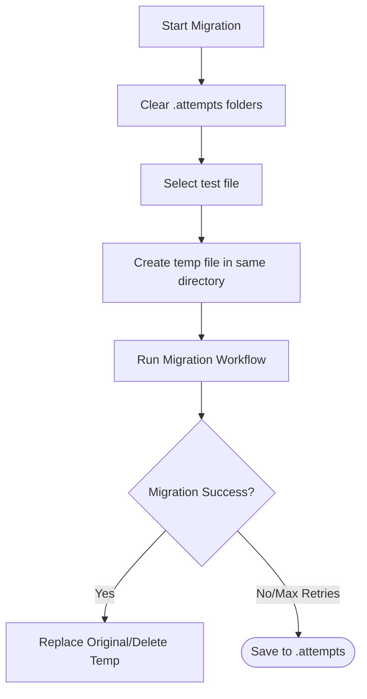
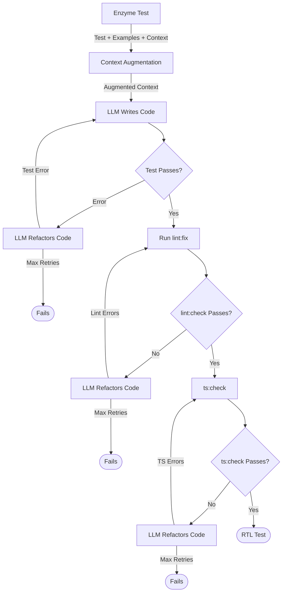

# Unshallow Workflow Documentation

## File Handling Flow


## Migration Workflow


### Directory Structure
```
src/
├── components/
│   ├── Button/
│   │   ├── Button.test.tsx
│   │   ├── Button.test.temp.tsx  # Temporary file during migration
│   │   └── .attempts/            # For developer review
│   │       └── Button.test.tsx
│   └── Modal/
│       ├── Modal.test.tsx
│       ├── Modal.test.temp.tsx   # Temporary file during migration
│       └── .attempts/            # For developer review
│           └── Modal.test.tsx
└── utils/
    ├── format.test.ts
    ├── format.test.temp.ts       # Temporary file during migration
    └── .attempts/                # For developer review
        └── format.test.ts
```

## Process Steps

### 1. Initialization
- Clear all `.attempts` folders in the migration scope
  - `.attempts` folders are for developer review only
  - Previous failed attempts are cleared to avoid confusion
- Create new `.attempts` folders if they don't exist
- Each test file directory gets its own `.attempts` folder

### 2. Temporary File Creation
- Create temp file with pattern: `{originalName}.temp.tsx`
- Place temp file in same directory as original test
- Maintain original file until migration succeeds
- Temp files are working files, visible during migration
- Clean up temp files after process completion

### 3. Migration Process
- Attempt migration on temp file in original directory
- Run validation steps:
  1. Migration to RTL
  2. TypeScript check
  3. Lint check
- On failure:
  - Copy failed attempt to `.attempts` folder
  - Keep temp file for next retry

### 4. Success Path
- All checks pass:
  1. Delete original file
  2. Rename temp file to original name
  3. Clean up any attempts in `.attempts` folder

### 5. Failure Path
- Any check fails:
  1. Copy current temp file to `.attempts` folder
  2. Increment retry counter
  3. If under max retries:
     - Keep temp file for next attempt
     - Update temp file content
  4. If max retries reached:
     - Move final temp file to `.attempts`
     - Delete temp file from original directory
     - Original file remains unchanged

### 6. Cleanup
- Remove all `.temp.tsx` files
- Keep failed attempts in `.attempts` folders for review
- Original files remain unchanged if migration fails

## UI Integration

### Progress Messages
```
🔄 Migrating: Button.test.tsx
   Creating temporary file Button.test.temp.tsx...
   Attempting migration (try 2/5)...
   Running TypeScript check...
   ❌ TypeScript check failed
   Saving attempt to .attempts folder...
   Retrying migration...
```

### Final Summary
```
Migration Results Summary
...
[Previous table content]
...

Failed migrations can be found in .attempts folders:
• src/components/Button/.attempts/Button.test.tsx
• src/utils/.attempts/format.test.ts

Review the .attempts folder to:
1. Check migration errors
2. Compare with original files
3. Manually fix issues
4. Re-run migration on specific files

Note: Temporary files (.temp.tsx) are automatically cleaned up
```

## Best Practices

### File Management
1. Keep original files untouched until success
2. Use `.attempts` folder for post-migration review only
3. Temporary files live alongside original tests
4. Clean up all temp files after each run

### Error Recovery
1. Check `.attempts` folder for failed migrations
2. Compare with original files
3. Fix issues manually if needed
4. Re-run migration on specific files

### Cleanup
1. Clear `.attempts` folders before new run
2. Remove all temp files after completion
3. Keep successful migrations only 