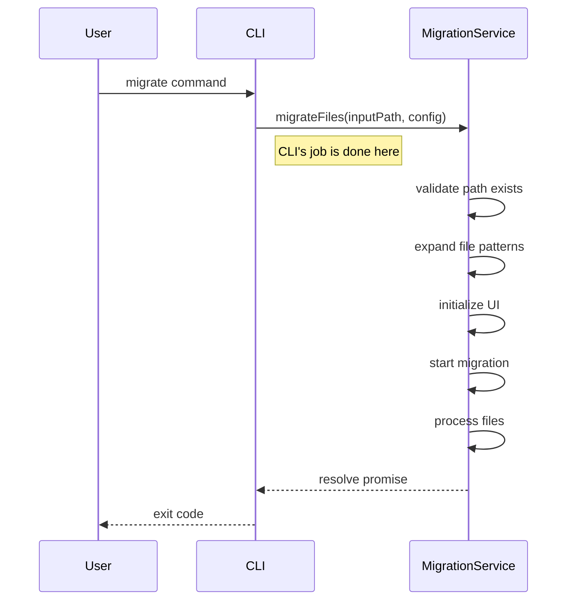

# CLI Layer

## Overview

The CLI tool serves as a minimal entry point for users to interact with the migration functionality. It has a single responsibility: parse the command-line arguments and initialize the Migration Service, which handles everything else including file expansion, UI and migration process.

## Command-Line Interface

### Commands and Options

```
unshallow migrate <path> [options]

Options:
  --skip-ts-check      Skip TypeScript checking
  --skip-lint-check    Skip ESLint checking
  --max-retries <number>  Maximum LLM retries (default: 5)
  --pattern <glob>     Test file pattern (default: "**/*.{test,spec}.{ts,tsx}")
  --import-depth <number>  Depth for AST import analysis (default: 1)
  --examples <paths>      Comma-separated list of example tests to use as references
  --context-file <path>   Path to a text file with additional context for the migration
  --lint-check-cmd <command>  Custom command for lint checking (default: "yarn lint:check")
  --lint-fix-cmd <command>    Custom command for lint fixing (default: "yarn lint:fix")
  --ts-check-cmd <command>    Custom command for TypeScript checking (default: "yarn ts:check")
  -h, --help           Show help information
```

### CLI Implementation

```typescript
#!/usr/bin/env node
// cli/index.ts
import {program} from 'commander';
import {handleMigrateCommand} from './commands/migrate';
import {version} from '../package.json';

program
	.name('unshallow')
	.description('Migrate Enzyme tests to React Testing Library')
	.version(version);

program
	.command('migrate')
	.description('Migrate Enzyme test files to React Testing Library')
	.argument('<path>', 'File or directory to migrate from Enzyme to RTL')
	.option('--skip-ts-check', 'Skip TypeScript checking')
	.option('--skip-lint-check', 'Skip ESLint checking')
	.option('--max-retries <number>', 'Maximum LLM retries', '5')
	.option('--pattern <glob>', 'Test file pattern', '**/*.{test,spec}.{ts,tsx}')
	.option('--import-depth <number>', 'Depth for AST import analysis', '1')
	.option(
		'--examples <paths>',
		'Comma-separated list of example tests to use as references',
	)
	.option(
		'--context-file <path>',
		'Path to a text file with additional context for the migration',
	)
	.option(
		'--lint-check-cmd <command>',
		'Custom command for lint checking',
		'yarn lint:check',
	)
	.option(
		'--lint-fix-cmd <command>',
		'Custom command for lint fixing',
		'yarn lint:fix',
	)
	.option(
		'--ts-check-cmd <command>',
		'Custom command for TypeScript checking',
		'yarn ts:check',
	)
	.action(handleMigrateCommand);

program.parse();
```

### Migrate Command Implementation

```typescript
// cli/commands/migrate.ts
import {migrationService} from '../../services/migrationService';

export async function handleMigrateCommand(
	inputPath: string,
	options: {
		skipTsCheck?: boolean;
		skipLintCheck?: boolean;
		maxRetries?: string;
		pattern?: string;
		importDepth?: string;
		examples?: string;
		contextFile?: string;
		lintCheckCmd?: string;
		lintFixCmd?: string;
		tsCheckCmd?: string;
	},
) {
	try {
		// Configure options for migration
		const config = {
			skipTs: options.skipTsCheck || false,
			skipLint: options.skipLintCheck || false,
			maxRetries: parseInt(options.maxRetries || '5', 10),
			pattern: options.pattern || '**/*.{test,spec}.{ts,tsx}',
			importDepth: parseInt(options.importDepth || '1', 10),
			exampleTests: options.examples
				? options.examples.split(',').map(path => path.trim())
				: undefined,
			extraContextFile: options.contextFile,
			lintCheckCmd: options.lintCheckCmd || 'yarn lint:check',
			lintFixCmd: options.lintFixCmd || 'yarn lint:fix',
			tsCheckCmd: options.tsCheckCmd || 'yarn ts:check',
		};

		// Log minimal initial message
		console.log(`Starting migration process for ${inputPath}`);

		// Start the migration service - all file handling happens inside the service
		await migrationService.migrateFiles(inputPath, config);

		// Exit with success code when completed
		process.exit(0);
	} catch (error) {
		// Log minimal error and exit
		console.error('Migration failed');
		process.exit(1);
	}
}
```

## Integration with Migration Service

The CLI's only responsibility is to call the Migration Service with the path and config:

```typescript
// All the handling of files happens inside the Migration Service
await migrationService.migrateFiles(inputPath, config);
```

This call starts the following cascade of events (handled by the Migration Service):

1. Path validation
2. File path expansion based on the provided pattern
3. UI initialization (React app is rendered)
4. State management setup
5. Migration process execution
6. Event handling and UI updates

## Single Responsibility

The CLI layer has a clearly defined single responsibility:

- **Does**: Parse arguments and start the Migration Service
- **Does Not**: Validate paths (delegated to Migration Service)
- **Does Not**: Expand file paths (delegated to Migration Service)
- **Does Not**: Handle UI rendering
- **Does Not**: Manage migration state
- **Does Not**: Track progress
- **Does Not**: Process test files

## Process Flow



## Usage Examples

```bash
# Migrate a single file
unshallow migrate ./src/tests/MyComponent.test.tsx

# Migrate an entire directory
unshallow migrate ./src/tests

# Migrate with options
unshallow migrate ./src/tests --skip-ts-check --max-retries 3

# Migrate with custom pattern
unshallow migrate ./src/tests --pattern "**/*Test.{ts,tsx}"

# Migrate with deeper import analysis for better context
unshallow migrate ./src/tests --import-depth 2

# Migrate with example tests for reference
unshallow migrate ./src/tests --examples="./examples/Button.test.tsx,./examples/Dropdown.test.tsx"

# Migrate with additional context from a file
unshallow migrate ./src/tests --context-file="./context/testing-guidelines.txt"

# Migrate with both examples and context
unshallow migrate ./src/tests --import-depth 2 --examples="./examples/Form.test.tsx" --context-file="./context/guidelines.txt"

# Migrate with custom validation commands
unshallow migrate ./src/tests --lint-check-cmd="npm run lint" --ts-check-cmd="npm run typecheck"

# Migrate with all customizations
unshallow migrate ./src/tests --lint-check-cmd="npm run lint" --lint-fix-cmd="npm run lint:fix" --ts-check-cmd="npm run typecheck" --import-depth 2
```

## Benefits of Command → Process Pattern

1. **Simplicity**: The CLI has a single responsibility - initiate migration
2. **Clarity**: Clear unidirectional flow makes the code easier to understand
3. **Separation**: CLI doesn't need to know about migration internals
4. **Reduced Coupling**: CLI depends only on the service's public interface
5. **Testability**: Easy to test CLI and service independently
