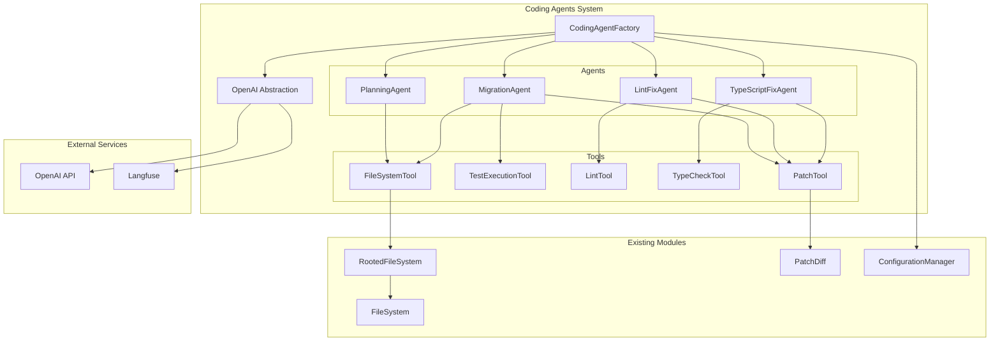
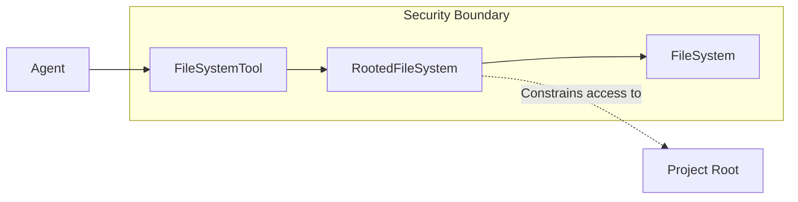
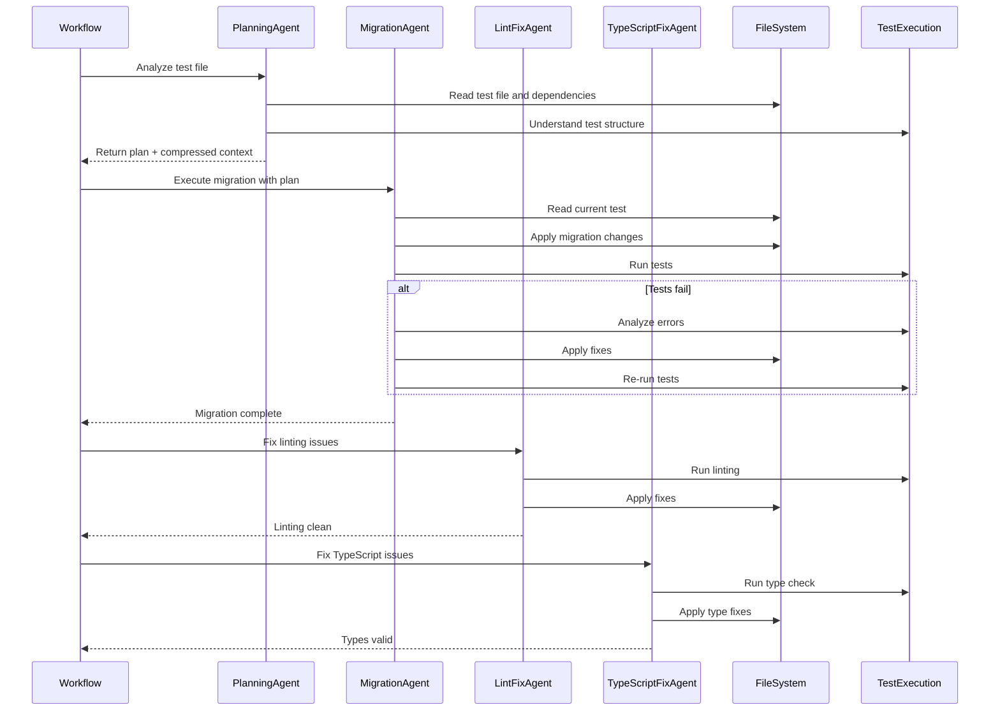
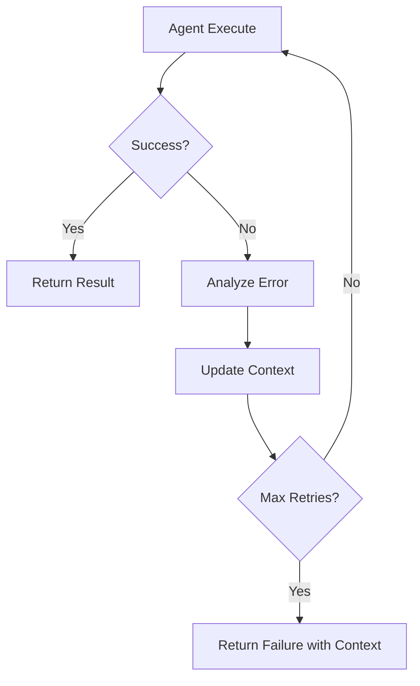

# Coding Agents Architecture

## Table of Contents

1. [Executive Summary](#executive-summary)
2. [Architecture Overview](#architecture-overview)
3. [Agent Design Patterns](#agent-design-patterns)
4. [Agent Types](#agent-types)
5. [Tool System Architecture](#tool-system-architecture)
6. [Implementation Details](#implementation-details)
7. [Data Flow & Interactions](#data-flow--interactions)
8. [Integration Strategy](#integration-strategy)
9. [Testing Strategy](#testing-strategy)
10. [Tool Implementation Details](#tool-implementation-details)
11. [Prompt Engineering](#prompt-engineering)

## Executive Summary

The Coding Agents Architecture represents a sophisticated system for automating code migration workflows using LangGraph's prebuilt ReAct agents. This system replaces traditional workflow nodes with intelligent agents that can reason about code, execute tools, and iteratively solve complex migration problems.

The architecture consists of four specialized agents:
- **PlanningAgent**: Analyzes test files and creates Gherkin migration plans
- **MigrationAgent**: Executes test migrations with iterative fix loops
- **LintFixAgent**: Resolves linting errors with auto-fix capabilities
- **TypeScriptFixAgent**: Corrects TypeScript compilation errors

Each agent operates through a curated toolkit that proxies operations to existing system modules (FileSystem, PatchDiff, Configuration), ensuring security and maintaining architectural consistency.

## Architecture Overview



### Core Principles

1. **Agent Specialization**: Each agent focuses on a specific domain (planning, migration, linting, type checking)
2. **Tool Composition**: Agents use curated tools that proxy to existing system modules
3. **Security by Design**: All file operations constrained through RootedFileSystem
4. **Context Engineering**: Optimized context passing and compression between agents
5. **Iterative Problem Solving**: Agents use ReAct patterns for reasoning and tool execution

## Agent Design Patterns

### LangGraph ReAct Agent Integration

The system leverages LangGraph's `createReactAgent` function as the foundation for all agents:

```typescript
const agent = createReactAgent({
  llm: model,
  tools: agentTools,
  stateModifier: systemPrompt,
  responseFormat: structuredOutputSchema
});
```

### System Prompt Engineering

Each agent uses carefully crafted system prompts following GPT-4.1 best practices:

- **Persistence**: "Keep working until the task is completely resolved"
- **Tool-calling**: "Use tools rather than guessing - read files, run tests, analyze errors"
- **Planning**: "Plan your approach before taking action"
- **Structured Output**: Use Zod schemas for consistent results

### Context Engineering Principles

1. **Dynamic Context Construction**: Context adapts based on agent type and current state
2. **Context Compression**: Planning agent compresses investigation context for handoff
3. **Error-Specific Context**: Fix agents receive targeted error information
4. **Token Optimization**: Minimize context while preserving essential information

## Agent Types

### PlanningAgent

**Purpose**: Analyze test files and dependencies to create comprehensive Gherkin migration plans.

**Responsibilities**:
- Read and understand test file structure and dependencies
- Analyze testing patterns and component usage
- Generate Gherkin-style migration plans
- Compress investigation context for subsequent agents
- Identify tests to update, remove, or maintain

**Tools Available**:
- `FileSystemTool`: Read test files and dependencies
- `TestExecutionTool`: Understand current test structure and execution

**Input Context**:
- Test file path and content
- Project configuration and patterns
- Migration guidelines and best practices

**Output**:
```typescript
interface PlanningResult {
  plan: string; // Gherkin-style migration plan
  testsToUpdate: string[];
  testsToRemove: string[];
  testsToMaintain: string[];
  compressedContext: string; // Investigation summary for MigrationAgent
}
```

### MigrationAgent

**Purpose**: Execute test migrations using iterative fix loops until tests pass.

**Responsibilities**:
- Implement migration plan step-by-step
- Run tests after each modification
- Analyze test failures and apply fixes
- Iterate until all tests pass or retry limit reached

**Tools Available**:
- `FileSystemTool`: Read and write test files
- `TestExecutionTool`: Execute tests and parse results
- `PatchTool`: Apply code modifications

**Workflow Pattern**:
1. Read current test file
2. Apply migration changes using PatchTool
3. Run tests using TestExecutionTool
4. If tests fail, analyze errors and apply fixes
5. Repeat until tests pass or max retries exceeded

**Input Context**:
- Planning result with migration plan
- Compressed context from PlanningAgent
- Current test file content
- Project configuration

### LintFixAgent

**Purpose**: Resolve linting errors through auto-fix and manual corrections.

**Responsibilities**:
- Execute linting tools on target files
- Apply automatic fixes when available
- Manually correct remaining linting issues
- Verify all linting errors are resolved

**Tools Available**:
- `LintTool`: Execute linting with auto-fix capabilities
- `FileSystemTool`: Read and write files
- `PatchTool`: Apply manual corrections

**Workflow Pattern**:
1. Run linting tool on target file
2. Apply automatic fixes if available
3. Analyze remaining errors
4. Apply manual fixes using PatchTool
5. Re-run linting to verify resolution

### TypeScriptFixAgent

**Purpose**: Resolve TypeScript compilation errors through targeted fixes.

**Responsibilities**:
- Execute TypeScript compiler on target files
- Analyze compilation errors and their causes
- Apply targeted fixes for type issues
- Verify successful compilation

**Tools Available**:
- `TypeCheckTool`: Execute TypeScript compiler and parse errors
- `FileSystemTool`: Read and write files
- `PatchTool`: Apply type fixes

**Workflow Pattern**:
1. Run TypeScript compiler on target file
2. Parse and analyze compilation errors
3. Apply targeted fixes using PatchTool
4. Re-run compiler to verify resolution

## Tool System Architecture

### Tool Interface Design

All tools implement a common interface for consistency and testability:

```typescript
interface BaseTool {
  name: string;
  description: string;
  schema: z.ZodSchema;
  execute(input: unknown): Promise<unknown>;
}
```

### Security Model

All file system operations are constrained through the RootedFileSystem:



### Tool Categories

1. **File Operations**: Secure file reading/writing through RootedFileSystem
2. **Code Execution**: Test running, linting, and type checking
3. **Code Modification**: Patch application through existing PatchDiff system
4. **Analysis**: Error parsing and context extraction

## Implementation Details

### CodingAgentFactory

The factory provides a centralized way to create and configure agents:

```typescript
class CodingAgentFactory {
  constructor(
    private config: ConfigurationManager,
    private openaiAbstraction: OpenAIAbstraction,
    private fileSystem: IFileSystem,
    private rootPath: string
  ) {}

  createPlanningAgent(): ReActAgent {
    const tools = [
      new FileSystemTool(this.fileSystem, this.rootPath),
      new TestExecutionTool(this.config)
    ];
    
    return createReactAgent({
      llm: this.openaiAbstraction.getModel('plan'),
      tools,
      stateModifier: PLANNING_SYSTEM_PROMPT,
      responseFormat: PlanningResultSchema
    });
  }

  createMigrationAgent(): ReActAgent {
    const tools = [
      new FileSystemTool(this.fileSystem, this.rootPath),
      new TestExecutionTool(this.config),
      new PatchTool(this.fileSystem, this.rootPath)
    ];
    
    return createReactAgent({
      llm: this.openaiAbstraction.getModel('migrate'),
      tools,
      stateModifier: MIGRATION_SYSTEM_PROMPT
    });
  }

  // Similar methods for LintFixAgent and TypeScriptFixAgent
}
```

### OpenAI Abstraction Layer

Centralizes model selection, telemetry, and API interaction:

```typescript
class OpenAIAbstraction {
  constructor(
    private config: ConfigurationManager,
    private langfuseClient?: LangfuseClient
  ) {}

  getModel(nodeType: 'plan' | 'migrate' | 'lint-fix' | 'ts-fix'): ChatOpenAI {
    const tier = this.config.getModelTier(nodeType);
    const modelName = this.mapTierToModel(tier);
    
    return new ChatOpenAI({
      modelName,
      temperature: 0,
      callbacks: this.langfuseClient ? [this.createLangfuseCallback()] : []
    });
  }

  private mapTierToModel(tier: ModelTier): string {
    switch (tier) {
      case 'nano': return 'gpt-4o-mini';
      case 'mini': return 'gpt-4o';
      case 'full': return 'gpt-4.1';
      default: return 'gpt-4o';
    }
  }
}
```

### Context Engineering Implementation

Context is dynamically constructed based on agent needs:

```typescript
class ContextEngineer {
  static buildPlanningContext(
    testFile: string,
    dependencies: string[],
    projectConfig: ProjectConfig
  ): string {
    return `
# Test File Analysis
${testFile}

# Dependencies
${dependencies.join('\n')}

# Project Patterns
${projectConfig.patterns}

# Migration Guidelines
${projectConfig.migrationGuidelines}
    `;
  }

  static compressContext(
    planningResult: PlanningResult,
    maxTokens: number = 1000
  ): string {
    // Context compression algorithm
    const essential = {
      plan: planningResult.plan,
      keyFindings: this.extractKeyFindings(planningResult),
      criticalDependencies: this.identifyCriticalDependencies(planningResult)
    };
    
    return this.formatCompressedContext(essential, maxTokens);
  }
}
```

## Data Flow & Interactions

### Agent Workflow Sequence



### Error Propagation and Retry

Each agent implements error handling with context preservation:



## Integration Strategy

### Workflow Replacement Pattern

Current LangGraph nodes are replaced with agent calls:

```typescript
// Before: Node-based approach
export const migrationWorkflow = new StateGraph(WorkflowState)
  .addNode('plan_rtl_conversion', planRtlConversionNode)
  .addNode('execute_rtl_conversion', executeRtlConversionNode)
  .addNode('fix_lint_error', fixLintErrorNode)
  .addNode('fix_ts_error', fixTsErrorNode);

// After: Agent-based approach
export class AgentWorkflow {
  constructor(private agentFactory: CodingAgentFactory) {}

  async execute(testFile: string): Promise<WorkflowResult> {
    const planningAgent = this.agentFactory.createPlanningAgent();
    const migrationAgent = this.agentFactory.createMigrationAgent();
    const lintFixAgent = this.agentFactory.createLintFixAgent();
    const tsFixAgent = this.agentFactory.createTypeScriptFixAgent();

    const planResult = await planningAgent.invoke({ testFile });
    const migrationResult = await migrationAgent.invoke({ 
      plan: planResult.plan,
      context: planResult.compressedContext 
    });
    const lintResult = await lintFixAgent.invoke({ filePath: testFile });
    const tsResult = await tsFixAgent.invoke({ filePath: testFile });

    return this.consolidateResults([planResult, migrationResult, lintResult, tsResult]);
  }
}
```

### Configuration Integration

Agents inherit configuration from the existing ConfigurationManager:

```typescript
// Model tier configuration remains unchanged
{
  "models": {
    "plan": "mini",
    "migrate": "full", 
    "lint-fix": "nano",
    "ts-fix": "mini"
  }
}
```

## Testing Strategy

### Unit Testing Approach

Each agent and tool is tested in isolation:

```typescript
describe('PlanningAgent', () => {
  it('should generate comprehensive migration plan', async () => {
    const mockFileSystem = new MockFileSystem();
    const mockTestExecution = new MockTestExecutionTool();
    const agent = createPlanningAgent([mockFileSystem, mockTestExecution]);
    
    const result = await agent.invoke({ testFile: 'sample.test.tsx' });
    
    expect(result.plan).toContain('Feature: Migrate Enzyme to RTL');
    expect(result.testsToUpdate).toHaveLength(3);
    expect(result.compressedContext).toBeDefined();
  });
});
```

### Integration Testing

End-to-end scenarios test complete agent workflows:

```typescript
describe('[integration]: Complete Migration Workflow', () => {
  it('should migrate Enzyme test to RTL successfully', async () => {
    const tempDir = await createTempProject();
    const agentFactory = new CodingAgentFactory(config, openai, fileSystem, tempDir);
    const workflow = new AgentWorkflow(agentFactory);
    
    const result = await workflow.execute('src/Component.test.tsx');
    
    expect(result.success).toBe(true);
    expect(result.migrationComplete).toBe(true);
    expect(result.testsPass).toBe(true);
    expect(result.lintingClean).toBe(true);
    expect(result.typesValid).toBe(true);
  });
});
```

### Tool Proxy Testing

Verify tools correctly proxy to existing modules:

```typescript
describe('FileSystemTool', () => {
  it('should proxy read operations to RootedFileSystem', async () => {
    const mockFileSystem = new MockFileSystem();
    const rootedFS = new RootedFileSystem(mockFileSystem, '/project');
    const tool = new FileSystemTool(mockFileSystem, '/project');
    
    await tool.execute({ operation: 'read', path: 'test.js' });
    
    expect(rootedFS.read).toHaveBeenCalledWith('test.js');
  });
});
```

## Tool Implementation Details

### FileSystemTool

Provides secure file operations through RootedFileSystem:

```typescript
class FileSystemTool implements BaseTool {
  name = 'filesystem';
  description = 'Read and write files within the project directory';
  
  schema = z.object({
    operation: z.enum(['read', 'write', 'exists', 'delete']),
    path: z.string(),
    content: z.string().optional()
  });

  constructor(
    private fileSystem: IFileSystem,
    private rootPath: string
  ) {
    this.rootedFileSystem = new RootedFileSystem(fileSystem, rootPath);
  }

  async execute(input: z.infer<typeof this.schema>) {
    switch (input.operation) {
      case 'read':
        return await this.rootedFileSystem.read(input.path);
      case 'write':
        return await this.rootedFileSystem.write(input.path, input.content!);
      case 'exists':
        return await this.rootedFileSystem.exists(input.path);
      case 'delete':
        return await this.rootedFileSystem.delete(input.path);
    }
  }
}
```

### TestExecutionTool

Executes tests and parses results for error analysis:

```typescript
class TestExecutionTool implements BaseTool {
  name = 'test_execution';
  description = 'Run tests and analyze results';
  
  schema = z.object({
    operation: z.enum(['run', 'analyze']),
    filePath: z.string(),
    testCommand: z.string().optional()
  });

  constructor(private config: ConfigurationManager) {}

  async execute(input: z.infer<typeof this.schema>) {
    const testCommand = input.testCommand || this.config.getTestCommand();
    
    switch (input.operation) {
      case 'run':
        return await this.runTests(input.filePath, testCommand);
      case 'analyze':
        return await this.analyzeTestResults(input.filePath);
    }
  }

  private async runTests(filePath: string, command: string) {
    const result = await execAsync(`${command} ${filePath}`);
    return {
      success: result.exitCode === 0,
      stdout: result.stdout,
      stderr: result.stderr,
      errors: this.parseTestErrors(result.stderr)
    };
  }
}
```

### LintTool

Executes linting with auto-fix capabilities:

```typescript
class LintTool implements BaseTool {
  name = 'lint';
  description = 'Run linting and apply fixes';
  
  schema = z.object({
    operation: z.enum(['check', 'fix']),
    filePath: z.string()
  });

  async execute(input: z.infer<typeof this.schema>) {
    const lintCommand = this.config.getLintCommand();
    
    switch (input.operation) {
      case 'check':
        return await this.runLintCheck(input.filePath, lintCommand);
      case 'fix':
        return await this.runLintFix(input.filePath, lintCommand);
    }
  }

  private async runLintFix(filePath: string, command: string) {
    const fixCommand = `${command} --fix ${filePath}`;
    const result = await execAsync(fixCommand);
    
    return {
      fixed: result.exitCode === 0,
      remainingErrors: this.parseLintErrors(result.stdout),
      autoFixApplied: true
    };
  }
}
```

### TypeCheckTool

Performs TypeScript validation and error analysis:

```typescript
class TypeCheckTool implements BaseTool {
  name = 'typecheck';
  description = 'Run TypeScript compilation and analyze errors';
  
  schema = z.object({
    operation: z.enum(['check', 'analyze']),
    filePath: z.string()
  });

  async execute(input: z.infer<typeof this.schema>) {
    const tscCommand = this.config.getTypeCheckCommand();
    
    switch (input.operation) {
      case 'check':
        return await this.runTypeCheck(input.filePath, tscCommand);
      case 'analyze':
        return await this.analyzeTypeErrors(input.filePath);
    }
  }

  private async runTypeCheck(filePath: string, command: string) {
    const result = await execAsync(`${command} --noEmit ${filePath}`);
    
    return {
      valid: result.exitCode === 0,
      errors: this.parseTypeErrors(result.stderr),
      errorCount: this.countErrors(result.stderr)
    };
  }
}
```

### PatchTool

Applies code modifications using the existing PatchDiff system:

```typescript
class PatchTool implements BaseTool {
  name = 'patch';
  description = 'Apply code modifications using patch format';
  
  schema = z.object({
    operation: z.enum(['apply', 'validate']),
    patchText: z.string(),
    targetFile: z.string().optional()
  });

  constructor(
    private fileSystem: IFileSystem,
    private rootPath: string
  ) {
    this.patchDiff = new PatchDiff(fileSystem, rootPath);
  }

  async execute(input: z.infer<typeof this.schema>) {
    switch (input.operation) {
      case 'apply':
        return await this.applyPatch(input.patchText);
      case 'validate':
        return await this.validatePatch(input.patchText);
    }
  }

  private async applyPatch(patchText: string) {
    const result = await this.patchDiff.apply(patchText);
    
    return {
      success: result.success,
      filesModified: result.filesModified,
      errors: result.error ? [result.error.message] : [],
      warnings: result.warnings
    };
  }
}
```

## Prompt Engineering

### System Prompt Templates

Each agent uses specialized system prompts optimized for their domain:

#### PlanningAgent System Prompt

```typescript
const PLANNING_SYSTEM_PROMPT = `
You are a specialized planning agent for migrating Enzyme tests to React Testing Library.

Your role is to:
1. Analyze test files and their dependencies thoroughly
2. Create comprehensive Gherkin-style migration plans
3. Identify which tests need updating, removal, or can be maintained
4. Compress your investigation context for the migration agent

Key principles:
- Keep working until you have a complete understanding of the test structure
- Use tools rather than guessing - read files, analyze dependencies
- Plan extensively before generating the migration strategy
- Focus on creating actionable, step-by-step plans

Always use the filesystem tool to read test files and dependencies.
Always use the test_execution tool to understand current test behavior.

Return your analysis in the specified structured format.
`;
```

#### MigrationAgent System Prompt

```typescript
const MIGRATION_SYSTEM_PROMPT = `
You are a specialized migration agent for converting Enzyme tests to React Testing Library.

Your role is to:
1. Execute migration plans step-by-step
2. Apply code changes using the patch tool
3. Run tests after each change to verify correctness
4. Fix any issues that arise during migration
5. Iterate until all tests pass

Key principles:
- Keep working until all tests pass successfully
- Use tools rather than guessing - read files, run tests, apply patches
- Fix one error at a time to maintain code stability
- Test frequently to catch issues early

Available tools:
- filesystem: Read and write test files
- test_execution: Run tests and analyze failures
- patch: Apply code modifications

Work methodically through the migration plan, testing at each step.
`;
```

#### LintFixAgent System Prompt

```typescript
const LINT_FIX_SYSTEM_PROMPT = `
You are a specialized linting agent for resolving code style and quality issues.

Your role is to:
1. Run linting tools on target files
2. Apply automatic fixes when available
3. Manually resolve remaining linting issues
4. Verify all linting errors are resolved

Key principles:
- Keep working until all linting errors are resolved
- Use auto-fix capabilities first, then manual corrections
- Apply fixes incrementally and verify each change
- Maintain code readability and style consistency

Available tools:
- lint: Run linting with auto-fix capabilities
- filesystem: Read and write files
- patch: Apply manual corrections

Start with auto-fix, then address remaining issues manually.
`;
```

#### TypeScriptFixAgent System Prompt

```typescript
const TS_FIX_SYSTEM_PROMPT = `
You are a specialized TypeScript agent for resolving compilation errors.

Your role is to:
1. Run TypeScript compiler on target files
2. Analyze compilation errors and their root causes
3. Apply targeted fixes for type issues
4. Verify successful compilation

Key principles:
- Keep working until all TypeScript errors are resolved
- Use precise type fixes rather than broad suppressions
- Fix one error at a time to avoid cascading issues
- Maintain type safety and code quality

Available tools:
- typecheck: Run TypeScript compiler and analyze errors
- filesystem: Read and write files  
- patch: Apply type fixes

Focus on resolving type errors while maintaining type safety.
`;
```

### Context Injection Strategies

Context is dynamically constructed based on agent needs and current state:

```typescript
class ContextBuilder {
  static buildPlanningContext(
    testFile: string,
    projectConfig: ProjectConfig
  ): string {
    return `
# Current Test File
\`\`\`typescript
${testFile}
\`\`\`

# Project Configuration
- Test Framework: ${projectConfig.testFramework}
- Lint Rules: ${projectConfig.lintRules}
- TypeScript Config: ${projectConfig.tsConfig}

# Migration Guidelines
${projectConfig.migrationGuidelines}

# Analysis Instructions
Analyze the test file structure, identify Enzyme patterns, and create a comprehensive migration plan.
    `;
  }

  static buildMigrationContext(
    planResult: PlanningResult,
    testFile: string
  ): string {
    return `
# Migration Plan
${planResult.plan}

# Current Test File
\`\`\`typescript
${testFile}
\`\`\`

# Context Summary
${planResult.compressedContext}

# Execution Instructions
Follow the migration plan step-by-step, testing after each major change.
    `;
  }
}
```

### Structured Output Schemas

Each agent returns structured output using Zod schemas:

```typescript
const PlanningResultSchema = z.object({
  plan: z.string().describe('Gherkin-style migration plan'),
  testsToUpdate: z.array(z.string()).describe('Test cases requiring updates'),
  testsToRemove: z.array(z.string()).describe('Test cases to be removed'),
  testsToMaintain: z.array(z.string()).describe('Test cases to keep as-is'),
  compressedContext: z.string().describe('Investigation summary for migration agent'),
  confidence: z.number().min(0).max(1).describe('Confidence in migration plan')
});

const MigrationResultSchema = z.object({
  success: z.boolean().describe('Whether migration completed successfully'),
  changesApplied: z.array(z.string()).describe('List of changes made'),
  testsPass: z.boolean().describe('Whether all tests pass'),
  issues: z.array(z.string()).describe('Any remaining issues'),
  nextSteps: z.array(z.string()).describe('Recommended next actions')
});
```

This comprehensive architecture provides a solid foundation for implementing sophisticated coding agents that can reason about code, use tools effectively, and solve complex migration problems through iterative refinement.