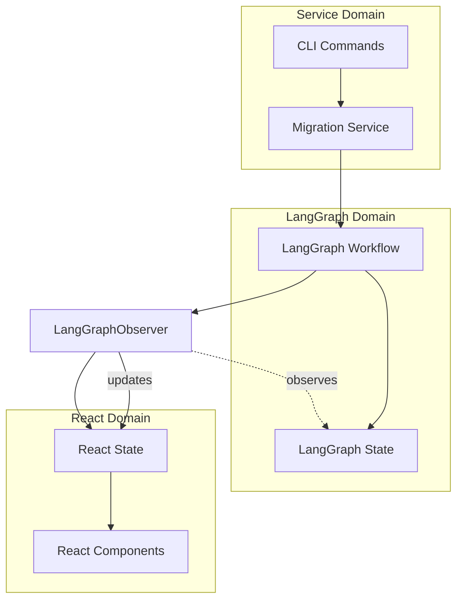

# LangGraph-React Integration: Observer Pattern

## Architecture Overview



## Observer Pattern Implementation

The Observer Pattern allows us to monitor LangGraph's internal state without tightly coupling our React application to LangGraph's implementation details. This approach:

1. Creates a thin observer layer using EventEmitter
2. Registers listeners on LangGraph events
3. Transforms LangGraph states to React-friendly formats
4. Triggers React state updates on relevant changes

### 1. LangGraph State Observer

```typescript
import {StateGraph} from 'langchain/graphs';
import {EventEmitter} from 'events';

/**
 * Observer that monitors LangGraph state changes and emits events
 * for React components to consume
 */
class LangGraphObserver extends EventEmitter {
	constructor() {
		super();
	}

	/**
	 * Registers listeners on a LangGraph StateGraph instance
	 * @param graph The LangGraph StateGraph to observe
	 * @param filePath The path of the file being processed by this graph
	 */
	observeGraph(graph: StateGraph, filePath: string) {
		// Monitor every state transition in the graph
		graph.onStateChange((oldState, newState) => {
			// Map the LangGraph state to our app state format
			const mappedState = this.mapLangGraphStateToAppState(
				newState.file,
				filePath,
			);

			// Emit state change event with the mapped state
			this.emit('fileStateUpdate', {
				filePath,
				fileState: mappedState,
			});
		});

		// Monitor workflow completion
		graph.onWorkflowEnd(finalState => {
			// Map the final state
			const mappedState = this.mapLangGraphStateToAppState(
				finalState.file,
				filePath,
			);

			this.emit('fileWorkflowComplete', {
				filePath,
				fileState: mappedState,
			});
		});

		// Monitor workflow errors
		graph.onError((error, state) => {
			// Map the error state
			const mappedState = this.mapLangGraphStateToAppState(
				state.file,
				filePath,
			);

			this.emit('fileWorkflowError', {
				filePath,
				error,
				fileState: mappedState,
			});
		});
	}

	/**
	 * Maps LangGraph file state to application file state format
	 */
	private mapLangGraphStateToAppState(lgState: any, filePath: string) {
		return {
			path: filePath,
			status: this.mapStatus(lgState.status),
			step: this.mapStep(lgState.currentStep),
			retries: lgState.retries || {rtl: 0, lint: 0, ts: 0},
			maxRetries: lgState.maxRetries || 5,
			tempFilePath: lgState.tempPath,
			attemptFilePath: lgState.attemptPath,
			error: lgState.error,
			rtlTest: lgState.rtlTest,
			lintCheck: lgState.lintCheck,
			tsCheck: lgState.tsCheck,
		};
	}

	/**
	 * Maps LangGraph status to application status
	 */
	private mapStatus(
		langGraphStatus: string,
	): 'pending' | 'in-progress' | 'success' | 'failed' {
		const statusMap = {
			RUNNING: 'in-progress',
			COMPLETE: 'success',
			FAILED: 'failed',
		};
		return statusMap[langGraphStatus] || 'pending';
	}

	/**
	 * Maps LangGraph step to application step
	 */
	private mapStep(
		langGraphStep: string,
	): 'migration' | 'ts' | 'lint' | 'complete' {
		const stepMap = {
			INITIALIZE: 'migration',
			LLM_CONVERT_TO_RTL: 'migration',
			RUN_RTL_TEST: 'migration',
			LLM_REFACTOR_RTL: 'migration',
			LINT_FIX: 'lint',
			LINT_CHECK: 'lint',
			LLM_REFACTOR_LINT: 'lint',
			TS_CHECK: 'ts',
			LLM_REFACTOR_TS: 'ts',
			SUCCESS: 'complete',
			FAILED: 'complete',
		};
		return stepMap[langGraphStep] || 'migration';
	}

	/**
	 * Emits event when migration starts
	 */
	notifyMigrationStarted(totalFiles: number) {
		this.emit('migrationStarted', {totalFiles});
	}

	/**
	 * Emits event when current file changes
	 */
	notifyCurrentFileChanged(filePath: string) {
		this.emit('currentFileChanged', {filePath});
	}

	/**
	 * Emits event when the entire migration completes
	 */
	notifyMigrationCompleted() {
		this.emit('migrationCompleted');
	}

	/**
	 * Emits event when the migration fails
	 */
	notifyMigrationFailed(error: Error) {
		this.emit('migrationFailed', {error});
	}

	/**
	 * Unregisters all listeners
	 */
	cleanup() {
		this.removeAllListeners();
	}
}

// Create a singleton observer
export const langGraphObserver = new LangGraphObserver();
```

### 2. Event Types

```typescript
// Define all possible events for better TypeScript support
export type LangGraphEvent =
	| 'fileStateUpdate' // Emitted when a file's state changes
	| 'fileWorkflowComplete' // Emitted when a file's workflow completes
	| 'fileWorkflowError' // Emitted when a file's workflow has an error
	| 'migrationStarted' // Emitted when migration starts
	| 'currentFileChanged' // Emitted when current file changes
	| 'migrationCompleted' // Emitted when all files are processed
	| 'migrationFailed'; // Emitted when migration fails

// Define event payload types
export interface FileStateUpdateEvent {
	filePath: string;
	fileState: FileState;
}

export interface FileWorkflowCompleteEvent {
	filePath: string;
	fileState: FileState;
}

export interface FileWorkflowErrorEvent {
	filePath: string;
	error: Error;
	fileState: FileState;
}

export interface MigrationStartedEvent {
	totalFiles: number;
}

export interface CurrentFileChangedEvent {
	filePath: string;
}

export interface MigrationFailedEvent {
	error: Error;
}
```

## React Hook for State Observation

### Custom Hook Implementation

```typescript
// hooks/useLangGraphObserver.ts
import {useState, useEffect, useReducer} from 'react';
import {langGraphObserver} from '../langGraph/observer';
import {migrationReducer, initialState} from '../state/migrationReducer';

/**
 * Custom hook that connects to LangGraph events and updates React state
 * This hook is purely observational - it doesn't control the migration
 */
export function useLangGraphObserver() {
	const [state, dispatch] = useReducer(migrationReducer, initialState);

	// Set up event listeners to update state based on observer events
	useEffect(() => {
		const handleFileStateUpdate = event => {
			dispatch({
				type: 'FILE_UPDATED',
				payload: event.fileState,
			});
		};

		const handleCurrentFileChanged = event => {
			dispatch({
				type: 'CURRENT_FILE_CHANGED',
				payload: {path: event.filePath},
			});
		};

		const handleMigrationStarted = event => {
			dispatch({
				type: 'MIGRATION_STARTED',
				payload: {totalFiles: event.totalFiles},
			});
		};

		const handleMigrationCompleted = () => {
			dispatch({type: 'MIGRATION_COMPLETED'});
		};

		const handleMigrationFailed = event => {
			dispatch({
				type: 'MIGRATION_FAILED',
				payload: {error: event.error},
			});
		};

		// Register event listeners
		langGraphObserver.on('fileStateUpdate', handleFileStateUpdate);
		langGraphObserver.on('currentFileChanged', handleCurrentFileChanged);
		langGraphObserver.on('migrationStarted', handleMigrationStarted);
		langGraphObserver.on('migrationCompleted', handleMigrationCompleted);
		langGraphObserver.on('migrationFailed', handleMigrationFailed);

		// Clean up listeners on unmount
		return () => {
			langGraphObserver.off('fileStateUpdate', handleFileStateUpdate);
			langGraphObserver.off('currentFileChanged', handleCurrentFileChanged);
			langGraphObserver.off('migrationStarted', handleMigrationStarted);
			langGraphObserver.off('migrationCompleted', handleMigrationCompleted);
			langGraphObserver.off('migrationFailed', handleMigrationFailed);
		};
	}, [dispatch]);

	// Return only the state, no control methods
	return {
		// State
		migrationStatus: state.status,
		files: state.files,
		currentFile: state.currentFile,

		// Computed properties
		fileCount: Object.keys(state.files).length,
		completedCount: Object.values(state.files).filter(
			f => f.status === 'success',
		).length,
		failedCount: Object.values(state.files).filter(f => f.status === 'failed')
			.length,
	};
}
```

## Integration with Migration Service

The LangGraphObserver is used by the MigrationService to notify UI of changes:

```typescript
// services/migrationService.ts
import {langGraphObserver} from '../langGraph/observer';
import {SequentialMigrationManager} from '../migration/migrationManager';

export class MigrationService {
	private manager: SequentialMigrationManager;
	private observer: typeof langGraphObserver;

	constructor() {
		this.observer = langGraphObserver;
		this.manager = new SequentialMigrationManager(this.observer);
	}

	async migrateFiles(filePaths: string[], options) {
		try {
			// Notify that migration is starting
			this.observer.notifyMigrationStarted(filePaths.length);

			// Start the migration process
			await this.manager.startMigration(filePaths, options);

			// Notify that migration completed successfully
			this.observer.notifyMigrationCompleted();
		} catch (error) {
			// Notify that migration failed
			this.observer.notifyMigrationFailed(error);
			throw error;
		}
	}

	stopMigration() {
		this.manager.stop();
	}
}
```

## Component Integration Example

```tsx
// components/MigrationStatus.tsx
import React from 'react';
import {useLangGraphObserver} from '../hooks/useLangGraphObserver';

export const MigrationStatus: React.FC = () => {
	const {
		migrationStatus,
		files,
		currentFile,
		fileCount,
		completedCount,
		failedCount,
	} = useLangGraphObserver();

	// Simply display migration status - no control functionality
	return (
		<div className="migration-status">
			<h2>Migration Status: {migrationStatus}</h2>

			{migrationStatus === 'running' && (
				<div className="progress">
					<div
						className="progress-bar"
						style={{
							width: `${((completedCount + failedCount) / fileCount) * 100}%`,
						}}
					/>
					<p>
						Progress: {completedCount + failedCount} of {fileCount} files
						processed
					</p>
					{currentFile && <p>Currently processing: {currentFile}</p>}
				</div>
			)}

			{(migrationStatus === 'completed' || migrationStatus === 'failed') && (
				<div className="summary">
					<p>Completed: {completedCount} files</p>
					<p>Failed: {failedCount} files</p>

					{failedCount > 0 && (
						<div className="failures">
							<h3>Failed Files:</h3>
							<ul>
								{Object.values(files)
									.filter(file => file.status === 'failed')
									.map(file => (
										<li key={file.path}>
											{file.path} - {file.error?.message}
										</li>
									))}
							</ul>
						</div>
					)}
				</div>
			)}
		</div>
	);
};
```

## Benefits of Unidirectional Observer Approach

1. **Clean Separation**

   - React components only observe state, they don't control the migration
   - Migration control is handled by the CLI and service layer
   - Observer transforms between LangGraph state and React state

2. **Reuse in Non-UI Contexts**

   - The migration process can be used without a UI
   - Multiple UI technologies could observe the same migration
   - CLI can use the same migration logic for headless operation

3. **Testability**

   - React components can be tested with mock state
   - Migration service can be tested without UI dependencies
   - Observer can be tested independently

4. **Independent Development**

   - UI team can develop components against a specified event interface
   - Migration team can develop workflows without UI concerns
   - Changes to either side don't affect the other as long as the event contract is maintained

5. **Scalability**
   - New migration features don't require UI changes
   - New UI features don't require migration changes
   - Multiple observers could be added (e.g., logging, metrics)
