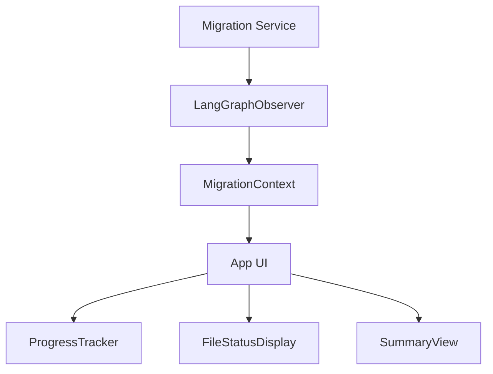

# State Management

## State Architecture



## Core State Structure

```typescript
type MigrationState = {
  // Overall status
  status: 'running' | 'completed' | 'failed';
  
  // Files tracking
  files: {
    [path: string]: FileState;
  };
  
  // Current operation
  currentFile?: string;
};

type FileState = {
  path: string;
  status: 'pending' | 'in-progress' | 'success' | 'failed';
  step: 'migration' | 'ts' | 'lint' | 'complete';
  retries: {
    rtl: number;
    lint: number;
    ts: number;
  };
  maxRetries: number;
  tempFilePath?: string;
  attemptFilePath?: string;
  error?: {
    step: string;
    message: string;
    details?: string;
    timestamp: number;
  };
  
  // Node-specific results
  rtlTest?: {
    passed: boolean;
    output: string;
  };
  
  lintCheck?: {
    passed: boolean;
    message: string;
    attempted: boolean;
  };
  
  tsCheck?: {
    passed: boolean;
    message: string;
  };
};
```

## State Management Pattern

```typescript
// Context definition - purely for state observation
const MigrationContext = createContext<{
  state: MigrationState;
}>(initialContextValue);

// Context provider
export const MigrationProvider: React.FC = ({ children }) => {
  const [state, dispatch] = useReducer(migrationReducer, initialState);
  
  // Set up event listeners to update state based on observer events
  useEffect(() => {
    const handleFileStateUpdate = (event) => {
      dispatch({ 
        type: 'FILE_UPDATED', 
        payload: event.fileState 
      });
    };
    
    const handleCurrentFileChanged = (event) => {
      dispatch({ 
        type: 'CURRENT_FILE_CHANGED', 
        payload: { path: event.filePath } 
      });
    };
    
    const handleMigrationCompleted = () => {
      dispatch({ type: 'MIGRATION_COMPLETED' });
    };
    
    const handleMigrationFailed = (event) => {
      dispatch({ 
        type: 'MIGRATION_FAILED', 
        payload: { error: event.error } 
      });
    };
    
    // Register event listeners
    langGraphObserver.on('fileStateUpdate', handleFileStateUpdate);
    langGraphObserver.on('currentFileChanged', handleCurrentFileChanged);
    langGraphObserver.on('migrationCompleted', handleMigrationCompleted);
    langGraphObserver.on('migrationFailed', handleMigrationFailed);
    
    // Clean up listeners on unmount
    return () => {
      langGraphObserver.off('fileStateUpdate', handleFileStateUpdate);
      langGraphObserver.off('currentFileChanged', handleCurrentFileChanged);
      langGraphObserver.off('migrationCompleted', handleMigrationCompleted);
      langGraphObserver.off('migrationFailed', handleMigrationFailed);
    };
  }, [dispatch]);
  
  // Memoize the context value to prevent unnecessary re-renders
  const contextValue = useMemo(() => ({
    state
  }), [state]);
  
  return (
    <MigrationContext.Provider value={contextValue}>
      {children}
    </MigrationContext.Provider>
  );
};

// Custom hook for components to access the context
export const useMigration = () => useContext(MigrationContext);
```

## UI Components

All UI components use the same context and re-render when the state changes:

```tsx
// App component wraps everything with the provider
const App = () => (
  <MigrationProvider>
    <Layout>
      <ProgressTracker />
      <FileStatusDisplay />
      <SummaryView />
    </Layout>
  </MigrationProvider>
);

// ProgressTracker uses the shared context
const ProgressTracker = () => {
  const { state } = useMigration();
  const { files, currentFile } = state;
  
  // Compute stats from files
  const total = Object.keys(files).length;
  const completed = Object.values(files).filter(f => f.status === 'success').length;
  const failed = Object.values(files).filter(f => f.status === 'failed').length;
  
  const percentage = total > 0 
    ? Math.round((completed + failed) / total * 100) 
    : 0;
  
  return (
    <Box>
      <Text>Progress: {percentage}%</Text>
      <Bar percentage={percentage} />
      <Text>Processing: {currentFile}</Text>
    </Box>
  );
};

// FileStatusDisplay also uses the shared context
const FileStatusDisplay = () => {
  const { state } = useMigration();
  const { currentFile, files } = state;
  
  // If no current file, don't render
  if (!currentFile) return null;
  
  const file = files[currentFile];
  
  return (
    <Box>
      <Text>Current file: {file.path}</Text>
      <Text>Status: {file.status}</Text>
      <Text>Step: {file.step}</Text>
      {file.retries.rtl > 0 && (
        <Text>RTL Retries: {file.retries.rtl}/{file.maxRetries}</Text>
      )}
      {file.retries.lint > 0 && (
        <Text>Lint Retries: {file.retries.lint}/{file.maxRetries}</Text>
      )}
      {file.retries.ts > 0 && (
        <Text>TS Retries: {file.retries.ts}/{file.maxRetries}</Text>
      )}
    </Box>
  );
};

// SummaryView uses the shared context too
const SummaryView = () => {
  const { state } = useMigration();
  const { files, status } = state;
  
  // Only show summary when migration is completed
  if (status !== 'completed' && status !== 'failed') return null;
  
  // Get all files with errors
  const filesWithErrors = Object.values(files).filter(f => f.error);
  
  return (
    <Box>
      <ResultsTable files={Object.values(files)} />
      <Text>Failed files: {filesWithErrors.length}</Text>
      {filesWithErrors.length > 0 && (
        <ErrorList files={filesWithErrors} />
      )}
    </Box>
  );
};
```

## Under the Hood

The state management uses a pure reducer that only responds to events from the observer:

```typescript
// Action types - all triggered by external events, not by UI
type MigrationAction = 
  | { type: 'MIGRATION_STARTED', payload: { totalFiles: number } }
  | { type: 'FILE_UPDATED', payload: FileState }
  | { type: 'CURRENT_FILE_CHANGED', payload: { path: string } }
  | { type: 'MIGRATION_COMPLETED' }
  | { type: 'MIGRATION_FAILED', payload: { error: Error } };

// Reducer to handle state transitions
const migrationReducer = (state: MigrationState, action: MigrationAction): MigrationState => {
  switch (action.type) {
    case 'MIGRATION_STARTED':
      return {
        ...state,
        status: 'running',
        files: {},
        currentFile: undefined
      };
      
    case 'FILE_UPDATED':
      const fileState = action.payload;
      return {
        ...state,
        files: {
          ...state.files,
          [fileState.path]: fileState
        }
      };
      
    case 'CURRENT_FILE_CHANGED':
      return {
        ...state,
        currentFile: action.payload.path
      };
      
    case 'MIGRATION_COMPLETED':
      return {
        ...state,
        status: 'completed'
      };
      
    case 'MIGRATION_FAILED':
      return {
        ...state,
        status: 'failed'
      };
      
    default:
      return state;
  }
};
```

## Integration with LangGraph Observer

The state management layer purely reacts to events from the LangGraph Observer:

```typescript
// In the MigrationProvider
useEffect(() => {
  // Register listeners for events from LangGraph Observer
  langGraphObserver.on('migrationStarted', (event) => {
    dispatch({
      type: 'MIGRATION_STARTED',
      payload: { totalFiles: event.totalFiles }
    });
  });
  
  // More event listeners...
  
  // Clean up on unmount
  return () => {
    langGraphObserver.off('migrationStarted');
    // Unregister other listeners...
  };
}, [dispatch]);
```

This pattern ensures that:
1. The UI is purely reactive, with no control logic
2. State updates come exclusively from external events
3. Components focus solely on rendering the current state 