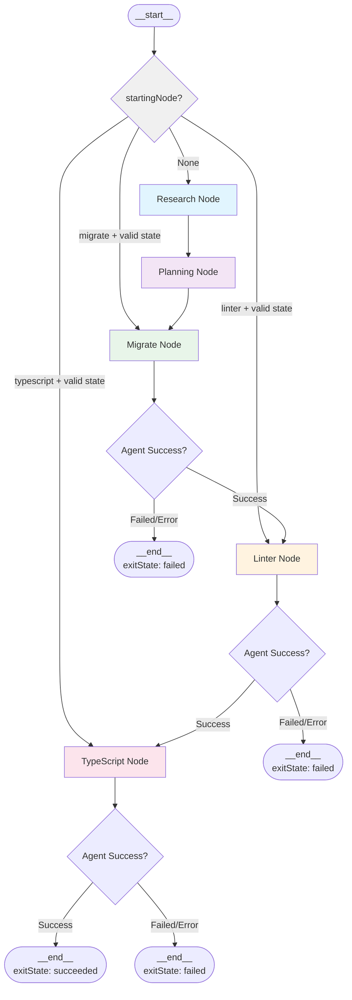
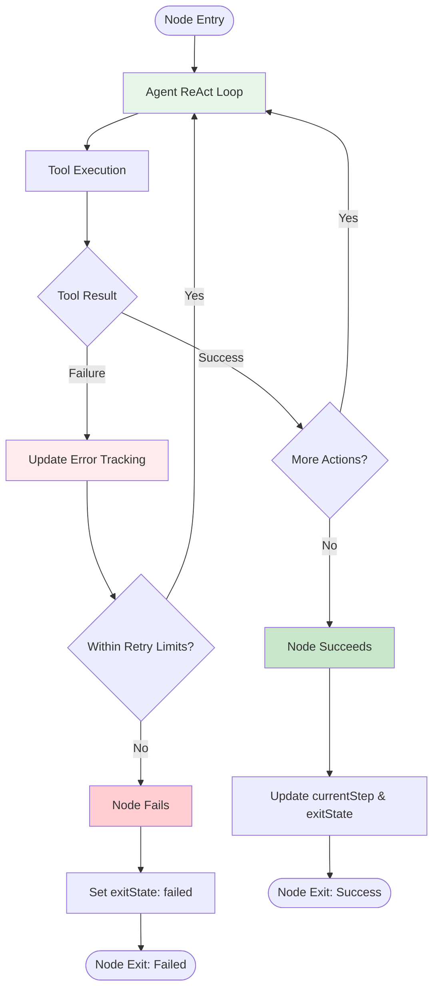
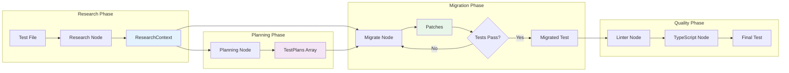
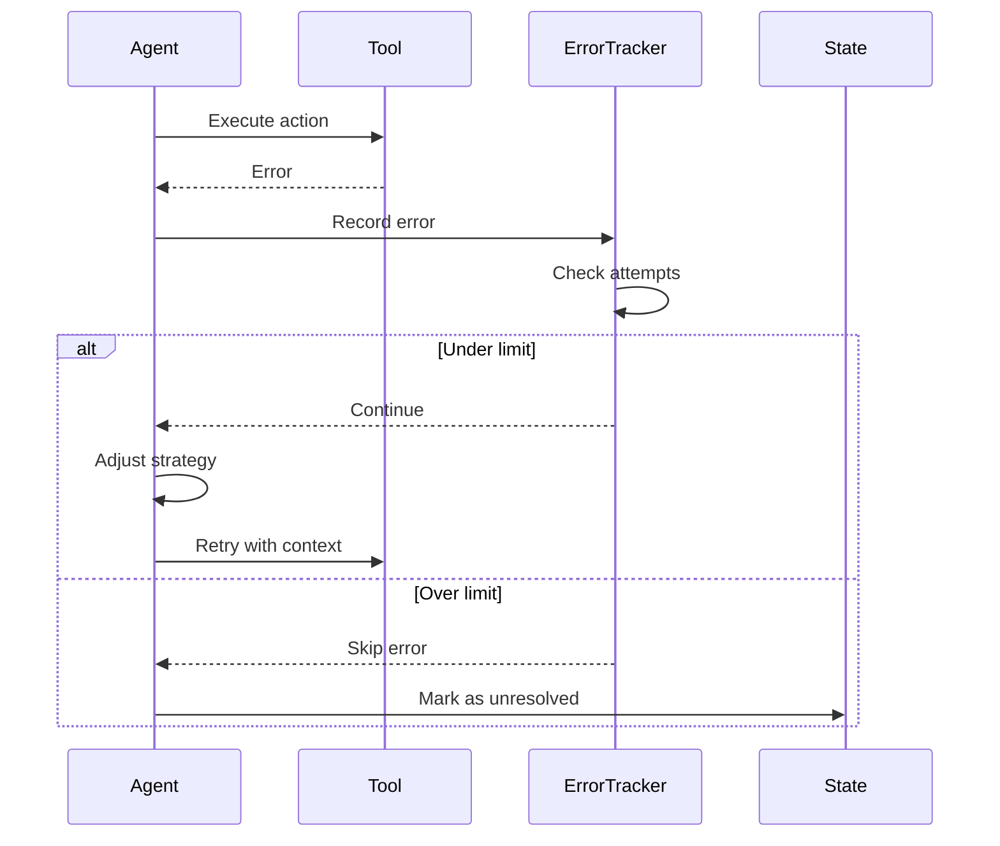

# Migration Workflow Architecture Plan

## Overview

A new LangGraph-based workflow system using ReAct agents for test migration from Enzyme to React Testing Library. The system follows a linear workflow with specialized agents at each step. Each workflow node contains a ReAct agent that operates in a continuous loop, calling tools and handling retries until the task is complete or retry limits are reached.

## Workflow Architecture

### Flow Diagram

```mermaid
graph TD
    Start([Start]) --> ResearchNode[Research Node]
    ResearchNode --> PlanningNode[Planning Node]
    PlanningNode --> MigrateNode[Migrate/Fix Node]
    MigrateNode --> LintNode[Linter Node]
    LintNode --> TSNode[TypeScript Node]
    TSNode --> Done([Done])
    
    %% Research Node Internal Flow
    subgraph ResearchFlow["Research Node Flow"]
        RA[Research Agent] --> RT[Call Research Tools]
        RT --> RLoop{Tool Success?}
        RLoop -->|Yes| RNext[Next Tool/Complete]
        RLoop -->|No| RA
        RNext --> RA
    end
    
    %% Planning Node Internal Flow
    subgraph PlanningFlow["Planning Node Flow"]
        PA[Planning Agent] --> PT[Call Planning Tools]
        PT --> PLoop{Tool Success?}
        PLoop -->|Yes| PNext[Next Tool/Complete]
        PLoop -->|No| PA
        PNext --> PA
    end
    
    %% Migrate Node Internal Flow
    subgraph MigrateFlow["Migrate/Fix Node Flow"]
        MA[Migrate Agent] --> MT[Call Migrate Tools]
        MT --> MResult{Tool Result}
        MResult -->|Patch Failed| MA
        MResult -->|Test Failed| MA
        MResult -->|Error Retry| MA
        MResult -->|Success| MNext[Next Tool/Complete]
        MNext --> MA
    end
    
    %% Linter Node Internal Flow
    subgraph LintFlow["Linter Node Flow"]
        LA[Linter Agent] --> LT[Call Linter Tools]
        LT --> LResult{Tool Result}
        LResult -->|Lint Errors| LA
        LResult -->|Auto-fix Failed| LA
        LResult -->|Success| LNext[Next Tool/Complete]
        LNext --> LA
    end
    
    %% TypeScript Node Internal Flow
    subgraph TSFlow["TypeScript Node Flow"]
        TA[TypeScript Agent] --> TT[Call TypeScript Tools]
        TT --> TResult{Tool Result}
        TResult -->|Type Errors| TA
        TResult -->|Success| TNext[Next Tool/Complete]
        TNext --> TA
    end
    
    style ResearchNode fill:#e1f5fe
    style PlanningNode fill:#f3e5f5
    style MigrateNode fill:#e8f5e9
    style LintNode fill:#fff3e0
    style TSNode fill:#fce4ec
```



### Path Resolution Strategy

All file paths in the workflow system are handled relative to the project root:

- **Configuration**: `WorkflowConfig.projectRoot` contains the absolute path to the project root
- **Tool Parameters**: All path parameters are relative to `projectRoot`
- **Tool Implementation**: Tools resolve relative paths by joining them with `projectRoot`
- **State Storage**: All paths in `WorkflowState` are stored as relative paths
- **Cross-Module Integration**: File System module receives absolute paths (projectRoot + relativePath)

This approach ensures:
- **Portability**: Workflow state can be serialized/deserialized across different environments
- **Consistency**: All tools operate with the same path resolution logic
- **Integration**: Seamless integration with existing modules (file-system, git, patch-diff)

### Agent Loop Behavior

Each workflow node contains a ReAct agent that operates in a continuous loop pattern:

1. **Agent Decision**: The agent analyzes the current state and decides which tool to call
2. **Tool Execution**: The selected tool is executed with appropriate parameters
3. **Result Evaluation**: The tool result is analyzed for success/failure
4. **Retry Logic**: On failure, the agent:
   - For **Migrate/Fix Node**: Retries on patch failures, test failures, or execution errors
   - For **Linter Node**: Retries on lint errors or auto-fix failures
   - For **TypeScript Node**: Retries on type errors
   - For **Research/Planning Nodes**: Retries on tool execution failures
5. **Completion**: The loop continues until success or retry limits are reached

The tools themselves handle:
- **Patch Application**: Retry logic for failed patches with conflict resolution
- **Test Execution**: Error analysis and retry with different approaches
- **Error Tracking**: Fingerprinting errors to avoid infinite loops

## Workflow Graph Definition

### Complete Workflow Graph

```typescript
const graph = new StateGraph(WorkflowState)
  .addNode("research", researchNode)
  .addNode("planning", planningNode)
  .addNode("migrate", migrateNode)
  .addNode("linter", linterNode)
  .addNode("typescript", typescriptNode)
  .addConditionalEdges("__start__", determineStartingNode, {
    research: "research",
    migrate: "migrate",
    linter: "linter", 
    typescript: "typescript"
  })
  .addEdge("research", "planning")
  .addEdge("planning", "migrate")
  .addEdge("migrate", "linter")
  .addEdge("linter", "typescript")
  .addEdge("typescript", "__end__");

// Conditional starting logic
function determineStartingNode(state: WorkflowState): string {
  if (state.startingNode) {
    // Validate that state has required fields for starting node
    switch (state.startingNode) {
      case 'migrate':
        return state.testPlans?.length > 0 ? 'migrate' : 'research';
      case 'linter':
        return state.successfulPatches > 0 ? 'linter' : 'research';
      case 'typescript':
        return state.exitState?.status === 'running' ? 'typescript' : 'research';
      default:
        return 'research';
    }
  }
  return 'research';
}
```

### Workflow Flow with Conditional Starting



### Node Error Handling Flow



## State Management

### Core Workflow State

```typescript
interface WorkflowState {
  // File Information (all paths relative to projectRoot from config)
  testFilePath: string; // Relative path to test file being migrated
  originalTestContent: string;
  componentFilePath?: string; // Relative path to component being tested
  
  // Research Context
  researchContext: ResearchContext;
  
  // Planning
  testPlans: TestPlan[];
  
  // Execution
  currentStep: WorkflowStep;
  successfulPatches: number; // Count of successfully applied patches
  startingNode?: 'migrate' | 'linter' | 'typescript'; // For conditional workflow starting
  
  // Error Tracking
  errors: ErrorTracker;
  
  // Exit State
  exitState: WorkflowExitState;
  
  // Configuration
  config: WorkflowConfig;
}

interface ResearchContext {
  dependencyTree: DependencyNode[];
  mocksRequired: MockRequirement[];
  mockPatterns: MockPattern[];
  coverageFromDependencies: CoverageInfo[];
  exampleTests: ExampleTest[];
  filesToRead: string[];
}

interface TestPlan {
  testName: string;
  action: 'migrate' | 'delete' | 'keep' | 'add';
  gherkinPlan?: string; // Only for migrate/add
}

interface ErrorTracker {
  [step: string]: {
    attempts: number;
    errors: Array<{
      fingerprint: string;
      message: string;
      attempts: number;
      fixes: string[];
    }>;
  };
}

// Additional supporting types
interface DependencyNode {
  filePath: string; // Relative to project root
  dependencies: string[]; // Relative paths to dependency files
  imports: ImportInfo[];
  exports: ExportInfo[];
  testCoverage?: CoverageInfo;
}

interface MockRequirement {
  dependency: string;
  reason: string;
  mockType: 'module' | 'function' | 'component' | 'context';
  existing?: string; // Path to existing mock if found
}

interface MockPattern {
  dependency: string;
  pattern: string;
  usage: string;
  filePath: string; // Relative to project root
}

interface CoverageInfo {
  filePath: string; // Relative to project root
  scenarios: string[];
  mockUsage: string[];
}

interface ExampleTest {
  filePath: string; // Relative to project root
  testName: string;
  pattern: string;
  mockUsage: string[];
}

interface ImportInfo {
  source: string;
  imports: string[];
  type: 'default' | 'named' | 'namespace';
}

interface ExportInfo {
  name: string;
  type: 'default' | 'named';
}

interface WorkflowConfig {
  projectRoot: string; // Absolute path to project root - all relative paths resolved against this
  modelTiers: Record<string, 'nano' | 'mini' | 'full'>;
  retryConfig: RetryConfig;
  userInstructions: string;
  testCommands: {
    test: string;
    lint: string;
    lintFix: string;
    typecheck: string;
  };
}

interface RetryConfig {
  maxAttemptsPerError: number;
  maxTotalAttempts: number;
  errorPrioritization: string[];
}


enum WorkflowStep {
  RESEARCH = 'research',
  PLANNING = 'planning',
  MIGRATE = 'migrate',
  LINT = 'lint',
  TYPESCRIPT = 'typescript',
  COMPLETED = 'completed'
}

interface WorkflowExitState {
  status: 'running' | 'succeeded' | 'failed' | 'cancelled';
  completedAt?: Date;
  failureReason?: string;
  summary?: {
    testsCreated: number;
    testsDeleted: number;
    testsMigrated: number;
    testsKept: number;
    patchesApplied: number;
    errorsEncountered: number;
  };
}
```

## Agent Definitions

### Agent Tools Table

| Agent | Tools | Purpose |
|-------|-------|---------|
| **Research** | `glob`, `grep`, `readFile`, `readFiles`, `ls`, `getDependencyTree`, `writeToScratchpad` | Navigate codebase, analyze dependencies, find mock patterns |
| **Planning** | `glob`, `grep`, `readFile`, `readFiles`, `ls`, `addTestPlan`, `addMultipleTestPlans` | Read research, create test plans |
| **Migrate/Fix** | `glob`, `grep`, `readFile`, `readFiles`, `ls`, `writeOnTestFile`, `runTestFile` | Implement tests, fix errors |
| **Linter** | `glob`, `grep`, `readFile`, `readFiles`, `ls`, `lintAutoFix`, `runLintCheck`, `writeOnTestFile` | Fix linting issues |
| **TypeScript** | `glob`, `grep`, `readFile`, `readFiles`, `ls`, `runTsCheck`, `writeOnTestFile` | Fix TypeScript errors |

### Agent Prompt Templates

#### Research Agent
```
# Role and Objective
You are a code analysis expert specializing in React testing migration. Your objective is to thoroughly research the codebase to gather comprehensive context needed for successful test migration from Enzyme to React Testing Library.

# Instructions

## Dependency Analysis
- Analyze the component under test and map its complete dependency tree
- Identify all external dependencies requiring mocks (router, data fetching, state management, themes)
- Resolve import aliases commonly used in monorepos

## Test Coverage Research
- Find existing tests for dependencies to avoid duplicate coverage
- Locate successfully migrated tests that mock similar dependencies
- Identify mock patterns and testing utilities already in use

## Context Building
- Build a comprehensive research report for downstream agents
- Use writeToScratchpad to persist findings in the ResearchContext schema
- Prioritize information that will help write better RTL tests

# Reasoning Steps
1. Start by analyzing the test file path to understand the component location
2. Parse the test file to identify the component being tested
3. Build a dependency tree for the component
4. Search for existing mock patterns in the codebase
5. Find similar migrated tests as reference examples
6. Compile findings into structured ResearchContext

# Output Format
Output a ResearchContext object containing:
- dependencyTree: Complete component dependency graph
- mocksRequired: List of dependencies needing mocks with reasoning
- mockPatterns: Existing mock implementations found in codebase
- coverageFromDependencies: What's already tested by dependency tests
- exampleTests: Similar migrated tests for reference
- filesToRead: Additional files for context

# Examples

## Example 1
Input: Test file for a component using React Router and Apollo Client
Output: ResearchContext with router mock patterns, GraphQL mock examples, and references to similar migrated components

# Context
<user-instructions>
{userInstructions}
</user-instructions>

<file-to-analyze>
{testFilePath}
</file-to-analyze>

# Final Instructions
Think step by step through the analysis process. Start with understanding the component structure, then systematically research each aspect needed for migration. Use the scratchpad tool to build your research context incrementally, ensuring all findings follow the ResearchContext schema.
```

#### Planning Agent
```
# Role and Objective
You are a test planning expert for React Testing Library migrations. Your objective is to create detailed migration plans for each test, determining which tests to migrate, keep, delete, or add based on RTL best practices.

# Instructions

## Test Analysis
- Review each test in the original file
- Determine if the test is for a React component or utility function
- Assess if the test follows user-centric testing principles

## Migration Planning
- Create Gherkin-style plans for tests that should be migrated
- Identify tests that should be deleted (implementation detail tests)
- Mark utility/non-React tests to keep as-is
- Propose new tests following RTL best practices if coverage gaps exist

## Plan Documentation
- Use clear action labels: 'migrate', 'delete', 'keep', 'add'
- Write detailed Gherkin plans for migrate/add actions
- Ensure plans follow "user does X, expects Y" pattern

# Reasoning Steps
1. Parse the original test file and identify all test cases
2. For each test, determine if it's testing React components
3. Assess if the test focuses on user behavior vs implementation
4. Create migration plan based on RTL principles
5. Add new test suggestions for missing user scenarios
6. Record all decisions using addTestPlan or addMultipleTestPlans

# Output Format
Array of TestPlan objects with:
- testName: Exact test description
- action: 'migrate' | 'delete' | 'keep' | 'add'
- gherkinPlan: For migrate/add actions, detailed Given/When/Then scenarios

# Examples

## Example 1
Input: Test checking component state directly
Output: TestPlan with action='delete' and new test with action='add' testing user-visible behavior

# Context
<research-context>
{researchContext}
</research-context>

<original-test>
{originalTestContent}
</original-test>

# Final Instructions
Think step by step through each test case. Focus on transforming implementation-focused tests into user-centric ones. Use addTestPlan or addMultipleTestPlans to record your migration strategy, ensuring each plan aligns with React Testing Library's philosophy of testing components the way users interact with them.
```

#### Migrate/Fix Agent
```
# Role and Objective
You are a React Testing Library migration expert. Your objective is to implement the planned test migrations, write new tests, and iteratively fix any test failures until all tests pass.

# Instructions

## Test Implementation
- Implement tests according to the provided test plans
- Follow React Testing Library best practices and patterns
- Use appropriate queries (getBy, findBy, queryBy) based on use case
- Implement proper async handling and waitFor patterns

## Error Resolution
- Run tests after implementation using runTestFile
- Focus on fixing one failing test at a time
- Use error messages and DOM output to diagnose issues
- Apply fixes incrementally using writeOnTestFile

## Code Quality
- Ensure migrated tests are more maintainable than originals
- Use semantic queries (by role, label, text) over test IDs
- Implement proper cleanup and isolation between tests

# Reasoning Steps
1. Review test plans and research context
2. Implement complete test suite based on plans
3. Apply changes using writeOnTestFile with patches
4. Run tests and analyze any failures
5. Fix errors iteratively, focusing on one test at a time
6. Repeat until all tests pass or retry limit reached

# Output Format
- Successful migration: All tests passing
- Partial success: Report which tests passed/failed with reasons
- Include accessibility snapshots for debugging failed tests

# Examples

## Example 1
Input: Plan to test form submission
Implementation: Use userEvent for interactions, findBy for async updates, proper form validation assertions

# Context
<research-context>
{researchContext}
</research-context>

<test-plans>
{testPlans}
</test-plans>

<user-instructions>
{userInstructions}
</user-instructions>

<previous-attempts>
{previousAttempts}
</previous-attempts>

# Final Instructions
Think step by step through the implementation. Start by writing the complete test suite according to the plans, then iteratively debug and fix any issues. Focus on writing tests that are resilient to implementation changes while accurately testing user behavior. Use writeOnTestFile for all file modifications and runTestFile to validate your changes.
```

#### Linter Agent
```
# Role and Objective
You are a code quality expert specializing in JavaScript/TypeScript linting. Your objective is to ensure the migrated test files comply with all project linting rules and code style guidelines.

# Instructions

## Automated Fixes
- Run lintAutoFix first to handle auto-fixable issues
- Review the changes made by auto-fix
- Identify any remaining linting errors

## Manual Fixes
- Run runLintCheck to get detailed error reports
- Fix each remaining lint error manually
- Preserve test functionality while fixing style issues
- Apply fixes using writeOnTestFile

## Common Issues
- Import ordering and grouping
- Unused variables or imports
- Formatting inconsistencies
- Missing type annotations
- Async/await best practices

# Reasoning Steps
1. Execute lintAutoFix for automatic corrections
2. Run runLintCheck to identify remaining issues
3. Analyze each lint error and determine fix approach
4. Apply fixes while ensuring tests still function correctly
5. Re-run linter to verify all issues resolved
6. Repeat until no lint errors remain

# Output Format
- Success: All lint errors resolved
- Failure: List of unresolvable errors with explanations

# Examples

## Example 1
Error: Missing return type on function
Fix: Add explicit return type annotation based on function implementation

# Context
<lint-errors>
{lintErrors}
</lint-errors>

<previous-fixes>
{previousFixes}
</previous-fixes>

# Final Instructions
Think step by step through the linting process. Start with automated fixes, then systematically address each remaining error. Ensure that style fixes don't break test functionality. Use writeOnTestFile to apply all manual corrections, maintaining code readability and consistency with project standards.
```

#### TypeScript Agent
```
# Role and Objective
You are a TypeScript expert specializing in type safety for React test files. Your objective is to resolve all TypeScript compilation errors in the migrated tests while maintaining type safety and test functionality.

# Instructions

## Type Error Analysis
- Run runTsCheck to identify all type errors
- Categorize errors by type (missing types, incorrect types, generic issues)
- Prioritize errors that could indicate actual bugs

## Type Resolution
- Add proper type annotations where missing
- Fix incorrect type usage in test utilities
- Resolve generic type parameters for RTL queries
- Ensure mock types match actual implementations

## Best Practices
- Avoid using 'any' type - use proper types or 'unknown'
- Leverage TypeScript's type inference where appropriate
- Add explicit types for better code documentation
- Use proper typing for async test patterns

# Reasoning Steps
1. Run runTsCheck to get all TypeScript errors
2. Group similar errors to identify patterns
3. Start with the most fundamental type errors
4. Fix each error while maintaining type safety
5. Re-run type check after each fix
6. Iterate until all errors are resolved

# Output Format
- Success: All TypeScript errors resolved
- Failure: List of unresolvable errors with technical explanations

# Examples

## Example 1
Error: Property 'xyz' does not exist on type 'HTMLElement'
Fix: Use proper type assertion or type guard to access specific element properties

# Context
<ts-errors>
{tsErrors}
</ts-errors>

<previous-fixes>
{previousFixes}
</previous-fixes>

# Final Instructions
Think step by step through each TypeScript error. Focus on adding proper types rather than suppressing errors. Ensure that type fixes accurately reflect the runtime behavior of the tests. Use writeOnTestFile to apply corrections, maintaining both type safety and test clarity. Remember that good types serve as documentation for future developers.
```

## Tool Implementations

### Function-Based Tools with LangChain

Each tool is implemented as a function using LangChain's `tool` helper with Zod schemas for validation.

**State-updating tools** use the Command pattern with ToolMessage feedback:
```typescript
import { tool } from "@langchain/core/tools";
import { z } from "zod";
import { Command, ToolMessage } from "@langchain/langgraph";
```

### State Update Patterns

**IMPORTANT**: Only tools should use LangGraph's `Command` pattern for state updates. When agents/nodes complete their work, state updates should be done by returning the updated state from the node.

#### Tool State Updates (using Command pattern):

1. **Research Context Updates**: Tools accumulate research findings with feedback
   ```typescript
   return new Command({
     update: {
       researchContext: {
         ...context // Merge with existing research context
       }
     },
     messages: [
       new ToolMessage({
         content: `Successfully updated research context with: ${contextKeys.join(', ')}`,
         tool_call_id: toolCallId,
       }),
     ],
   });
   ```

2. **Test Plan Updates**: Tools add test plans with confirmation
   ```typescript
   return new Command({
     update: {
       testPlans: (current: TestPlan[]) => [...current, newPlan]
     },
     messages: [
       new ToolMessage({
         content: `Added test plan: "${plan.testName}" with action "${plan.action}"`,
         tool_call_id: toolCallId,
       }),
     ],
   });
   ```

3. **Error Tracking**: Tools track errors and inform agent
   ```typescript
   return new Command({
     update: {
       errors: (current: ErrorTracker) => ({
         ...current,
         [stepName]: updateStepErrors(current[stepName], error)
       })
     },
     messages: [
       new ToolMessage({
         content: `Tests failed: ${failedTestNames}. Tracking for retry logic.`,
         tool_call_id: toolCallId,
       }),
     ],
   });
   ```

4. **Success Feedback**: Tools provide positive feedback on successful operations
   ```typescript
   return new Command({
     update: {
       successfulPatches: (current: number) => current + 1
     },
     messages: [
       new ToolMessage({
         content: `Successfully applied patch. Patch count increased to ${current + 1}.`,
         tool_call_id: toolCallId,
       }),
     ],
   });
   ```

#### Node State Updates (return from node):

1. **Step Progression**: Nodes update currentStep when complete
   ```typescript
   // In node implementation
   return {
     ...state,
     currentStep: WorkflowStep.PLANNING
   };
   ```

2. **Exit State**: Nodes mark workflow completion/failure
   ```typescript
   // In final node
   return {
     ...state,
     exitState: {
       status: 'succeeded',
       completedAt: new Date(),
       summary: generateSummary(state)
     },
     currentStep: WorkflowStep.COMPLETED
   };
   ```

### Base Tools (used by all agents)

#### globTool.ts
```typescript
import { tool } from "@langchain/core/tools";
import { z } from "zod";

export const globTool = tool(
  ({ pattern, options }: { pattern: string; options?: GlobOptions }): string[] => {
    /**
     * Search for files matching a glob pattern.
     * All paths are relative to the project root from configuration.
     */
    // Implementation will use existing Glob functionality with projectRoot resolution
    return []; // placeholder
  },
  {
    name: "glob",
    description: "Search for files matching a glob pattern (paths relative to project root)",
    schema: z.object({
      pattern: z.string().describe("The glob pattern to match files against (relative to project root)"),
      options: z.object({
        ignore: z.array(z.string()).optional().describe("Patterns to ignore"),
        absolute: z.boolean().optional().describe("Return absolute paths")
      }).optional()
    }),
  }
);
```

#### grepTool.ts
```typescript
import { tool } from "@langchain/core/tools";
import { z } from "zod";

export const grepTool = tool(
  ({ pattern, path }: { pattern: string; path: string }): GrepResult[] => {
    /**
     * Search for content within files using regex patterns.
     * All paths are relative to the project root from configuration.
     */
    // Implementation will use existing Grep functionality with projectRoot resolution
    return []; // placeholder
  },
  {
    name: "grep",
    description: "Search for content within files using regex patterns (paths relative to project root)",
    schema: z.object({
      pattern: z.string().describe("The regex pattern to search for"),
      path: z.string().describe("The file or directory path to search in (relative to project root)")
    }),
  }
);
```

#### readFileTool.ts
```typescript
import { tool } from "@langchain/core/tools";
import { z } from "zod";

export const readFileTool = tool(
  ({ path }: { path: string }): string => {
    /**
     * Read the contents of a single file.
     * Path is relative to the project root from configuration.
     */
    // Implementation will use existing file system functionality with projectRoot resolution
    return ""; // placeholder
  },
  {
    name: "readFile",
    description: "Read the contents of a single file (path relative to project root)",
    schema: z.object({
      path: z.string().describe("The file path to read (relative to project root)")
    }),
  }
);
```

#### readFilesTool.ts
```typescript
import { tool } from "@langchain/core/tools";
import { z } from "zod";

export const readFilesTool = tool(
  ({ paths }: { paths: string[] }): Record<string, string> => {
    /**
     * Read the contents of multiple files.
     * All paths are relative to the project root from configuration.
     */
    // Implementation will use existing file system functionality with projectRoot resolution
    return {}; // placeholder
  },
  {
    name: "readFiles",
    description: "Read the contents of multiple files (paths relative to project root)",
    schema: z.object({
      paths: z.array(z.string()).describe("Array of file paths to read (relative to project root)")
    }),
  }
);
```

#### lsTool.ts
```typescript
import { tool } from "@langchain/core/tools";
import { z } from "zod";

export const lsTool = tool(
  ({ path }: { path: string }): FileInfo[] => {
    /**
     * List files and directories in a given path.
     * Path is relative to the project root from configuration.
     */
    // Implementation will use existing LS functionality with projectRoot resolution
    return []; // placeholder
  },
  {
    name: "ls",
    description: "List files and directories in a given path (path relative to project root)",
    schema: z.object({
      path: z.string().describe("The directory path to list (relative to project root)")
    }),
  }
);
```

### Research Tools

#### getDependencyTreeTool.ts
```typescript
import { tool } from "@langchain/core/tools";
import { z } from "zod";

export const getDependencyTreeTool = tool(
  ({ filePath }: { filePath: string }): DependencyNode[] => {
    /**
     * Analyze a file and return its dependency tree.
     * File path is relative to the project root from configuration.
     */
    // Implementation will analyze imports and build dependency graph with projectRoot resolution
    return []; // placeholder
  },
  {
    name: "getDependencyTree",
    description: "Analyze a file and return its dependency tree (path relative to project root)",
    schema: z.object({
      filePath: z.string().describe("The file path to analyze (relative to project root)")
    }),
  }
);
```

#### writeToScratchpadTool.ts
```typescript
import { tool } from "@langchain/core/tools";
import { z } from "zod";
import { Command, ToolMessage } from "@langchain/langgraph";

export const writeToScratchpadTool = tool(
  ({ context }, config): Command => {
    /**
     * Write research findings to the scratchpad for use by other agents.
     * Updates the workflow state and provides feedback to the agent.
     */
    const toolCallId = config.toolCall.id;
    const contextKeys = Object.keys(context).filter(key => context[key] !== undefined);
    
    return new Command({
      update: {
        researchContext: {
          ...context // Merge with existing research context
        }
      },
      messages: [
        new ToolMessage({
          content: `Successfully updated research context with: ${contextKeys.join(', ')}. Context is now available for planning and migration agents.`,
          tool_call_id: toolCallId,
        }),
      ],
    });
  },
  {
    name: "writeToScratchpad",
    description: "Write research findings to the scratchpad (updates workflow state)",
    schema: z.object({
      context: z.object({
        dependencyTree: z.array(z.any()).optional(),
        mocksRequired: z.array(z.any()).optional(),
        mockPatterns: z.array(z.any()).optional(),
        coverageFromDependencies: z.array(z.any()).optional(),
        exampleTests: z.array(z.any()).optional(),
        filesToRead: z.array(z.string()).optional()
      }).describe("Partial research context to add to scratchpad")
    }),
  }
);
```

### Planning Tools

#### addTestPlanTool.ts
```typescript
import { tool } from "@langchain/core/tools";
import { z } from "zod";
import { Command } from "@langchain/langgraph";

export const addTestPlanTool = tool(
  ({ plan }, config): Command => {
    /**
     * Add a single test plan to the workflow state.
     * Updates the workflow state and provides feedback to the agent.
     */
    const toolCallId = config.toolCall.id;
    
    return new Command({
      update: {
        testPlans: (currentPlans: TestPlan[]) => [...currentPlans, plan]
      },
      messages: [
        new ToolMessage({
          content: `Added test plan: "${plan.testName}" with action "${plan.action}". ${plan.gherkinPlan ? 'Gherkin plan included.' : ''}`,
          tool_call_id: toolCallId,
        }),
      ],
    });
  },
  {
    name: "addTestPlan",
    description: "Add a single test plan to the workflow state",
    schema: z.object({
      plan: z.object({
        testName: z.string().describe("The name of the test"),
        action: z.enum(['migrate', 'delete', 'keep', 'add']).describe("Action to take with this test"),
        gherkinPlan: z.string().optional().describe("Gherkin-style plan for migrate/add actions")
      })
    }),
  }
);
```

#### addMultipleTestPlansTool.ts
```typescript
import { tool } from "@langchain/core/tools";
import { z } from "zod";
import { Command } from "@langchain/langgraph";

export const addMultipleTestPlansTool = tool(
  ({ plans }, config): Command => {
    /**
     * Add multiple test plans to the workflow state.
     * Updates the workflow state and provides feedback to the agent.
     */
    const toolCallId = config.toolCall.id;
    const actionCounts = plans.reduce((acc, plan) => {
      acc[plan.action] = (acc[plan.action] || 0) + 1;
      return acc;
    }, {} as Record<string, number>);
    
    const summary = Object.entries(actionCounts)
      .map(([action, count]) => `${count} ${action}`)
      .join(', ');
    
    return new Command({
      update: {
        testPlans: (currentPlans: TestPlan[]) => [...currentPlans, ...plans]
      },
      messages: [
        new ToolMessage({
          content: `Added ${plans.length} test plans: ${summary}. All plans are now ready for migration.`,
          tool_call_id: toolCallId,
        }),
      ],
    });
  },
  {
    name: "addMultipleTestPlans",
    description: "Add multiple test plans to the workflow state",
    schema: z.object({
      plans: z.array(z.object({
        testName: z.string().describe("The name of the test"),
        action: z.enum(['migrate', 'delete', 'keep', 'add']).describe("Action to take with this test"),
        gherkinPlan: z.string().optional().describe("Gherkin-style plan for migrate/add actions")
      })).describe("Array of test plans to add")
    }),
  }
);
```

### Migration Tools

#### writeOnTestFileTool.ts
```typescript
import { tool } from "@langchain/core/tools";
import { z } from "zod";
import { Command } from "@langchain/langgraph";

export const writeOnTestFileTool = tool(
  ({ patch }, config): Command => {
    /**
     * Apply a patch to the test file using the patch-diff system.
     * Only tracks successful patches - test errors tracked by runTestFile tool.
     */
    const toolCallId = config.toolCall.id;
    // Apply patch using patch-diff module
    const patchResult = applyPatch(patch); // placeholder implementation
    
    // Only update state if patch was successfully applied
    if (patchResult.applied) {
      return new Command({
        update: {
          successfulPatches: (current: number) => current + 1
        },
        messages: [
          new ToolMessage({
            content: `Successfully applied patch to test file. Patch count increased to ${current + 1}.`,
            tool_call_id: toolCallId,
          }),
        ],
        result: patchResult
      });
    }
    
    // If patch failed, return error message for agent to handle
    return new Command({
      messages: [
        new ToolMessage({
          content: `Failed to apply patch: ${patchResult.error || 'Unknown error'}. Agent should retry with different approach.`,
          tool_call_id: toolCallId,
        }),
      ],
      result: patchResult
    });
  },
  {
    name: "writeOnTestFile",
    description: "Apply a patch to the test file (updates state with results and error tracking)",
    schema: z.object({
      patch: z.string().describe("The patch content to apply to the test file")
    }),
  }
);
```

#### runTestFileTool.ts
```typescript
import { tool } from "@langchain/core/tools";
import { z } from "zod";
import { Command } from "@langchain/langgraph";

export const runTestFileTool = tool(
  (args, config): Command => {
    /**
     * Run tests for the current test file and return results.
     * Tracks test errors for retry logic and provides feedback to agent.
     */
    const toolCallId = config.toolCall.id;
    // Execute test commands and parse results
    const testResult = executeTests(); // placeholder implementation
    
    if (testResult.passed) {
      return new Command({
        messages: [
          new ToolMessage({
            content: `All tests passed! ✅ Test migration successful.`,
            tool_call_id: toolCallId,
          }),
        ],
        result: testResult
      });
    } else {
      const failedTestNames = testResult.failed.map(f => f.testName).join(', ');
      const errorSummary = testResult.failed.length === 1 
        ? testResult.failed[0].error 
        : `${testResult.failed.length} tests failed`;
      
      return new Command({
        update: {
          errors: (currentErrors: ErrorTracker) => {
            // Update error tracking for test failures
            const stepErrors = currentErrors.migrate || { attempts: 0, errors: [] };
            
            return {
              ...currentErrors,
              migrate: {
                attempts: stepErrors.attempts + 1,
                errors: updateTestErrorTracking(stepErrors.errors, testResult.failed)
              }
            };
          }
        },
        messages: [
          new ToolMessage({
            content: `Tests failed: ${failedTestNames}. Error: ${errorSummary}. Tracking for retry logic.`,
            tool_call_id: toolCallId,
          }),
        ],
        result: testResult
      });
    }
  },
  {
    name: "runTestFile",
    description: "Run tests for the current test file (tracks test errors for retry logic)",
    schema: z.object({}),
  }
);
```

### Linter Tools

#### lintAutoFixTool.ts
```typescript
import { tool } from "@langchain/core/tools";
import { z } from "zod";
import { Command, ToolMessage } from "@langchain/langgraph";

export const lintAutoFixTool = tool(
  (args, config): Command => {
    /**
     * Run the linter with auto-fix enabled and provide feedback.
     */
    const toolCallId = config.toolCall.id;
    // Implementation will execute lint fix command
    const lintResult = executeLintAutoFix(); // placeholder implementation
    
    return new Command({
      messages: [
        new ToolMessage({
          content: lintResult.passed 
            ? "Auto-fix completed successfully. No manual lint fixes needed."
            : `Auto-fix applied. ${lintResult.errors.length} errors and ${lintResult.warnings.length} warnings remain for manual fixing.`,
          tool_call_id: toolCallId,
        }),
      ],
      result: lintResult
    });
  },
  {
    name: "lintAutoFix",
    description: "Run the linter with auto-fix enabled",
    schema: z.object({}),
  }
);
```

#### runLintCheckTool.ts
```typescript
import { tool } from "@langchain/core/tools";
import { z } from "zod";
import { Command, ToolMessage } from "@langchain/langgraph";

export const runLintCheckTool = tool(
  (args, config): Command => {
    /**
     * Run the linter and return any errors or warnings with feedback.
     */
    const toolCallId = config.toolCall.id;
    // Implementation will execute lint check command
    const lintResult = executeLintCheck(); // placeholder implementation
    
    return new Command({
      messages: [
        new ToolMessage({
          content: lintResult.passed 
            ? "✅ Linting passed! No lint errors found."
            : `Linting failed: ${lintResult.errors.length} errors, ${lintResult.warnings.length} warnings. Manual fixes needed.`,
          tool_call_id: toolCallId,
        }),
      ],
      result: lintResult
    });
  },
  {
    name: "runLintCheck",
    description: "Run the linter and return any errors or warnings",
    schema: z.object({}),
  }
);
```

### TypeScript Tools

#### runTsCheckTool.ts
```typescript
import { tool } from "@langchain/core/tools";
import { z } from "zod";
import { Command, ToolMessage } from "@langchain/langgraph";

export const runTsCheckTool = tool(
  (args, config): Command => {
    /**
     * Run TypeScript compiler check and provide feedback on type errors.
     */
    const toolCallId = config.toolCall.id;
    // Implementation will execute tsc --noEmit and parse results
    const tsResult = executeTsCheck(); // placeholder implementation
    
    return new Command({
      messages: [
        new ToolMessage({
          content: tsResult.passed 
            ? "✅ TypeScript check passed! No type errors found."
            : `TypeScript check failed: ${tsResult.errors.length} type errors found. Manual fixes needed.`,
          tool_call_id: toolCallId,
        }),
      ],
      result: tsResult
    });
  },
  {
    name: "runTsCheck",
    description: "Run TypeScript compiler check and return any type errors",
    schema: z.object({}),
  }
);
```

### Toolkit Functions

Toolkits are organized by domain and return arrays of function-based tools:

```typescript
// common/toolkits/base.ts - Base toolkit function
export function getBaseTools() {
  return [globTool, grepTool, readFileTool, readFilesTool, lsTool];
}

// research/toolkit.ts - Research domain toolkit
export function getResearchTools() {
  return [...getBaseTools(), getDependencyTreeTool, writeToScratchpadTool];
}

// planning/toolkit.ts - Planning domain toolkit  
export function getPlanningTools() {
  return [...getBaseTools(), addTestPlanTool, addMultipleTestPlansTool];
}

// migrate/toolkit.ts - Migration domain toolkit
export function getMigrateTools() {
  return [...getBaseTools(), writeOnTestFileTool, runTestFileTool];
}

// linter/toolkit.ts - Linter domain toolkit
export function getLinterTools() {
  return [...getBaseTools(), lintAutoFixTool, runLintCheckTool, writeOnTestFileTool];
}

// typescript/toolkit.ts - TypeScript domain toolkit
export function getTypeScriptTools() {
  return [...getBaseTools(), runTsCheckTool, writeOnTestFileTool];
}
```

### Type Definitions

```typescript
// Result types for tools
interface GlobOptions {
  ignore?: string[];
  absolute?: boolean;
}

interface GrepResult {
  file: string;
  line: number;
  match: string;
  context?: string;
}

interface FileInfo {
  name: string;
  type: 'file' | 'directory';
  size?: number;
  modified?: Date;
}

interface TestResult {
  passed: boolean;
  failed: TestFailure[];
  coverage?: CoverageReport;
}

interface TestFailure {
  testName: string;
  error: string;
  stack?: string;
  snapshot?: string;
}

interface PatchResult {
  applied: boolean;
  error?: string;
  conflicts?: string[];
}

interface LintResult {
  passed: boolean;
  errors: LintError[];
  warnings: LintWarning[];
}

interface LintError {
  file: string;
  line: number;
  column: number;
  rule: string;
  message: string;
  severity: 'error' | 'warning';
}

interface TsCheckResult {
  passed: boolean;
  errors: TsError[];
}

interface TsError {
  file: string;
  line: number;
  column: number;
  message: string;
  code: number;
}
```

## Context Flow Diagram



## Error Handling and Retry Logic

### Retry Strategy

```typescript
interface RetryConfig {
  maxAttemptsPerError: 5;
  maxTotalAttempts: 15;
  errorPrioritization: ['regressed', 'new', 'active'];
}
```

### Error Flow



## Folder Structure (Domain-Driven Design)

```
src/core/workflow/
├── types.ts                    # Core workflow types and interfaces
├── WorkflowEngine.ts          # Main workflow orchestrator using LangGraph
├── common/
│   ├── state/
│   │   ├── StateManager.ts     # State persistence and updates
│   │   ├── ErrorTracker.ts     # Error tracking logic
│   │   └── types.ts            # Shared state types
│   └── toolkits/
│       └── base.ts             # Base toolkit function
├── tools/                      # All tools in one location
│   ├── globTool.ts
│   ├── grepTool.ts
│   ├── readFileTool.ts
│   ├── readFilesTool.ts
│   ├── lsTool.ts
│   ├── getDependencyTreeTool.ts
│   ├── writeToScratchpadTool.ts
│   ├── addTestPlanTool.ts
│   ├── addMultipleTestPlansTool.ts
│   ├── writeOnTestFileTool.ts
│   ├── runTestFileTool.ts
│   ├── lintAutoFixTool.ts
│   ├── runLintCheckTool.ts
│   └── runTsCheckTool.ts
├── research/                   # Research domain
│   ├── ResearchNode.ts         # Node implementation
│   ├── ResearchAgent.ts        # ReAct agent
│   ├── toolkit.ts              # Research-specific toolkit
│   ├── prompts.ts              # Research agent prompts
│   ├── state.ts                # Research-specific state (if any)
│   └── types.ts                # Research domain types
├── planning/                   # Planning domain
│   ├── PlanningNode.ts         # Node implementation
│   ├── PlanningAgent.ts        # ReAct agent
│   ├── toolkit.ts              # Planning-specific toolkit
│   ├── prompts.ts              # Planning agent prompts
│   └── types.ts                # Planning domain types
├── migrate/                    # Migration domain
│   ├── MigrateNode.ts          # Node implementation
│   ├── MigrateAgent.ts         # ReAct agent
│   ├── toolkit.ts              # Migration-specific toolkit
│   ├── prompts.ts              # Migration agent prompts
│   └── types.ts                # Migration domain types
├── linter/                     # Linter domain
│   ├── LinterNode.ts           # Node implementation
│   ├── LinterAgent.ts          # ReAct agent
│   ├── toolkit.ts              # Linter-specific toolkit
│   ├── prompts.ts              # Linter agent prompts
│   └── types.ts                # Linter domain types
├── typescript/                 # TypeScript domain
│   ├── TypeScriptNode.ts       # Node implementation
│   ├── TypeScriptAgent.ts      # ReAct agent
│   ├── toolkit.ts              # TypeScript-specific toolkit
│   ├── prompts.ts              # TypeScript agent prompts
│   └── types.ts                # TypeScript domain types
└── index.ts                    # Public exports
```

## Integration Points

### Configuration Module
- Load workflow configuration
- Model tier selection per agent
- User-defined rules and instructions

### File System Module
- All file operations through IFileSystem with absolute paths (projectRoot + relativePath)
- Support for rooted file systems in git worktrees
- Tools convert relative paths to absolute before calling file system operations

### Patch-Diff Module
- Generate patches for writeOnTestFile using absolute file paths
- Apply patches with error handling and conflict resolution
- Receive absolute paths from workflow tools

### Git Management Module
- Create worktrees for isolated execution using absolute projectRoot
- Manage branches for migrations with absolute path operations
- Commit successful migrations with proper path resolution

## API Design

```typescript
interface WorkflowAPI {
  // Main execution
  executeMigration(config: MigrationConfig): Promise<MigrationResult>;
  
  // Restart capabilities
  restartFromStep(
    state: WorkflowState, 
    step: 'migrate' | 'lint' | 'typescript'
  ): Promise<MigrationResult>;
  
  // State management
  getState(migrationId: string): Promise<WorkflowState>;
  saveState(state: WorkflowState): Promise<void>;
  
  // Events (for WebSocket)
  on(event: WorkflowEvent, handler: EventHandler): void;
  emit(event: WorkflowEvent, data: any): void;
}

interface MigrationResult {
  success: boolean;
  exitState: WorkflowExitState;
  finalState: WorkflowState;
  duration: number; // milliseconds
  error?: string;
}
```

## Key Design Decisions

1. **Node-Agent Architecture**: Each workflow node contains a specialized ReAct agent with its own toolkit
2. **Patch-Based Updates**: All file modifications go through patch-diff system
3. **Immutable State**: State updates create new objects, enabling easy rollback
4. **Tool-Based State Updates**: Tools use LangGraph's Command pattern to update workflow state
5. **Path Resolution**: All paths relative to project root for portability and consistency
6. **Tool Isolation**: Each agent only has access to necessary tools
7. **Retry Intelligence**: Error fingerprinting prevents infinite loops with state tracking
8. **Context Preservation**: Research context flows through entire workflow via state updates
9. **Restart Capability**: Can resume from any major step (migrate/lint/ts)