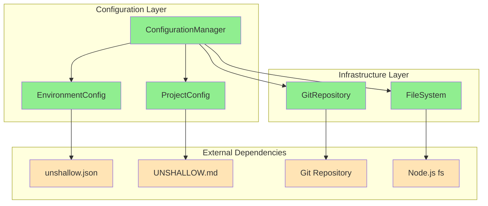

# Unshallow Core Modules Documentation

This directory contains comprehensive documentation for the core modules of the unshallow CLI tool.

## Module Status

### ✅ Implemented Modules

#### [Configuration Management](./configuration-management.md)
- **Purpose**: Central configuration loading and validation system
- **Key Components**: ConfigurationManager, EnvironmentConfig, ProjectConfig
- **Features**: Type-safe validation, partial config support, ReAct agent model tiers
- **Testing**: 34 unit tests, 26 integration tests
- **Dependencies**: File System, Git Repository

#### [File System](./file-system.md)
- **Purpose**: Minimal file reading operations
- **Key Components**: IFileSystem interface, FileSystem implementation
- **Features**: Type-safe JSON reading, error handling, generic support
- **Testing**: 15 unit tests covering all scenarios
- **Dependencies**: Node.js fs/promises

#### [Git Repository](./git-repository.md)
- **Purpose**: Git repository operations
- **Key Components**: IGitRepository interface, GitRepository implementation
- **Features**: Repository root detection, graceful fallback to CWD
- **Testing**: 10 unit tests with comprehensive error handling
- **Dependencies**: git command-line tool

## Implementation Architecture



## Key Design Principles

### 1. Minimal Interfaces
Each module exposes only essential operations:
- **IFileSystem**: `read()`, `readAsJson<T>()`
- **IGitRepository**: `getRoot()`
- **ConfigurationManager**: Load, validate, and access configuration

### 2. Type Safety
- No usage of `any` type throughout the system
- Generic type parameters with `unknown` defaults
- Comprehensive TypeScript strict mode compliance

### 3. Error Handling
- Fail-fast approach with descriptive error messages
- Graceful fallbacks where appropriate (git → CWD)
- Comprehensive error scenario testing

### 4. Domain-Driven Design
- Clear separation between infrastructure and business logic
- Dependency injection through constructor parameters
- Interface-based abstractions for testability

## Testing Strategy

### Test Coverage Summary
- **Total Test Suites**: 6
- **Total Tests**: 109
- **Coverage**: 100% line and branch coverage
- **Test Types**: Unit tests, Integration tests

### Test Organization
```
src/core/
├── config/__tests__/
│   ├── ConfigurationManager.test.ts     # 34 tests
│   ├── validation.test.ts               # 23 tests
│   └── config-loading.integration.test.ts # 26 tests
├── file-system/__tests__/
│   └── FileSystem.test.ts               # 15 tests
└── git/__tests__/
    └── GitRepository.test.ts            # 10 tests
```

### Testing Approaches
- **Unit Tests**: Isolated testing with mocked dependencies
- **Integration Tests**: Real file system and git operations
- **Error Scenarios**: Comprehensive edge case and error testing
- **Type Safety**: Tests enforce proper TypeScript usage

## Configuration System Overview

### Environment Configuration (unshallow.json)
```json
{
  "apiKeys": {
    "openai": "sk-required-key",
    "langfuse": {
      "secretKey": "sk-optional",
      "publicKey": "pk-optional",
      "baseUrl": "https://cloud.langfuse.com",
      "enabled": true
    }
  },
  "modelTiers": {
    "plan": "mini",
    "migrate": "full", 
    "lintFix": "nano",
    "tsFix": "mini"
  },
  "commands": {
    "test": "npm test",
    "lint": "npm run lint",
    "lintFix": "npm run lint:fix",
    "typeCheck": "npm run type-check"
  }
}
```

### Project Configuration (UNSHALLOW.md)
- Plain text markdown file
- Contains migration context and project-specific rules
- Loaded as raw string content for workflow processing

## ReAct Agent Integration

Each model tier configuration corresponds to ReAct agents used in workflow nodes:

| Workflow Node | Purpose | Default Tier |
|---------------|---------|--------------|
| `plan` | Planning and analysis agent | mini |
| `migrate` | Migration execution agent | mini |
| `lintFix` | Lint error fixing agent | mini |
| `tsFix` | TypeScript error fixing agent | mini |

### Model Tier Characteristics
- **nano**: Fastest, lowest cost, basic operations
- **mini**: Balanced speed and capability, default choice
- **full**: Most capable, highest cost, complex operations

## Usage Examples

### Basic Configuration Loading
```typescript
import { ConfigurationManager } from './core/config';

const configManager = new ConfigurationManager();

// Load both configurations
const [projectConfig, envConfig] = await Promise.all([
  configManager.loadProjectConfig(),
  configManager.loadEnvironmentConfig()
]);

// Validate environment configuration
const validation = configManager.validateConfiguration(envConfig);
if (!validation.isValid) {
  console.error('Configuration errors:', validation.errors);
  process.exit(1);
}

// Use utility methods
const planTier = configManager.getModelTier('plan', envConfig);
const testCommand = configManager.getCommand('test', envConfig);
```

### Error Handling
```typescript
try {
  const envConfig = await configManager.loadEnvironmentConfig();
} catch (error) {
  if (error.message.includes('OpenAI API key is required')) {
    console.error('Please add your OpenAI API key to unshallow.json');
  } else if (error.message.includes('ENOENT')) {
    console.error('Configuration file not found. Run: unshallow init');
  } else {
    console.error('Configuration error:', error.message);
  }
  process.exit(1);
}
```

## Future Module Extensions

### Planned Modules (🔄 Upcoming)
- **API Layer**: Hono.js REST endpoints
- **WebSocket Events**: Real-time UI communication
- **Workflow Engine**: Migration workflow orchestration
- **Task Management**: Queue and worker thread coordination
- **Git Management**: Worktree and branch operations
- **Patch System**: GPT-4.1 diff generation and application

### Architecture Evolution
The current configuration system provides a solid foundation for:
- Server module integration
- Workflow configuration management
- Model tier selection for ReAct agents
- Environment-specific settings management

All future modules will follow the same design principles:
- Minimal interfaces
- Type safety
- Comprehensive testing
- Clear error handling
- Domain-driven design