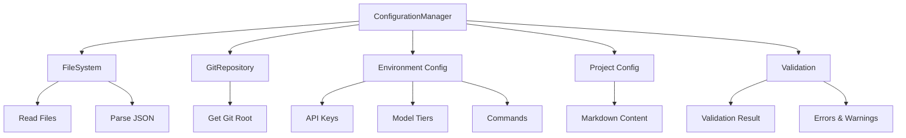

# Configuration Management Module

## Overview

The Configuration Management module provides a centralized system for loading, validating, and accessing project and environment configurations. It supports both plain text project configuration (`UNSHALLOW.md`) and structured environment configuration (`unshallow.json`).

## Architecture



## Core Components

### 1. ConfigurationManager

Main class that orchestrates configuration loading and provides utility methods.

**Key Methods:**
- `loadProjectConfig()`: Loads UNSHALLOW.md content
- `loadEnvironmentConfig()`: Loads and validates unshallow.json
- `validateConfiguration()`: Validates environment config
- `getModelTier()`: Returns model tier for workflow nodes
- `getCommand()`: Returns configured commands

### 2. Types

#### EnvironmentConfig
```typescript
interface EnvironmentConfig {
  apiKeys: {
    openai: string;
    langfuse: LangfuseConfig | null;
  };
  modelTiers: {
    plan: ModelTier;        // ReAct agent for planning
    migrate: ModelTier;     // ReAct agent for migration
    lintFix: ModelTier;     // ReAct agent for lint fixing
    tsFix: ModelTier;       // ReAct agent for TypeScript fixing
  };
  commands: {
    test: string;
    lint: string;
    lintFix: string;
    typeCheck: string;
  };
}
```

#### ProjectConfig
```typescript
interface ProjectConfig {
  content: string;    // Raw text content of UNSHALLOW.md
  filePath?: string;
}
```

#### ModelTier
```typescript
type ModelTier = 'nano' | 'mini' | 'full';
```

### 3. File Dependencies

- **FileSystem**: Handles file reading operations
- **GitRepository**: Provides git repository root detection

## Configuration Files

### UNSHALLOW.md
- Plain text markdown file
- Contains project-specific migration context and rules
- Read as raw text content
- Located at git repository root

### unshallow.json
- Structured JSON configuration
- Contains API keys, model tiers, and command configurations
- Required OpenAI API key
- Located at git repository root

#### Example unshallow.json:
```json
{
  "apiKeys": {
    "openai": "sk-your-api-key",
    "langfuse": {
      "secretKey": "sk-langfuse-key",
      "publicKey": "pk-langfuse-key",
      "baseUrl": "https://cloud.langfuse.com",
      "enabled": true
    }
  },
  "modelTiers": {
    "plan": "mini",
    "migrate": "full",
    "lintFix": "nano",
    "tsFix": "mini"
  },
  "commands": {
    "test": "npm test",
    "lint": "npm run lint",
    "lintFix": "npm run lint:fix",
    "typeCheck": "npm run type-check"
  }
}
```

## Default Values

When partial configuration is provided, the system applies these defaults:

### Model Tiers
- All workflow nodes default to `"mini"`

### Commands
- `test`: `"npm test"`
- `lint`: `"npm run lint"`
- `lintFix`: `"npm run lint:fix"`
- `typeCheck`: `"npm run type-check"`

### API Keys
- `langfuse`: `null` (disabled by default)

## Validation

The configuration system performs comprehensive validation:

### Required Fields
- `apiKeys.openai`: Must be present and non-empty

### Model Tier Validation
- Must be one of: `"nano"`, `"mini"`, `"full"`
- Invalid tiers generate specific error messages

### Error Handling
- Missing configuration files throw descriptive errors
- Malformed JSON files are caught and reported
- All errors include file paths for debugging

## Usage Examples

### Basic Usage
```typescript
const configManager = new ConfigurationManager();

// Load project configuration
const projectConfig = await configManager.loadProjectConfig();
console.log(projectConfig.content);

// Load environment configuration
const envConfig = await configManager.loadEnvironmentConfig();

// Validate configuration
const validation = configManager.validateConfiguration(envConfig);
if (!validation.isValid) {
  console.error('Configuration errors:', validation.errors);
}
```

### Utility Methods
```typescript
// Get model tier for workflow node
const planTier = configManager.getModelTier('plan', envConfig);
const migrateTier = configManager.getModelTier('migrate', envConfig);

// Get configured commands
const testCommand = configManager.getCommand('test', envConfig);
const lintCommand = configManager.getCommand('lint', envConfig);
```

## Testing

The module includes comprehensive test coverage:

### Unit Tests
- **ConfigurationManager**: 34 test cases covering all methods
- **Validation**: 23 test cases for configuration validation logic
- **FileSystem**: 15 test cases for file operations
- **GitRepository**: 10 test cases for git operations

### Integration Tests
- **End-to-end**: 26 test cases with real file system and git operations
- **Complete flows**: Tests entire configuration loading process
- **Error scenarios**: Comprehensive error handling validation

### Test Structure
```
src/core/config/__tests__/
├── ConfigurationManager.test.ts       # Unit tests
├── validation.test.ts                  # Validation logic tests
└── config-loading.integration.test.ts # Integration tests
```

## Error Scenarios

### File Not Found
```
Failed to load project configuration from /path/to/UNSHALLOW.md: ENOENT: no such file or directory
```

### Missing OpenAI Key
```
Failed to load environment configuration from /path/to/unshallow.json: OpenAI API key is required in unshallow.json
```

### Invalid Model Tier
```
Invalid model tier for plan: invalid-tier
```

## ReAct Agent Integration

Each model tier configuration corresponds to ReAct agents used in workflow nodes:

- **plan**: Planning and analysis agent
- **migrate**: Migration execution agent  
- **lintFix**: Lint error fixing agent
- **tsFix**: TypeScript error fixing agent

The tier selection affects the underlying model used for each agent, balancing cost and capability.