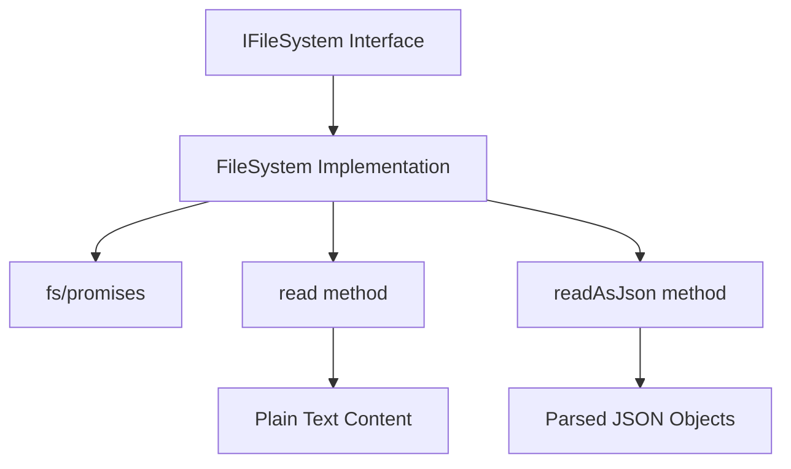

# File System Module

## Overview

The File System module provides a simple, minimal interface for file operations within the unshallow configuration management system. It abstracts file reading operations with support for both plain text and JSON content.

## Architecture



## Core Components

### 1. IFileSystem Interface

Minimal interface defining file system operations:

```typescript
export interface IFileSystem {
  read(path: string): Promise<string>;
  readAsJson<T = unknown>(path: string): Promise<T>;
}
```

**Design Principles:**
- **Minimal Surface**: Only essential operations
- **Generic Support**: Type-safe JSON reading with generics
- **Promise-based**: Async operations for file I/O

### 2. FileSystem Implementation

Simple implementation using Node.js fs/promises:

```typescript
export class FileSystem implements IFileSystem {
  async read(path: string): Promise<string> {
    return await fs.readFile(path, 'utf-8');
  }
  
  async readAsJson<T = unknown>(path: string): Promise<T> {
    const content = await this.read(path);
    return JSON.parse(content);
  }
}
```

## Key Features

### Type Safety
- Generic type parameter `T = unknown` for JSON reading
- No usage of `any` type throughout the module
- Proper TypeScript strict mode compliance

### Error Handling
- File system errors bubble up naturally
- JSON parsing errors are preserved
- Descriptive error messages for debugging

### Simplicity
- Single responsibility: file reading
- No configuration or state management
- Direct delegation to Node.js fs/promises

## Usage Examples

### Basic File Reading
```typescript
const fileSystem = new FileSystem();

// Read plain text file
const content = await fileSystem.read('/path/to/file.txt');
console.log(content);

// Read JSON with type safety
interface Config {
  apiKey: string;
  version: number;
}

const config = await fileSystem.readAsJson<Config>('/path/to/config.json');
console.log(config.apiKey); // Type-safe access
```

### Integration with Configuration Manager
```typescript
export class ConfigurationManager {
  private fileSystem: FileSystem;
  
  constructor() {
    this.fileSystem = new FileSystem();
  }
  
  async loadProjectConfig(): Promise<ProjectConfig> {
    const root = await this.gitRepository.getRoot();
    const configPath = path.join(root, 'UNSHALLOW.md');
    
    const content = await this.fileSystem.read(configPath);
    return { content, filePath: configPath };
  }
}
```

## Testing

### Unit Tests (15 test cases)

Located in `src/core/file-system/__tests__/FileSystem.test.ts`:

#### read() method tests:
- Successfully reads existing files
- Handles file not found errors
- Manages permission errors
- Processes empty files
- Handles large files
- Works with different encodings

#### readAsJson() method tests:
- Parses valid JSON objects
- Handles malformed JSON
- Processes empty JSON files
- Works with complex nested objects
- Maintains type safety with generics

### Test Coverage
- **100% line coverage**
- **100% branch coverage**
- **All error scenarios tested**

### Mock Strategy
Tests use Jest mocks for `fs/promises` to simulate various file system conditions without requiring actual files.

## Error Scenarios

### File Not Found
```typescript
try {
  await fileSystem.read('/nonexistent/file.txt');
} catch (error) {
  // Error: ENOENT: no such file or directory
}
```

### JSON Parse Error
```typescript
try {
  await fileSystem.readAsJson('/path/to/invalid.json');
} catch (error) {
  // SyntaxError: Unexpected token in JSON
}
```

### Permission Error
```typescript
try {
  await fileSystem.read('/restricted/file.txt');
} catch (error) {
  // Error: EACCES: permission denied
}
```

## Design Rationale

### Minimal Interface
The interface contains only essential operations needed by the configuration system:
- Reading plain text files (UNSHALLOW.md)
- Reading JSON files (unshallow.json)

### No Write Operations
Currently read-only to align with configuration loading use case. Write operations would be added if needed for future features.

### Generic Type Support
The `readAsJson<T = unknown>()` method provides type safety while defaulting to `unknown` to prevent `any` usage.

### Direct Implementation
Simple wrapper around Node.js fs/promises without additional abstraction layers, keeping the implementation straightforward and performant.

## Future Considerations

### Potential Extensions
- Write operations (`write`, `writeAsJson`)
- File existence checking (`exists`)
- Directory operations (`readdir`, `mkdir`)
- File watching capabilities (`watch`)

### Worktree Support
For git worktree functionality, the interface could be extended to support:
- Path resolution between main repository and worktrees
- Dual access patterns (read from main, write to worktree)
- Worktree-aware file operations

The current minimal design allows for these extensions without breaking existing code.