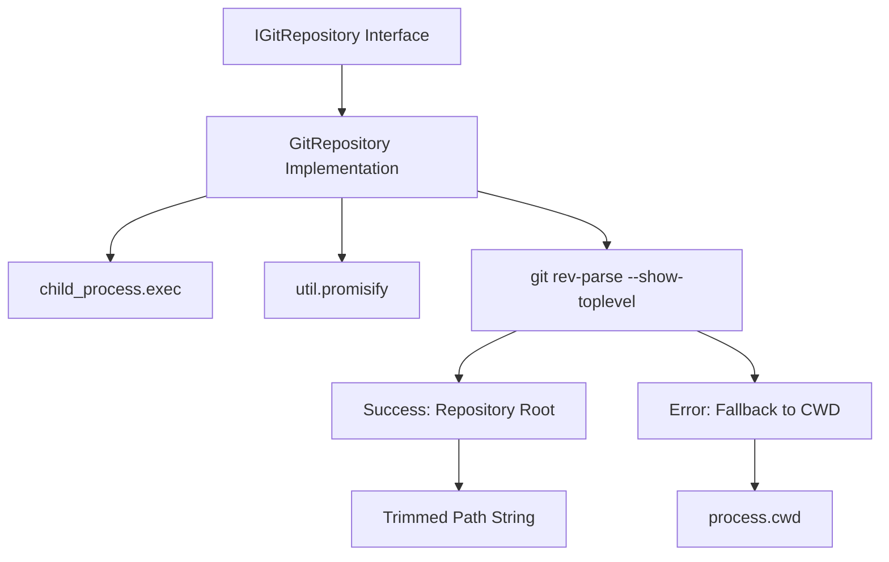

# Git Repository Module

## Overview

The Git Repository module provides minimal git repository operations for the unshallow configuration system. It focuses on the essential capability of determining the git repository root, which is crucial for locating configuration files.

## Architecture



## Core Components

### 1. IGitRepository Interface

Minimal interface for git operations:

```typescript
export interface IGitRepository {
  getRoot(): Promise<string>;
}
```

**Design Philosophy:**
- **Single Responsibility**: Only git root detection
- **Essential Operations**: Minimal surface area
- **Future-Ready**: Interface allows for extension

### 2. GitRepository Implementation

Implementation using git command-line interface:

```typescript
export class GitRepository implements IGitRepository {
  async getRoot(): Promise<string> {
    try {
      const { stdout } = await execAsync('git rev-parse --show-toplevel');
      return stdout.trim();
    } catch (error) {
      return process.cwd();
    }
  }
}
```

## Key Features

### Graceful Fallback
- **Git Repository**: Returns actual repository root
- **Non-Git Directory**: Falls back to current working directory
- **Error Handling**: All git errors result in CWD fallback

### Robust Error Handling
Handles various error scenarios:
- Not in a git repository
- Git command not found
- Permission errors
- Command timeouts
- Corrupted git repositories

### Output Processing
- **Whitespace Trimming**: Removes newlines and spaces from git output
- **Path Normalization**: Returns clean path strings
- **Cross-Platform**: Works on Windows, macOS, and Linux

## Usage Examples

### Basic Usage
```typescript
const gitRepo = new GitRepository();

const root = await gitRepo.getRoot();
console.log(`Repository root: ${root}`);

// Use for configuration file paths
const configPath = path.join(root, 'unshallow.json');
```

### Integration with Configuration Manager
```typescript
export class ConfigurationManager {
  private gitRepository: GitRepository;
  
  constructor() {
    this.gitRepository = new GitRepository();
  }
  
  async loadProjectConfig(): Promise<ProjectConfig> {
    const root = await this.gitRepository.getRoot();
    const configPath = path.join(root, 'UNSHALLOW.md');
    
    try {
      const content = await this.fileSystem.read(configPath);
      return { content, filePath: configPath };
    } catch (error) {
      throw new Error(`Failed to load project configuration from ${configPath}: ${error instanceof Error ? error.message : 'Unknown error'}`);
    }
  }
}
```

## Testing

### Unit Tests (10 test cases)

Located in `src/core/git/__tests__/GitRepository.test.ts`:

#### Success Scenarios:
- Returns git repository root when in git repo
- Trims whitespace from git output  
- Handles different repository paths correctly
- Processes git output with various whitespace patterns

#### Error Scenarios:
- Falls back to CWD when not in git repo
- Handles git command errors gracefully
- Manages git command timeouts
- Processes permission denied errors
- Handles corrupted git repository errors

#### Edge Cases:
- Empty git output
- Whitespace-only git output
- Various path formats (Unix, Windows)

### Test Coverage
- **100% line coverage**
- **100% branch coverage**
- **All error paths tested**

### Mock Strategy
Tests use Jest mocks for:
- `child_process.exec` to simulate git command execution
- `util.promisify` to control async behavior
- Various error conditions and outputs

## Behavior Scenarios

### In Git Repository
```bash
$ pwd
/Users/developer/my-project

$ git rev-parse --show-toplevel
/Users/developer/my-project
```
**Result**: `/Users/developer/my-project`

### In Git Subdirectory
```bash
$ pwd
/Users/developer/my-project/src/components

$ git rev-parse --show-toplevel
/Users/developer/my-project
```
**Result**: `/Users/developer/my-project`

### Not in Git Repository
```bash
$ pwd
/Users/developer/random-folder

$ git rev-parse --show-toplevel
fatal: not a git repository (or any of the parent directories): .git
```
**Result**: `/Users/developer/random-folder` (fallback to CWD)

### Git Not Installed
```bash
$ git rev-parse --show-toplevel
bash: git: command not found
```
**Result**: `process.cwd()` (fallback to CWD)

## Error Handling Strategy

### Comprehensive Fallback
The module never throws errors - it always returns a usable path:

```typescript
async getRoot(): Promise<string> {
  try {
    const { stdout } = await execAsync('git rev-parse --show-toplevel');
    return stdout.trim();
  } catch (error) {
    // Any error results in CWD fallback
    return process.cwd();
  }
}
```

### Error Types Handled
- **Not a git repository**: Most common case
- **Permission denied**: Git directory access issues
- **Command not found**: Git not installed
- **Timeout errors**: Git command hangs
- **Corrupted repository**: Invalid .git directory

## Design Rationale

### Minimal Interface
- Single method focuses on core requirement
- Easy to mock and test
- Clear separation of concerns

### Command-Line Git
- **Reliability**: Uses official git implementation
- **Compatibility**: Works with any git version
- **Simplicity**: Direct command execution

### Graceful Degradation
- **Always Functional**: Never blocks configuration loading
- **Reasonable Fallback**: CWD is sensible default
- **Silent Handling**: Errors don't propagate upward

## Performance Considerations

### Command Execution Overhead
- Single subprocess spawn per call
- Minimal for configuration loading use case
- Could be cached if called frequently

### Optimization Opportunities
```typescript
// Potential caching implementation
export class GitRepository implements IGitRepository {
  private cachedRoot?: string;
  
  async getRoot(): Promise<string> {
    if (this.cachedRoot) {
      return this.cachedRoot;
    }
    
    // ... existing implementation
    this.cachedRoot = result;
    return result;
  }
}
```

## Future Extensions

### Potential Interface Additions
```typescript
export interface IGitRepository {
  getRoot(): Promise<string>;
  getBranch(): Promise<string>;
  getCommitHash(): Promise<string>;
  isClean(): Promise<boolean>;
  createWorktree(path: string, branch: string): Promise<void>;
}
```

### Worktree Operations
For the full unshallow implementation, git worktree support would be essential:
- Creating isolated workspaces
- Branch management
- Cleanup operations
- Path resolution between main repo and worktrees

The current minimal design provides a solid foundation for these future capabilities.