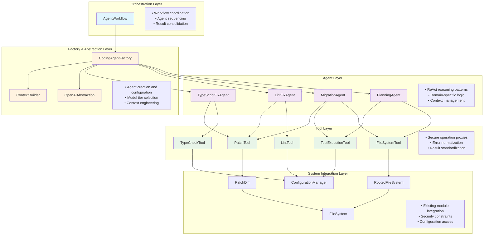
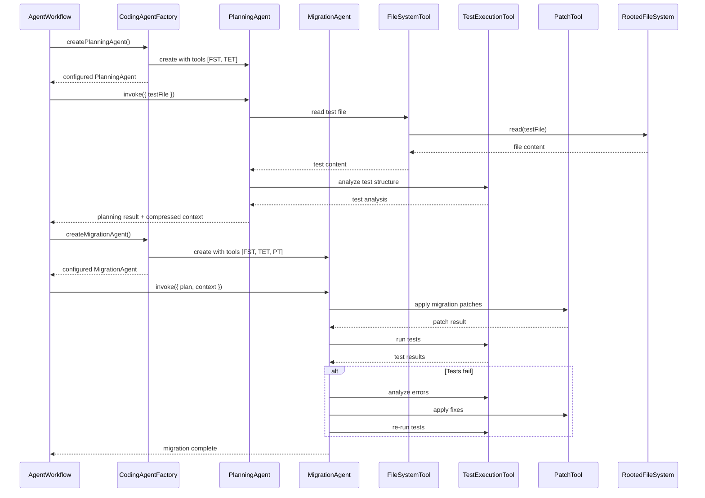
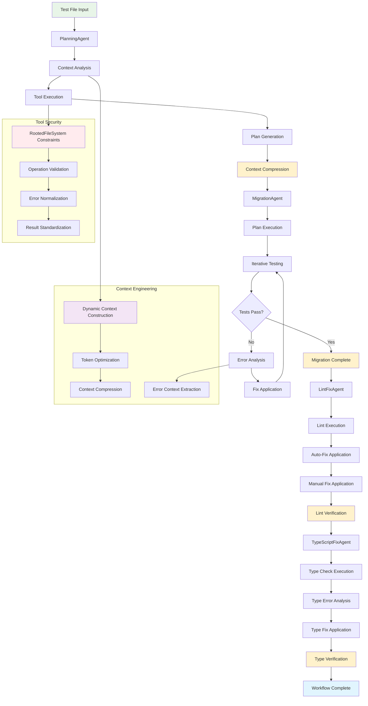

# Coding Agents Subsystem

## Introduction

The Coding Agents Subsystem implements a sophisticated multi-agent architecture for automating code migration workflows using LangGraph's prebuilt ReAct agents. It consists of four specialized agents (Planning, Migration, LintFix, and TypeScriptFix) that work together through a curated toolkit to transform Enzyme tests into React Testing Library implementations.

The subsystem replaces traditional workflow nodes with intelligent agents that can reason about code, execute tools iteratively, and solve complex migration problems through context-aware decision making. Each agent operates through secure tool proxies that integrate with existing system modules (FileSystem, PatchDiff, Configuration) while maintaining architectural consistency and security boundaries.

## Table of Contents

- [Purpose](#purpose)
- [Architecture](#architecture)
- [Module Interactions](#module-interactions)
- [Data Flow](#data-flow)
- [Design Decisions](#design-decisions)
- [Error Handling](#error-handling)
- [Test Surface](#test-surface)

## Purpose

The Coding Agents Subsystem addresses several critical requirements for intelligent code migration:

- **Intelligent Reasoning**: Replaces rigid workflow nodes with agents that can analyze, plan, and adapt their approach based on code context and error feedback
- **Tool Composition**: Provides a secure, modular toolkit that allows agents to interact with existing system modules through well-defined interfaces
- **Context Engineering**: Implements sophisticated context management and compression techniques to optimize token usage while preserving essential information
- **Iterative Problem Solving**: Enables agents to work through complex migration issues using feedback loops and retry mechanisms
- **Security by Design**: Ensures all operations are constrained within project boundaries through RootedFileSystem integration
- **Model Flexibility**: Supports different AI model tiers per agent type, optimizing cost and performance based on task complexity

## Architecture

The subsystem implements a **four-layer architecture** with clear separation of concerns and dependency boundaries:



### Layer Responsibilities

- **Orchestration Layer**: Coordinates agent execution and consolidates results across the complete workflow
- **Agent Layer**: Implements domain-specific reasoning and decision making using LangGraph ReAct patterns
- **Factory & Abstraction Layer**: Handles agent creation, configuration, and context engineering
- **Tool Layer**: Provides secure, standardized interfaces for system operations
- **System Integration Layer**: Maintains existing module contracts and security boundaries

## Module Interactions

The agent workflow involves coordinated interactions between multiple layers:



### Key Interaction Patterns

1. **Factory-Mediated Creation**: All agents are created through the CodingAgentFactory with proper configuration
2. **Tool Proxy Pattern**: All system operations go through tool proxies that enforce security and standardization
3. **Context Compression**: Planning agents compress investigation context for efficient handoff to migration agents
4. **Iterative Feedback**: Migration and fix agents use test execution feedback to refine their approach
5. **Security Enforcement**: All file operations are constrained through RootedFileSystem boundaries

## Data Flow

Agent data flows through a sophisticated pipeline involving context engineering, tool execution, and result consolidation:



### Data Transformation Stages

1. **Context Construction**: Raw input → enriched context with project patterns and guidelines
2. **Plan Generation**: Context analysis → structured Gherkin migration plan
3. **Context Compression**: Full investigation → compressed essential context for handoff
4. **Iterative Execution**: Plan steps → code changes → test feedback → refinements
5. **Error Resolution**: Test failures → error analysis → targeted fixes → verification
6. **Quality Assurance**: Completed migration → lint fixes → type fixes → final validation

## Design Decisions

### LangGraph ReAct Agent Foundation

**Implementation**: All agents use LangGraph's `createReactAgent` as the foundation
```typescript
const agent = createReactAgent({
  llm: model,
  tools: agentTools,
  stateModifier: systemPrompt,
  responseFormat: structuredOutputSchema
});
```

**Rationale**: Leverages proven ReAct patterns while avoiding custom agent implementation complexity.

**Benefits**:
- Mature reasoning and tool execution patterns
- Built-in error handling and retry mechanisms
- Structured output support with Zod schemas
- Consistent behavior across all agent types

### Tool Proxy Architecture

**Implementation**: All system operations go through tool proxies that enforce security and standardization
```typescript
class FileSystemTool implements BaseTool {
  constructor(fileSystem: IFileSystem, rootPath: string) {
    this.rootedFileSystem = new RootedFileSystem(fileSystem, rootPath);
  }
  
  async execute(input: FileSystemInput) {
    // All operations constrained to rootPath
    return await this.rootedFileSystem[input.operation](input.path, input.content);
  }
}
```

**Rationale**: Maintains security boundaries while providing consistent interfaces.

**Benefits**:
- Security through RootedFileSystem constraints
- Standardized error handling across all tools
- Easy testing with mock implementations
- Clean integration with existing modules

### Context Engineering Strategy

**Implementation**: Multi-stage context optimization
```typescript
class ContextBuilder {
  static buildPlanningContext(testFile: string, config: ProjectConfig): string {
    return this.optimizeForPlanning(testFile, config);
  }
  
  static compressContext(planResult: PlanningResult, maxTokens: number): string {
    return this.extractEssentialContext(planResult, maxTokens);
  }
}
```

**Rationale**: Balances context richness with token efficiency for optimal agent performance.

**Benefits**:
- Optimized token usage across agent transitions
- Preserved essential information for decision making
- Scalable context management for complex migrations
- Reduced API costs through intelligent compression

### Agent Specialization Pattern

**Implementation**: Each agent focuses on a specific domain with curated tools
- **PlanningAgent**: Analysis and planning tools only
- **MigrationAgent**: File operations, testing, and patching
- **LintFixAgent**: Linting and fixing tools
- **TypeScriptFixAgent**: Type checking and fixing tools

**Rationale**: Domain expertise leads to better outcomes than generalist approaches.

**Benefits**:
- Focused prompts and context for better performance
- Specialized error handling per domain
- Clear responsibility boundaries
- Easier testing and validation

### Structured Output Enforcement

**Implementation**: All agents return structured output using Zod schemas
```typescript
const PlanningResultSchema = z.object({
  plan: z.string().describe('Gherkin-style migration plan'),
  testsToUpdate: z.array(z.string()),
  compressedContext: z.string(),
  confidence: z.number().min(0).max(1)
});
```

**Rationale**: Ensures consistent, parseable results for downstream processing.

**Benefits**:
- Type-safe result handling
- Validation of agent outputs
- Consistent data structures across agents
- Clear contracts for workflow orchestration

## Error Handling

The subsystem implements **multi-layer error handling** with context preservation and intelligent retry mechanisms:

### Error Categories

1. **Agent Execution Errors**
   - Tool execution failures
   - Reasoning loop failures
   - Context overflow issues
   - Model API failures

2. **Tool Operation Errors**
   - File system access denied
   - Test execution failures
   - Lint/type check failures
   - Patch application errors

3. **Context Engineering Errors**
   - Context compression failures
   - Token limit exceeded
   - Invalid context format
   - Context handoff failures

4. **Workflow Orchestration Errors**
   - Agent creation failures
   - Configuration errors
   - Sequencing failures
   - Result consolidation errors

### Error Propagation Strategy

```typescript
// Layer 1: Tool Layer (operation-specific errors)
FileSystemTool.execute() throws → "EACCES: permission denied"

// Layer 2: Agent Layer (domain-specific context)
PlanningAgent.invoke() throws → "Failed to analyze test file: EACCES: permission denied"

// Layer 3: Factory Layer (configuration context)
CodingAgentFactory.createAgent() throws → "Cannot create PlanningAgent: Failed to analyze test file: EACCES: permission denied"

// Layer 4: Workflow Layer (business context)
AgentWorkflow.execute() throws → "Migration workflow failed at planning stage: Cannot create PlanningAgent: Failed to analyze test file: EACCES: permission denied"
```

### Recovery Mechanisms

- **Tool Failures**: Retry with exponential backoff for transient errors
- **Agent Failures**: Context adjustment and re-execution with modified prompts
- **Context Overflow**: Dynamic context compression and essential information extraction
- **Workflow Failures**: Checkpoint-based recovery allowing restart from last successful stage

### Error Context Preservation

```typescript
interface AgentError extends Error {
  agentType: 'planning' | 'migration' | 'lint-fix' | 'ts-fix';
  context: {
    currentState: WorkflowState;
    toolsUsed: string[];
    retryCount: number;
    lastSuccessfulOperation?: string;
  };
  recoveryHints: string[];
}
```

## Test Surface

The coding agents subsystem uses **multi-level testing** strategies to verify functionality across all architectural layers:

### Integration Test Coverage

#### Complete Agent Workflow Test
Tests the full end-to-end workflow with all agents working together:

```typescript
describe('[integration]: Complete Agent Workflow Tests', () => {
  it('should execute complete migration workflow from Enzyme to RTL', async () => {
    // Real project setup
    const tempProject = await createTempProject();
    await setupEnzymeTest(tempProject, 'Component.test.tsx');
    
    // Agent factory with real dependencies
    const agentFactory = new CodingAgentFactory(
      configManager,
      openaiAbstraction,
      new FileSystem(),
      tempProject
    );
    
    // Complete workflow execution
    const workflow = new AgentWorkflow(agentFactory);
    const result = await workflow.execute('src/Component.test.tsx');
    
    // Verification of all stages
    expect(result.planningComplete).toBe(true);
    expect(result.migrationComplete).toBe(true);
    expect(result.testsPass).toBe(true);
    expect(result.lintingClean).toBe(true);
    expect(result.typesValid).toBe(true);
    
    // Verification of file changes
    const migratedTest = await fs.readFile(path.join(tempProject, 'src/Component.test.tsx'), 'utf8');
    expect(migratedTest).toContain('@testing-library/react');
    expect(migratedTest).not.toContain('enzyme');
  });
});
```

**What this tests**:
- Complete agent orchestration and sequencing
- Real file system operations through tool proxies
- Actual test execution and result parsing
- Context engineering and compression between agents
- Error handling and recovery across the full workflow

#### Individual Agent Integration Tests
Tests each agent with real dependencies in isolation:

```typescript
describe('[integration]: PlanningAgent Integration Tests', () => {
  it('should analyze real Enzyme test and generate comprehensive plan', async () => {
    // Real test file setup
    const testContent = await fs.readFile('fixtures/enzyme-test.tsx', 'utf8');
    await fs.writeFile(path.join(tempProject, 'test.tsx'), testContent);
    
    // Real agent creation
    const agent = agentFactory.createPlanningAgent();
    
    // Agent execution with real tools
    const result = await agent.invoke({
      testFile: 'test.tsx',
      projectConfig: realProjectConfig
    });
    
    // Plan structure validation
    expect(result.plan).toMatch(/Feature: Migrate .+ from Enzyme to RTL/);
    expect(result.testsToUpdate).toHaveLength(3);
    expect(result.compressedContext).toContain('enzyme patterns');
    expect(result.confidence).toBeGreaterThan(0.8);
  });
});
```

#### Tool Proxy Integration Tests
Verifies tools correctly integrate with existing modules:

```typescript
describe('[integration]: Tool Proxy Integration Tests', () => {
  it('should proxy file operations through RootedFileSystem correctly', async () => {
    // Real file system with root constraint
    const fileSystem = new FileSystem();
    const tool = new FileSystemTool(fileSystem, tempProject);
    
    // Test read operation
    await fs.writeFile(path.join(tempProject, 'test.js'), 'test content');
    const content = await tool.execute({
      operation: 'read',
      path: 'test.js'
    });
    expect(content).toBe('test content');
    
    // Test security constraint
    await expect(tool.execute({
      operation: 'read',
      path: '../outside-project.js'
    })).rejects.toThrow('outside project root');
  });
  
  it('should execute tests and parse results correctly', async () => {
    const tool = new TestExecutionTool(configManager);
    
    const result = await tool.execute({
      operation: 'run',
      filePath: 'src/failing-test.js'
    });
    
    expect(result.success).toBe(false);
    expect(result.errors).toHaveLength(2);
    expect(result.errors[0]).toMatchObject({
      type: 'assertion',
      message: expect.stringContaining('Expected'),
      file: 'src/failing-test.js',
      line: 15
    });
  });
});
```

### Error Simulation Tests
Verify error handling and recovery mechanisms:

```typescript
describe('[integration]: Error Handling Tests', () => {
  it('should handle and recover from tool failures gracefully', async () => {
    // Simulate file system error
    const mockFileSystem = new MockFileSystem();
    mockFileSystem.read.mockRejectedValueOnce(new Error('EACCES: permission denied'));
    
    const tool = new FileSystemTool(mockFileSystem, '/project');
    const agent = createAgentWithTool(tool);
    
    // Agent should handle error and retry
    const result = await agent.invoke({ testFile: 'test.js' });
    
    expect(result.success).toBe(true); // Eventually succeeds
    expect(result.retryCount).toBe(1);
    expect(mockFileSystem.read).toHaveBeenCalledTimes(2);
  });
});
```

These integration tests verify that the coding agents subsystem works correctly as a complete system, using real dependencies and file operations to validate the sophisticated interactions between agents, tools, and existing modules.