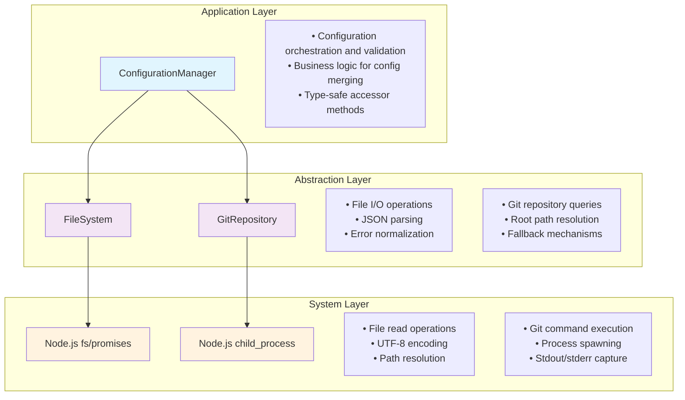
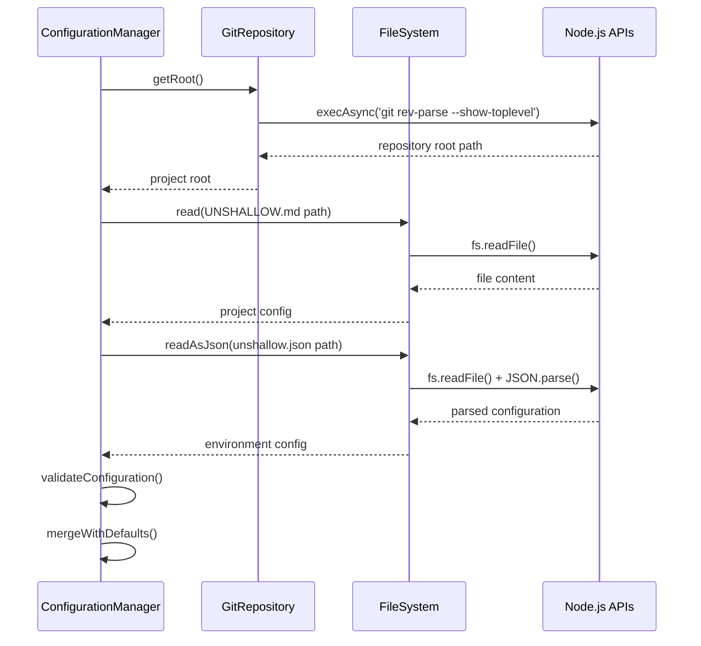
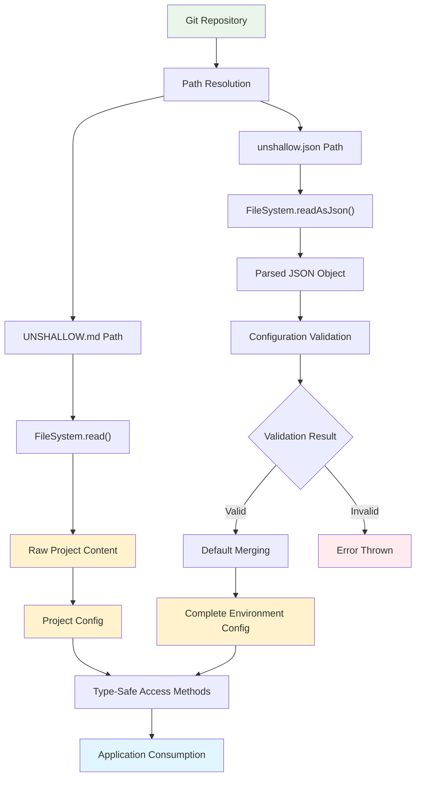

# Configuration Subsystem

## Introduction

The Configuration Subsystem handles loading and managing project and environment settings for Unshallow. It reads two types of configuration files: `UNSHALLOW.md` (project context as plain text) and `unshallow.json` (structured environment settings like API keys and model tiers). 

The subsystem automatically detects the git repository root, loads both configuration files, validates the settings, applies defaults for missing values, and provides type-safe access to configuration throughout the application. It follows a fail-fast approach, throwing descriptive errors if required configuration is missing or invalid.

## Table of Contents

- [Purpose](#purpose)
- [Architecture](#architecture)
- [Module Interactions](#module-interactions)
- [Data Flow](#data-flow)
- [Design Decisions](#design-decisions)
- [Error Handling](#error-handling)
- [Test Surface](#test-surface)

## Purpose

The Configuration Subsystem serves as a central abstraction layer for managing project and environment-specific settings within the Unshallow application. It addresses several critical internal requirements:

- **Separation of Concerns**: Isolates configuration logic from business logic, preventing tight coupling between application features and configuration sources
- **Type Safety**: Provides compile-time guarantees for configuration structure and content through TypeScript interfaces
- **Fail-Fast Philosophy**: Validates configuration at startup to prevent runtime failures in downstream systems
- **Abstraction of I/O Operations**: Decouples configuration loading from specific file system and git operations, enabling easier testing and future extensibility
- **Default Management**: Implements a layered approach to configuration merging, ensuring sane defaults while allowing customization

## Architecture

The subsystem implements a **three-layered architecture** with clear dependency boundaries:



### Layer Responsibilities

- **Application Layer**: Coordinates configuration loading workflow and provides business logic
- **Abstraction Layer**: Provides clean interfaces over system operations with proper error handling
- **System Layer**: Direct interaction with Node.js APIs and external processes

## Module Interactions

The configuration loading process involves coordinated interactions between modules:



### Key Interaction Patterns

1. **Sequential Dependency**: Git root must be determined before file paths can be resolved
2. **Independent Loading**: Project and environment configs can be loaded independently after path resolution
3. **Internal Validation**: ConfigurationManager handles all validation and merging internally
4. **Error Propagation**: Errors from lower layers are caught and re-thrown with additional context

## Data Flow

Configuration data flows through a series of transformations from file system to application consumption:



### Data Transformation Stages

1. **Path Resolution**: Git root + filename → absolute file paths
2. **File Reading**: File paths → raw file content
3. **Parsing**: Raw content → structured data (JSON parsing for environment config)
4. **Validation**: Structured data → validated configuration or error
5. **Merging**: Partial config + defaults → complete configuration
6. **Access**: Complete configuration → type-safe getters

## Design Decisions

### Separate FileSystem and GitRepository Modules

**Rationale**: Each module has a single, well-defined responsibility and can be tested independently.

- **FileSystem**: Handles file I/O operations with a focus on reading and parsing
- **GitRepository**: Manages git-specific operations with graceful fallback behavior

**Benefits**:
- Clear separation of concerns
- Independent testability with different mocking strategies
- Different error handling requirements (file I/O vs. git operations)

### Dependency Injection Pattern

**Current Implementation**: ConfigurationManager creates its own dependencies
```typescript
export class ConfigurationManager {
  private fileSystem: FileSystem;
  private gitRepository: GitRepository;
  
  constructor() {
    this.fileSystem = new FileSystem();
    this.gitRepository = new GitRepository();
  }
}
```

**Rationale**: Simplifies usage while maintaining abstraction benefits for testing.

**Future Evolution**: As the system grows, we can move to constructor injection:
```typescript
constructor(
  fileSystem: IFileSystem = new FileSystem(),
  gitRepository: IGitRepository = new GitRepository()
) {
  this.fileSystem = fileSystem;
  this.gitRepository = gitRepository;
}
```

### Fail-Fast Philosophy

**Implementation**: Configuration loading throws descriptive errors immediately when problems are detected.

**Examples**:
```typescript
// File not found
throw new Error(`Failed to load project configuration from ${configPath}: ENOENT: no such file or directory`);

// Missing required field
throw new Error('OpenAI API key is required in unshallow.json');

// Invalid model tier
throw new Error('Invalid model tier for plan: invalid-tier');
```

**Benefits**:
- Problems are caught at startup rather than during workflow execution
- Clear, actionable error messages help developers fix configuration issues
- Prevents undefined behavior in downstream systems

### Type Safety Approach

**Implementation**: Strong TypeScript typing throughout the configuration flow
```typescript
interface EnvironmentConfig {
  apiKeys: {
    openai: string;
    langfuse: LangfuseConfig | null;
  };
  modelTiers: {
    plan: ModelTier;
    migrate: ModelTier;
    lintFix: ModelTier;
    tsFix: ModelTier;
  };
  // ...
}
```

**Benefits**:
- Compile-time validation of configuration structure
- IDE support with autocomplete and error detection
- Prevents runtime type errors in configuration access

## Error Handling

The subsystem implements **layered error propagation** with context enrichment at each level:

### Error Categories

1. **File System Errors**
   - File not found (`ENOENT`)
   - Permission denied (`EACCES`) 
   - Invalid JSON syntax (`SyntaxError`)

2. **Git Errors**
   - Not in git repository
   - Git command not found
   - Permission issues

3. **Validation Errors**
   - Missing required fields
   - Invalid model tier values
   - Malformed configuration structure

### Error Propagation Strategy

```typescript
// Layer 1: System Layer (raw errors)
fs.readFile() throws → ENOENT: no such file or directory

// Layer 2: Abstraction Layer (normalized errors)
FileSystem.read() throws → ENOENT: no such file or directory

// Layer 3: Application Layer (contextualized errors)  
ConfigurationManager.loadProjectConfig() throws → 
  "Failed to load project configuration from /path/to/UNSHALLOW.md: ENOENT: no such file or directory"
```

### Recovery Mechanisms

- **Git Operations**: Falls back to `process.cwd()` when not in a git repository
- **Partial Configuration**: Merges user configuration with defaults for missing values
- **Validation**: Provides specific error messages for each validation failure

## Test Surface

The configuration subsystem is tested through **integration tests** that verify the complete end-to-end flow using real file system and git operations. These tests ensure the subsystem works correctly as a cohesive unit.

### Integration Test Coverage

#### Complete Configuration Flow Test
Tests the full workflow with all configuration options populated:

```typescript
describe('[integration]: Configuration Loading End-to-End Tests', () => {
  it('should load, validate, and provide access to complete configuration end-to-end', async () => {
    // Real git repository setup
    await execAsync('git init');
    
    // Real file creation
    await fs.writeFile('UNSHALLOW.md', projectContent);
    await fs.writeFile('unshallow.json', JSON.stringify(completeConfig));
    
    // Complete configuration loading
    const [projectConfig, envConfig] = await Promise.all([
      configManager.loadProjectConfig(),
      configManager.loadEnvironmentConfig()
    ]);
    
    // Validation and utility method testing
    const validation = configManager.validateConfiguration(envConfig);
    const modelTier = configManager.getModelTier('plan', envConfig);
    const command = configManager.getCommand('test', envConfig);
  });
});
```

**What this tests**:
- Real git root detection
- Actual file I/O operations
- JSON parsing and validation
- Complete configuration merging
- Type-safe accessor methods
- Error handling with real file system

#### Minimal Configuration Flow Test
Tests the workflow with only required fields, verifying default application:

```typescript
it('should load, validate, and provide access to minimal configuration with defaults end-to-end', async () => {
  // Minimal configuration file
  const minimalConfig = {
    apiKeys: { openai: 'sk-minimal-test-key' }
  };
  
  // Verify defaults are applied correctly
  expect(envConfig.modelTiers.plan).toBe('mini');
  expect(envConfig.commands.test).toBe('npm test');
});
```

**What this tests**:
- Default value application
- Partial configuration handling
- Required field validation
- Graceful degradation

These integration tests verify that the configuration subsystem works correctly as a complete unit, using real file system and git operations to catch any issues with module interactions or data flow through the layers.