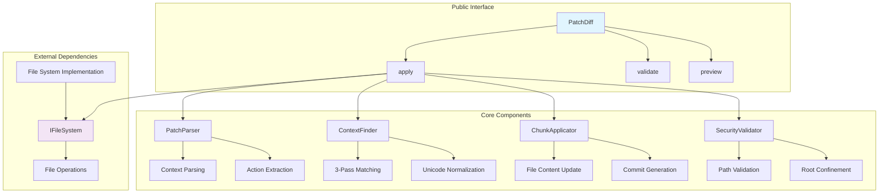
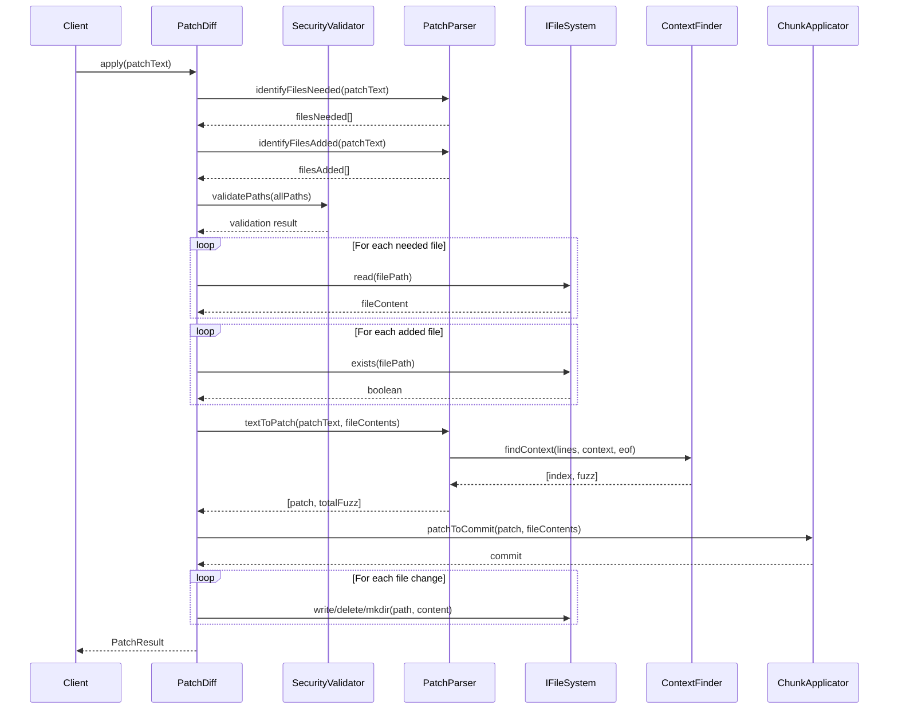
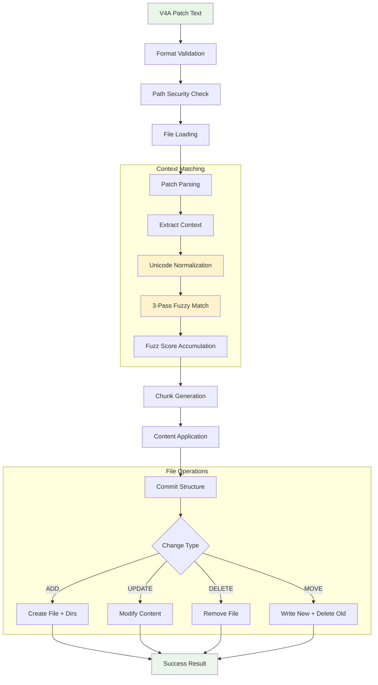
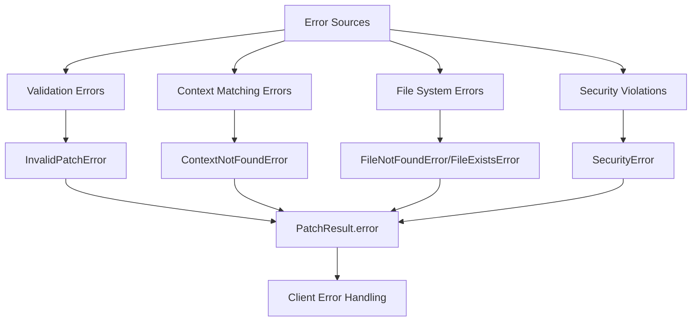

# Patch-Diff Subsystem

## Introduction

The Patch-Diff Subsystem provides context-based file patching capabilities using the V4A diff format. Unlike traditional line-based diffs, it locates code sections using surrounding context and hierarchical markers, making patches resilient to file changes and formatting variations. The subsystem handles Unicode normalization, fuzzy matching, security validation, and integrates with the file system abstraction for safe, atomic file operations.

## Table of Contents

- [Purpose](#purpose)
- [Architecture](#architecture)
- [Module Interactions](#module-interactions)
- [Data Flow](#data-flow)
- [Design Decisions](#design-decisions)
- [Error Handling](#error-handling)
- [Test Surface](#test-surface)

## Purpose

The Patch-Diff Subsystem serves as the core mechanism for applying AI-generated code changes within the Unshallow application. It addresses several critical requirements:

- **Context-Based Patching**: Eliminates brittleness of line-number-based diffs by using code context for location identification
- **AI Model Integration**: Provides a format that AI models can reliably generate without needing exact line numbers
- **Resilient Matching**: Handles formatting variations, Unicode differences, and minor code changes through fuzzy matching
- **Security-First Design**: Prevents path traversal attacks and ensures all operations stay within designated boundaries
- **Atomic Operations**: Ensures all changes in a patch succeed or fail together, preventing partial application states
- **File System Abstraction**: Works with any storage backend through the IFileSystem interface

## Architecture

The subsystem consists of five main components working together:

- **PatchDiff**: Main orchestrator that coordinates the entire patch application process
- **PatchParser**: Converts V4A text format into structured patch objects with validation
- **ContextFinder**: Implements sophisticated context matching with Unicode normalization and fuzzy matching
- **ChunkApplicator**: Applies parsed changes to file content and generates commit structures
- **SecurityValidator**: Ensures all file paths are safe and operations stay within boundaries

## Module Interactions

The interaction flow demonstrates the subsystem's coordinated approach:

1. **Validation Phase**: Security and format validation happen before any file operations
2. **Loading Phase**: Required files are loaded concurrently for efficiency
3. **Parsing Phase**: Context finding and patch structure generation with fuzz tracking
4. **Application Phase**: Atomic application of all changes through the file system

## Data Flow

Data flows through three main stages:

1. **Input Processing**: Text parsing, validation, and structure extraction
2. **Context Resolution**: Advanced matching with normalization and fuzz calculation
3. **File System Operations**: Safe, atomic changes with proper error handling

## Design Decisions

### Context-Based Identification

**Decision**: Use surrounding code context instead of line numbers for change location.

**Rationale**: 
- AI models can generate context more reliably than exact line numbers
- Resilient to file changes that don't affect the target code section
- Matches human mental model of code location ("in the calculate function")

**Implementation**: 3-pass fuzzy matching algorithm with configurable tolerance levels.

### Unicode Normalization

**Decision**: Normalize Unicode punctuation variants before context matching.

**Rationale**:
- AI models often emit ASCII variants of Unicode characters (EN DASH → hyphen)
- Prevents matching failures due to visually identical but different Unicode codepoints
- Maintains compatibility across different text encoders/decoders

**Implementation**: 19-character mapping table with NFC normalization covering common programming punctuation.

### Fuzzy Matching Strategy

**Decision**: Progressive whitespace tolerance with fuzz scoring.

**Implementation**:
- **Pass 1** (fuzz=0): Exact match after Unicode normalization
- **Pass 2** (fuzz=1): Ignore trailing whitespace differences  
- **Pass 3** (fuzz=100): Ignore all whitespace variations
- **EOF Penalty** (fuzz=10000+): High penalty for context found at wrong position

**Rationale**: Balances matching reliability with precision feedback to detect low-quality matches.

### Security-First Architecture

**Decision**: Comprehensive path validation and root confinement.

**Implementation**:
- Reject absolute paths and directory traversal attempts
- Resolve all paths against a configured root directory
- Validate before any file system operations

**Rationale**: Prevents path traversal attacks and ensures operations stay within designated project boundaries.

### Atomic Operations

**Decision**: All changes in a patch succeed or fail together.

**Implementation**: Parse and validate entire patch before applying any changes, with error handling that prevents partial states.

**Rationale**: Maintains consistency and prevents difficult-to-debug partial application scenarios.

## Error Handling

The subsystem implements a comprehensive error hierarchy:

### Error Categories

1. **Format Errors**: Malformed V4A syntax, missing sentinels, invalid operations
2. **Context Errors**: Unable to locate specified context within target files
3. **File System Errors**: Missing files, permission issues, disk space problems
4. **Security Errors**: Path traversal attempts, absolute paths, root boundary violations

### Error Propagation Strategy

- **Early Validation**: Catch format and security errors before file operations
- **Descriptive Messages**: Include file paths, line numbers, and specific failure reasons
- **Graceful Degradation**: Return structured error results rather than throwing exceptions
- **Fuzz Score Warnings**: High fuzz scores indicate potential matching issues

### Recovery Patterns

- **Validation First**: Use `validate()` method to check patches before applying
- **Preview Mode**: Use `preview()` to understand changes before execution
- **Fuzz Monitoring**: Monitor fuzz scores to detect degraded matching quality
- **Rollback Support**: File system abstraction enables implementation of rollback mechanisms

## Test Surface

The subsystem maintains comprehensive test coverage across three levels:

### Unit Test Coverage

- **PatchParser**: 25 tests covering syntax parsing, error scenarios, and edge cases
- **ContextFinder**: 28 tests covering fuzzy matching, Unicode normalization, and EOF handling
- **ChunkApplicator**: 20 tests covering content application and commit generation
- **SecurityValidator**: 22 tests covering path validation and security scenarios
- **PatchDiff**: 18 tests covering orchestration with mocked file system

### Integration Test Coverage

**Fixture-Based Testing**: 9 comprehensive scenarios using template→patch→expected patterns:

1. **simple-update**: Basic context matching and content replacement
2. **multiple-updates-single-file**: Multiple chunks in single file
3. **complex-update**: Advanced context scenarios with nested changes
4. **add-at-beginning**: File start position handling
5. **whitespace-fuzzy**: Fuzzy matching with whitespace variations
6. **move-file**: File relocation with content changes
7. **add-file**: New file creation with directory handling
8. **delete-file**: File removal operations
9. **hierarchical-updates**: Same method names in different classes using @@ markers

### Critical Test Scenarios

**Unicode Normalization**: Comprehensive testing of all 19 character mappings to ensure AI-generated patches match file content despite Unicode variations.

**Fuzzy Matching Validation**: Progressive fuzz testing to verify the 3-pass algorithm correctly handles common formatting variations while maintaining precision.

**Security Boundary Testing**: Extensive path traversal and boundary testing to ensure the security model prevents all known attack vectors.

**Error Scenario Coverage**: Systematic testing of all error conditions to ensure graceful handling and appropriate error reporting.

The test surface provides confidence in the subsystem's reliability for production use while serving as documentation for expected behavior and edge case handling.