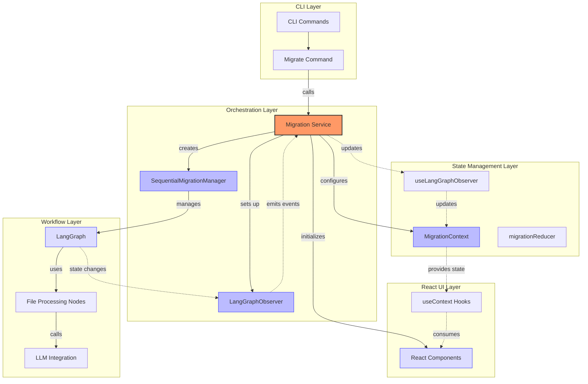
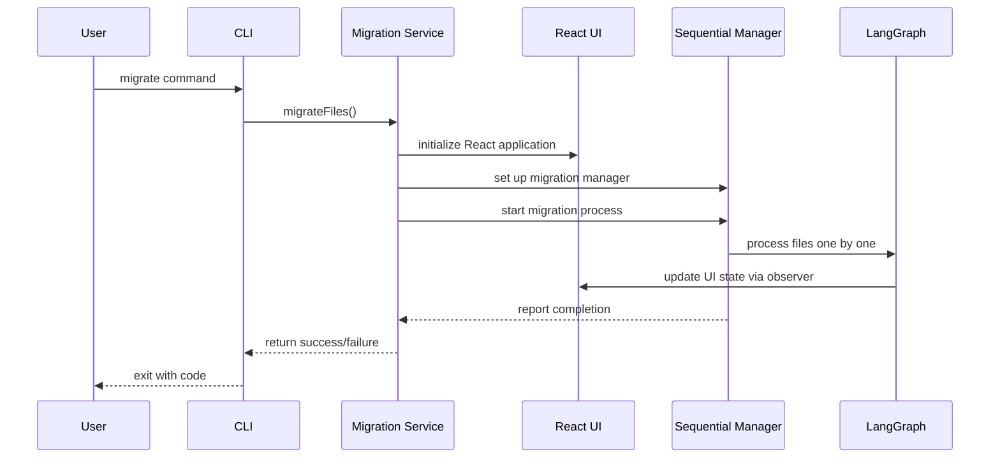

# High-Level Architecture

## Overview

The application follows a layered architecture that separates concerns between the CLI layer, Migration Service, workflow engine, and React UI. The CLI acts only as an entry point, while the Migration Service initializes the UI, manages state, and coordinates the entire migration process.

## Architecture Diagram

## Process Flow

This flow illustrates how:
1. CLI only initiates the process
2. Migration Service initializes the UI and manages the entire process
3. The UI is updated directly from the Migration Service

## Key Components

### 1. CLI Layer

- **CLI Commands**: Command-line interface for starting migrations
- **Migrate Command**: Handles file path parsing and migration initiation

This layer serves as a minimal entry point, with no UI responsibilities.

### 2. Migration Service

- **Service API**: Central service that receives CLI commands and orchestrates everything
- **UI Initialization**: Starts the React application when migration begins
- **Process Management**: Coordinates the entire migration process

This layer serves as the core of the application, responsible for initializing and managing all other components.

### 3. Workflow Layer (LangGraph Engine)

- **LangGraph**: Handles the complex workflow of migrating a single file through various processing steps
- **File Processing Nodes**: Individual processing steps like RTL conversion, linting, and TypeScript checking
- **LLM Integration**: Nodes that leverage LLMs for code conversion and refactoring

This layer operates on a per-file basis, processing one file at a time through the migration workflow.

### 4. Orchestration Layer

- **SequentialMigrationManager**: Coordinates the sequential processing of multiple files
- **LangGraphObserver**: Monitors LangGraph state changes and emits events

This layer manages the processing of multiple files and provides state updates to the UI.

### 5. State Management Layer

- **MigrationContext**: Provides application-wide state using React Context
- **migrationReducer**: Manages state transitions based on observed events
- **useLangGraphObserver**: Custom hook that connects the UI to migration state updates

This layer maintains the state for the React UI, providing a real-time view of the migration.

### 6. React UI Layer

- **React Components**: UI components that display migration status and results
- **useContext Hooks**: Component-level hooks that access the shared state

This layer presents the migration process to the user but is initialized and controlled by the Migration Service.

## Responsibility Separation

### CLI
- Parse command-line arguments
- Validate input path
- Call Migration Service
- Exit with appropriate code

### Migration Service
- Initialize React UI
- Set up state management
- Create and configure SequentialMigrationManager
- Start the migration process
- Relay events between components

### SequentialMigrationManager
- Process files one by one
- Manage LangGraph instances
- Track migration progress
- Report status to Migration Service

### React UI
- Display migration progress
- Show file statuses
- Visualize results

## Key Design Decisions

1. **CLI as Entry Point Only**: CLI just starts the process, Migration Service does everything else
2. **UI Initialization by Service**: React UI is started by the Migration Service, not separately
3. **Central Orchestration**: Migration Service initializes and coordinates all components
4. **Observable Process**: LangGraph state changes are observed and reflected in the UI
5. **Complete Encapsulation**: CLI doesn't need to know about UI, state, or migration details

This architecture ensures that the CLI remains a thin wrapper around the Migration Service, which handles all the complexity of the migration process including UI initialization, state management, and workflow coordination.

## Extension Points

The architecture allows for several extension points:

1. **Enhanced CLI Commands**: Additional command options or new commands
2. **Parallel Processing**: Could replace SequentialMigrationManager with a parallel version
3. **Different UI Technologies**: Could replace React with another UI framework
4. **Headless Operation**: Can run migrations without any UI attached
5. **Alternative LLM Integration**: LLM components can be swapped without affecting the architecture 