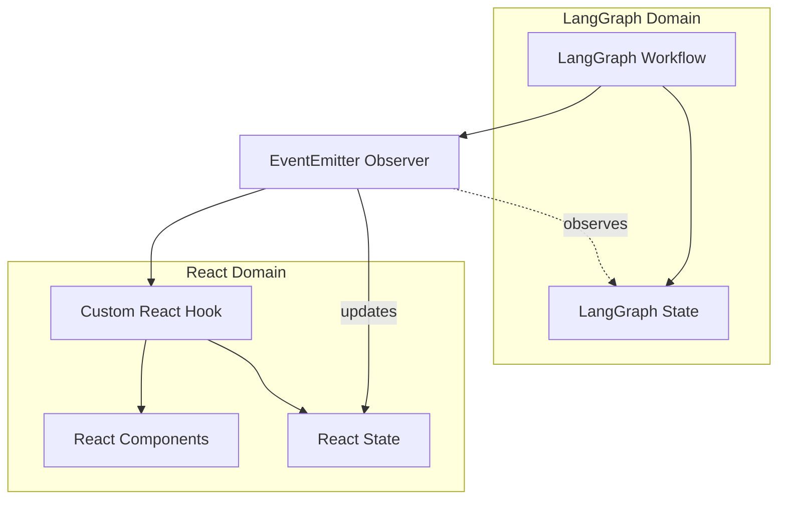

# LangGraph-React Integration: Observer Pattern

## Architecture Overview



## Observer Pattern Implementation

The Observer Pattern allows us to monitor LangGraph's internal state without tightly coupling our React application to LangGraph's implementation details. This approach:

1. Creates a thin observer layer using EventEmitter
2. Registers listeners on LangGraph events
3. Transforms LangGraph states to React-friendly formats
4. Triggers React state updates on relevant changes

### 1. LangGraph State Observer

```typescript
import { StateGraph } from "langchain/graphs";
import { EventEmitter } from "events";

/**
 * Observer that monitors LangGraph state changes and emits events
 * for React components to consume
 */
class LangGraphObserver extends EventEmitter {
  constructor() {
    super();
  }
  
  /**
   * Registers listeners on a LangGraph StateGraph instance
   * @param graph The LangGraph StateGraph to observe
   */
  observeGraph(graph: StateGraph) {
    // Monitor every state transition in the graph
    graph.onStateChange((oldState, newState) => {
      // Emit normalized state change events
      this.emit('stateChange', { oldState, newState });
    });
    
    // Monitor individual node executions for granular updates
    graph.onNodeExecution((node, input, output) => {
      // Emit node-specific events with relevant data
      this.emit('nodeExecution', { 
        node: node.id, 
        input, 
        output,
        timestamp: Date.now()
      });
      
      // Emit specialized events for specific nodes
      this.emit(`node:${node.id}`, { input, output });
    });
    
    // Monitor workflow completion
    graph.onWorkflowEnd((finalState) => {
      this.emit('workflowEnd', finalState);
    });
    
    // Monitor workflow errors
    graph.onError((error, state) => {
      this.emit('error', { error, state });
    });
  }
  
  /**
   * Unregisters all listeners
   */
  cleanup() {
    this.removeAllListeners();
  }
}

// Create a singleton observer
export const langGraphObserver = new LangGraphObserver();
```

### 2. Event Types

```typescript
// Define all possible events for better TypeScript support
export type LangGraphEvent = 
  | 'stateChange'      // Emitted on any state change
  | 'nodeExecution'    // Emitted when any node executes
  | 'workflowEnd'      // Emitted when workflow completes
  | 'error'            // Emitted on errors
  | `node:${string}`;  // Dynamically generated event for specific nodes

// Define event payload types
export interface StateChangeEvent {
  oldState: any;
  newState: any;
}

export interface NodeExecutionEvent {
  node: string;
  input: any;
  output: any;
  timestamp: number;
}

export interface WorkflowEndEvent {
  finalState: any;
}

export interface ErrorEvent {
  error: Error;
  state: any;
}
```

## Using Custom Hook with Observer

### 1. Custom Hook Implementation

```typescript
// hooks/useLangGraphMigration.ts
import { useState, useEffect, useCallback } from 'react';
import { useMigration } from '../context/migrationContext';
import { langGraphObserver } from '../langGraph/observer';
import { initiateLangGraphWorkflow } from '../langGraph/workflow';

/**
 * Custom hook that integrates LangGraph with the React application
 * Provides a simple interface for components to interact with the migration process
 */
export function useLangGraphMigration() {
  const { state, dispatch } = useMigration();
  const [isInitializing, setIsInitializing] = useState(false);
  
  // Set up event listeners when the hook mounts
  useEffect(() => {
    // Handle state changes from LangGraph
    const handleStateChange = ({ oldState, newState }) => {
      dispatch({ 
        type: 'LANGGRAPH_STATE_UPDATE', 
        payload: mapLangGraphStateToReactState(newState)
      });
    };
    
    // Handle node executions to track progress
    const handleNodeExecution = ({ node, output }) => {
      if (output.file) {
        // Map node names to our step types
        const stepMap = {
          'parseEnzyme': 'migration',
          'tsCheck': 'ts',
          'lintCheck': 'lint'
        };
        
        dispatch({ 
          type: 'STEP_STARTED', 
          payload: { 
            file: output.file.path, 
            step: stepMap[node] || node
          }
        });
      }
    };
    
    // Listen for workflow completion
    const handleWorkflowEnd = (finalState) => {
      dispatch({ type: 'MIGRATION_COMPLETED' });
    };
    
    // Listen for errors
    const handleError = ({ error, state }) => {
      if (state.file) {
        dispatch({
          type: 'ERROR',
          payload: {
            file: state.file.path,
            error: error.message,
            step: state.file.currentStep
          }
        });
      }
    };
    
    // Register event listeners
    langGraphObserver.on('stateChange', handleStateChange);
    langGraphObserver.on('nodeExecution', handleNodeExecution);
    langGraphObserver.on('workflowEnd', handleWorkflowEnd);
    langGraphObserver.on('error', handleError);
    
    // Clean up on unmount
    return () => {
      langGraphObserver.off('stateChange', handleStateChange);
      langGraphObserver.off('nodeExecution', handleNodeExecution);
      langGraphObserver.off('workflowEnd', handleWorkflowEnd);
      langGraphObserver.off('error', handleError);
    };
  }, [dispatch]);
  
  // Start migration process
  const startMigration = useCallback(async (files: string[]) => {
    if (state.status === 'running' || isInitializing) return;
    
    try {
      setIsInitializing(true);
      dispatch({ type: 'MIGRATION_STARTED', payload: { totalFiles: files.length } });
      
      // Initialize the workflow
      await initiateLangGraphWorkflow(files);
      
      setIsInitializing(false);
    } catch (error) {
      setIsInitializing(false);
      dispatch({ 
        type: 'MIGRATION_FAILED', 
        payload: { error: error.message } 
      });
    }
  }, [state.status, isInitializing, dispatch]);
  
  // Cancel ongoing migration
  const cancelMigration = useCallback(() => {
    // Implementation would depend on how LangGraph supports cancellation
    dispatch({ type: 'MIGRATION_CANCELLED' });
  }, [dispatch]);
  
  // Return state and methods
  return {
    // Methods
    startMigration,
    cancelMigration,
    
    // State
    isInitializing,
    migrationStatus: state.status,
    files: state.files,
    currentFile: state.currentFile,
    
    // Computed properties
    fileCount: Object.keys(state.files).length,
    completedCount: Object.values(state.files).filter(f => f.status === 'success').length,
    failedCount: Object.values(state.files).filter(f => f.status === 'failed').length
  };
}
```

### 2. State Mapping Helper

```typescript
/**
 * Transforms LangGraph state structure to our React state format
 */
function mapLangGraphStateToReactState(langGraphState) {
  // If no files array in state, return empty state
  if (!langGraphState.files) return { files: {}, status: 'running' };
  
  // Transform to React state shape
  return {
    files: langGraphState.files.reduce((acc, file) => {
      acc[file.path] = {
        path: file.path,
        status: mapStatus(file.status),
        step: mapStep(file.currentStep),
        retries: file.retryCount || 0,
        maxRetries: file.maxRetries || 5,
        tempFilePath: file.tempPath,
        attemptFilePath: file.attemptPath,
        error: file.error ? {
          step: mapStep(file.error.step),
          message: file.error.message,
          details: file.error.details,
          timestamp: file.error.timestamp || Date.now()
        } : undefined
      };
      return acc;
    }, {}),
    currentFile: langGraphState.currentFile,
    status: langGraphState.status === "COMPLETED" ? "completed" :
            langGraphState.status === "FAILED" ? "failed" : "running"
  };
}

// Helper mapping functions
function mapStatus(langGraphStatus) {
  const statusMap = {
    'WAITING': 'pending',
    'IN_PROGRESS': 'in-progress',
    'COMPLETE': 'success',
    'FAILED': 'failed'
  };
  return statusMap[langGraphStatus] || 'pending';
}

function mapStep(langGraphStep) {
  const stepMap = {
    'PARSE_ENZYME': 'migration',
    'CONVERT_TO_RTL': 'migration',
    'RUN_TS_CHECK': 'ts',
    'RUN_LINT_CHECK': 'lint'
  };
  return stepMap[langGraphStep] || 'migration';
}
```

## Component Integration Example

```tsx
// components/MigrationController.tsx
import React, { useState } from 'react';
import { useLangGraphMigration } from '../hooks/useLangGraphMigration';
import { FileSelector } from './FileSelector';
import { ProgressTracker } from './ProgressTracker';
import { SummaryView } from './SummaryView';

export const MigrationController: React.FC = () => {
  const { 
    startMigration, 
    cancelMigration, 
    isInitializing,
    migrationStatus,
    files,
    currentFile,
    fileCount,
    completedCount,
    failedCount
  } = useLangGraphMigration();
  
  const [selectedFiles, setSelectedFiles] = useState<string[]>([]);
  
  const handleFileSelect = (files: string[]) => {
    setSelectedFiles(files);
  };
  
  const handleStartClick = () => {
    if (selectedFiles.length > 0) {
      startMigration(selectedFiles);
    }
  };
  
  return (
    <div className="migration-container">
      <h1>Enzyme to RTL Migration Tool</h1>
      
      {/* File selection UI - only shown when not running */}
      {migrationStatus !== 'running' && (
        <div className="selection-panel">
          <FileSelector onSelect={handleFileSelect} />
          <button 
            onClick={handleStartClick} 
            disabled={isInitializing || selectedFiles.length === 0}
          >
            {isInitializing ? 'Initializing...' : 'Start Migration'}
          </button>
        </div>
      )}
      
      {/* Progress UI - shown during migration */}
      {migrationStatus === 'running' && (
        <div className="progress-panel">
          <ProgressTracker 
            files={files} 
            currentFile={currentFile} 
            completed={completedCount}
            failed={failedCount}
            total={fileCount}
          />
          <button onClick={cancelMigration}>
            Cancel Migration
          </button>
        </div>
      )}
      
      {/* Results UI - shown after completion */}
      {(migrationStatus === 'completed' || migrationStatus === 'failed') && (
        <SummaryView 
          files={files}
          stats={{
            total: fileCount,
            completed: completedCount,
            failed: failedCount
          }}
        />
      )}
    </div>
  );
};
```

## Benefits of Custom Hook Approach

1. **Component Simplification**
   - Components don't need to know about the observer implementation
   - Clean API through the hook's return values
   - Computed values provided directly

2. **Encapsulation**
   - All LangGraph interaction logic is contained in the hook
   - Observer setup is hidden from components
   - Event handling is centralized

3. **Reusability**
   - Single hook can be used across multiple components
   - Consistent state access and update patterns
   - Shared event listeners

4. **Lifecycle Management**
   - Proper setup and cleanup of event listeners
   - Component-tied initialization state
   - Error boundary around LangGraph interactions

5. **Testability**
   - Hook can be mocked for component testing
   - Event handling can be tested in isolation
   - State transformations are pure and testable 