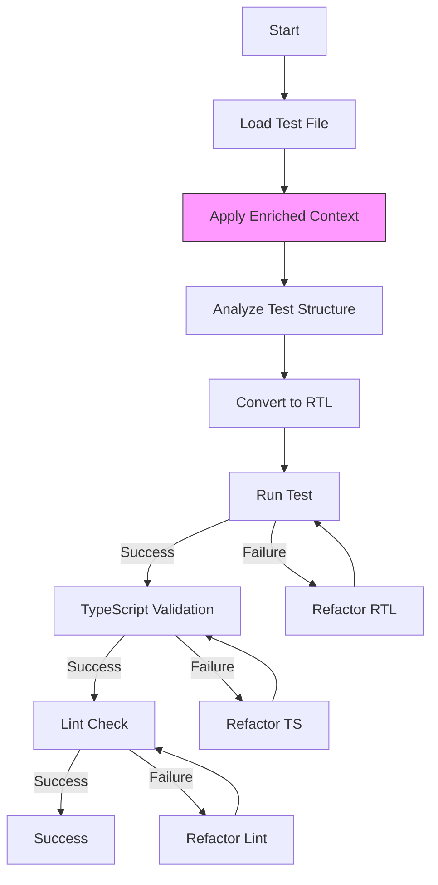

# LangGraph Workflow

## Overview

The LangGraph workflow defines the process of migrating a single test file from Enzyme to React Testing Library. The workflow operates as a state machine with multiple nodes that handle different aspects of the migration process, from AST analysis to LLM-based conversion to validation steps.

## Workflow Architecture



## State Definition

The LangGraph state includes the enriched context from the ContextEnricher:

```typescript
interface LangGraphState {
  file: {
    path: string;
    content: string;
    tempPath?: string;
    outputPath?: string;
    status: 'pending' | 'in-progress' | 'success' | 'failed';
    currentStep: string;
    error?: Error;
    
    // Enriched context from ContextEnricher
    enrichedContext: EnrichedContext;
    
    // Migration outputs
    originalTest: string;
    rtlTest?: string;
    tsCheck?: {
      success: boolean;
      errors: string[];
    };
    lintCheck?: {
      success: boolean;
      errors: string[];
    };
    
    // Retry counters
    retries: {
      rtl: number;
      ts: number;
      lint: number;
    };
    maxRetries: number;
  }
}

interface EnrichedContext {
  testedComponents: Component[];
  importChain: ImportNode[];
  contextSummary: string;
}
```

## Key Workflow Nodes

### 1. Load Test File
Loads the test file content and initializes the state.

### 2. Apply Enriched Context
Integrates the context information from the ContextEnricher into the prompt context for the LLM.

```typescript
// nodes/applyContext.ts
import { StateGraph } from "langchain/graphs";

export const applyContextNode = {
  invoke: async (state) => {
    const { file } = state;
    const { context } = file;
    
    // Create a summary of the component for the LLM
    let componentContext = "";
    
    // Add information about the tested component
    componentContext += `\n## Tested Component: ${context.componentName}\n\n`;
    componentContext += "```typescript\n";
    componentContext += context.componentCode;
    componentContext += "\n```\n\n";
    
    // Add information about related imports
    componentContext += `## Related Imports\n\n`;
    
    for (const [relativePath, content] of Object.entries(context.imports)) {
      componentContext += `### ${relativePath}\n\n`;
      componentContext += "```typescript\n";
      
      // Limit size to avoid token issues
      const truncatedContent = content.length > 1000 
        ? content.substring(0, 1000) + "\n// ... (truncated)"
        : content;
        
      componentContext += truncatedContent;
      componentContext += "\n```\n\n";
    }
    
    // Add example tests if available
    if (Object.keys(context.examples).length > 0) {
      componentContext += `## Example Migrations\n\n`;
      componentContext += `These are examples of similar tests that have been migrated from Enzyme to RTL:\n\n`;
      
      for (const [examplePath, exampleContent] of Object.entries(context.examples)) {
        componentContext += `### ${examplePath}\n\n`;
        componentContext += "```typescript\n";
        
        // Limit size to avoid token issues
        const truncatedExample = exampleContent.length > 1500 
          ? exampleContent.substring(0, 1500) + "\n// ... (truncated)"
          : exampleContent;
          
        componentContext += truncatedExample;
        componentContext += "\n```\n\n";
      }
    }
    
    // Add extra context if available
    if (context.extraContext && context.extraContext.trim().length > 0) {
      componentContext += `## Additional Context\n\n`;
      componentContext += context.extraContext;
      componentContext += "\n\n";
    }
    
    // Update the file state with this context
    return {
      file: {
        ...file,
        componentContext,
        currentStep: "APPLY_CONTEXT"
      }
    };
  }
};
```

### 3. Analyze Test Structure
Uses the enriched context to understand the test structure, including which components are being tested and how.

### 4. Convert to RTL
Performs the core migration using the LLM, with the enriched context as part of the prompt.

```typescript
// nodes/convertToRTL.ts
import { StateGraph } from "langchain/graphs";
import { ChatOpenAI } from "langchain/chat_models/openai";
import { HumanMessage, SystemMessage } from "langchain/schema";

export const convertToRTLNode = {
  invoke: async (state) => {
    const { file } = state;
    const { content, componentContext } = file;
    
    // Configure the LLM
    const llm = new ChatOpenAI({
      temperature: 0.2,
      modelName: "gpt-4",
    });
    
    // Build the system prompt with enriched context
    const systemPrompt = `
You are an expert in migrating Enzyme tests to React Testing Library.
You will be provided with an Enzyme test file and detailed context about the components being tested.

## Component Context
${componentContext}

## Guidelines for migration:
1. Replace Enzyme's shallow/mount with React Testing Library's render
2. Replace Enzyme selectors with RTL queries
3. Replace Enzyme interactions with RTL's fireEvent or userEvent
4. Update assertions to match RTL's philosophy
5. Maintain the same test coverage and assertions
6. Keep the same test structure and descriptions
`;

    try {
      // Call the LLM with the Enzyme test and context
      const result = await llm.call([
        new SystemMessage(systemPrompt),
        new HumanMessage(`Here is the Enzyme test to migrate to React Testing Library:
\`\`\`typescript
${content}
\`\`\`

Please convert this test to use React Testing Library, maintaining the same behavior.`)
      ]);
      
      // Extract the RTL test from the response
      const rtlTest = extractCodeFromMarkdown(result.content);
      
      // Update the state with the converted test
      return {
        file: {
          ...file,
          rtlTest,
          currentStep: "CONVERT_TO_RTL"
        }
      };
    } catch (error) {
      return {
        file: {
          ...file,
          error,
          status: "failed",
          currentStep: "FAILED"
        }
      };
    }
  }
};

// Helper to extract code blocks from markdown
function extractCodeFromMarkdown(markdown: string): string {
  const codeBlockRegex = /```(?:typescript|tsx|javascript|jsx)?\n([\s\S]*?)```/;
  const match = markdown.match(codeBlockRegex);
  return match ? match[1] : markdown;
}
```

### 5. Remaining Nodes
The remaining nodes handle test execution, TypeScript validation, linting, and any necessary refactoring.

## LangGraph Configuration

```typescript
// workflow/langGraphWorkflow.ts
import { StateGraph } from "langchain/graphs";
import { loadTestFileNode } from "./nodes/loadTestFile";
import { applyContextNode } from "./nodes/applyContext";
import { analyzeTestNode } from "./nodes/analyzeTest";
import { convertToRTLNode } from "./nodes/convertToRTL";
// Import other nodes...

export function createLangGraphWorkflow(
  testFilePath: string,
  context: {
    componentName: string;
    componentCode: string;
    imports: Record<string, string>;
    examples: Record<string, string>;
    extraContext: string;
  },
  options: WorkflowOptions
) {
  // Initialize the state graph
  const graph = new StateGraph({
    channels: {
      file: {
        path: testFilePath,
        content: "",
        status: "pending",
        currentStep: "INITIALIZE",
        context, // Simplified context structure from ContextEnricher
        retries: {
          rtl: 0,
          ts: 0,
          lint: 0
        },
        maxRetries: options.maxRetries || 5
      }
    }
  });

  // Add nodes to the graph
  graph.addNode("LoadTestFile", loadTestFileNode);
  graph.addNode("ApplyContext", applyContextNode);
  graph.addNode("AnalyzeTest", analyzeTestNode);
  graph.addNode("ConvertToRTL", convertToRTLNode);
  // Add other nodes...
  
  // Define edges and other workflow configuration...
  
  return graph;
}
```

## Integration with Sequential Migration Manager

```typescript
// migration/sequentialMigrationManager.ts
import { StateGraph } from "langchain/graphs";
import { createLangGraphWorkflow } from "../workflow/langGraphWorkflow";
import { LangGraphObserver } from "../langGraph/observer";

export class SequentialMigrationManager {
  constructor(private observer: LangGraphObserver) {}
  
  async processSingleFile(
    filePath: string, 
    enrichedContext: {
      testedComponent: {
        name: string;
        filePath: string;
        content: string;
      };
      relatedFiles: Map<string, string>;
      exampleTests?: Map<string, string>;
      extraContext?: string;
    }, 
    options?: MigrationOptions
  ) {
    // Create a new workflow for this file with the complete context
    const workflow = createLangGraphWorkflow(
      filePath, 
      {
        componentName: enrichedContext.testedComponent.name,
        componentCode: enrichedContext.testedComponent.content,
        imports: Object.fromEntries(enrichedContext.relatedFiles),
        examples: enrichedContext.exampleTests ? Object.fromEntries(enrichedContext.exampleTests) : {},
        extraContext: enrichedContext.extraContext || ""
      },
      {
        maxRetries: options?.maxRetries || 5,
        skipTs: options?.skipTs || false,
        skipLint: options?.skipLint || false
      }
    );
    
    // Register the observer
    this.observer.observeGraph(workflow, filePath);
    
    // Notify that we're processing this file
    this.observer.notifyCurrentFileChanged(filePath);
    
    // Run the workflow
    try {
      const result = await workflow.execute();
      return result;
    } catch (error) {
      console.error(`Error processing file ${filePath}:`, error);
      throw error;
    }
  }
  
  // Other methods...
}
```

## How Context Enhances LLM Performance

The enriched context from the ContextEnricher significantly improves the LLM's migration performance:

1. **Component Access**: The LLM has direct access to the full code of the component being tested
2. **Import Visibility**: Access to imported files gives the LLM understanding of dependencies and utilities
3. **API Awareness**: Having the actual component code helps the LLM understand its API and behavior
4. **Testing Context**: The LLM can see how the component was intended to be used
5. **Simpler Structure**: The straightforward structure makes it easy for the LLM to navigate

This context is especially valuable for complex components with unique usage patterns that would otherwise be difficult for the LLM to infer from the test file alone. 