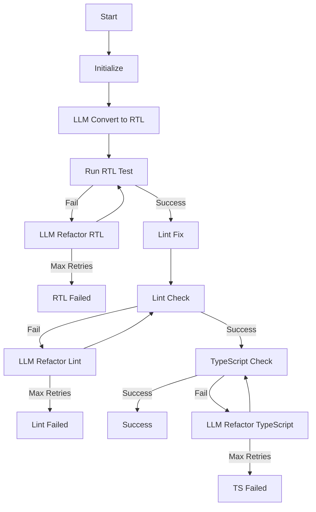

# LangGraph Workflow Design

## Workflow Architecture



## State Definition

```typescript
// Core state passed between nodes
interface FileState {
  // File information
  path: string;
  tempPath: string;
  attemptPath: string;
  
  // Content
  originalContent: string;
  currentContent: string;
  
  // Status tracking - simplified
  status: "RUNNING" | "COMPLETE" | "FAILED";
  currentStep: string;
  
  // Retry tracking
  retries: {
    rtl: number;
    lint: number;
    ts: number;
  };
  maxRetries: number;
  
  // Error information
  error: {
    step: string;
    message: string;
    details?: string;
    timestamp: number;
  } | null;
  
  // Node-specific state
  rtlTest: {
    passed: boolean;
    output: string;
  } | null;
  
  lintCheck: {
    passed: boolean;
    message: string;
    attempted: boolean;  // Track if lint check has been attempted
  } | null;
  
  tsCheck: {
    passed: boolean;
    message: string;
  } | null;
}
```

## Node Implementations

### 1. Initialize Node

```typescript
const initializeNode = async (state: FileState): Promise<FileState> => {
  // Create temp file
  const tempContent = await fs.readFile(state.path, 'utf-8');
  await fs.writeFile(state.tempPath, tempContent, 'utf-8');
  
  return {
    ...state,
    originalContent: tempContent,
    currentContent: tempContent,
    status: "RUNNING",
    currentStep: "INITIALIZE",
    retries: {
      rtl: 0,
      lint: 0,
      ts: 0
    }
  };
};
```

### 2. LLM Convert to RTL Node

```typescript
const llmConvertToRTLNode = async (state: FileState): Promise<FileState> => {
  try {
    // Create prompt for initial conversion
    const prompt = createInitialConversionPrompt({
      enzymeTest: state.originalContent
    });
    
    // Call LLM for conversion
    const rtlContent = await callLLM(prompt);
    
    // Write to temp file
    await fs.writeFile(state.tempPath, rtlContent, 'utf-8');
    
    return {
      ...state,
      currentContent: rtlContent,
      currentStep: "LLM_CONVERT_TO_RTL"
    };
  } catch (error) {
    return {
      ...state,
      status: "FAILED",
      error: {
        step: "LLM_CONVERT_TO_RTL",
        message: "Failed to convert to RTL using LLM",
        details: error.message,
        timestamp: Date.now()
      }
    };
  }
};
```

### 3. Run RTL Test Node

```typescript
const runRTLTestNode = async (state: FileState): Promise<FileState> => {
  try {
    // Run the test file to see if it executes without errors
    const testResult = await runTest(state.tempPath);
    
    return {
      ...state,
      rtlTest: {
        passed: testResult.success,
        output: testResult.output
      },
      currentStep: "RUN_RTL_TEST"
    };
  } catch (error) {
    return {
      ...state,
      rtlTest: {
        passed: false,
        output: error.message
      },
      currentStep: "RUN_RTL_TEST"
    };
  }
};
```

### 4. LLM Refactor RTL Node

```typescript
const llmRefactorRTLNode = async (state: FileState): Promise<FileState> => {
  // Check retry limit
  if (state.retries.rtl >= state.maxRetries) {
    return {
      ...state,
      status: "FAILED",
      error: {
        step: "LLM_REFACTOR_RTL",
        message: "Max retries reached for RTL conversion",
        details: `Failed after ${state.retries.rtl} attempts`,
        timestamp: Date.now()
      }
    };
  }
  
  try {
    // Create prompt with test error information
    const prompt = createRTLRefactorPrompt({
      original: state.originalContent,
      current: state.currentContent,
      testOutput: state.rtlTest?.output || ""
    });
    
    // Call LLM for refactoring
    const refactoredContent = await callLLM(prompt);
    
    // Write to temp file
    await fs.writeFile(state.tempPath, refactoredContent, 'utf-8');
    
    return {
      ...state,
      currentContent: refactoredContent,
      retries: {
        ...state.retries,
        rtl: state.retries.rtl + 1
      },
      currentStep: "LLM_REFACTOR_RTL"
    };
  } catch (error) {
    return {
      ...state,
      status: "FAILED",
      error: {
        step: "LLM_REFACTOR_RTL",
        message: "Failed to refactor RTL with LLM",
        details: error.message,
        timestamp: Date.now()
      }
    };
  }
};
```

### 5. Lint Fix Node

```typescript
const lintFixNode = async (state: FileState): Promise<FileState> => {
  try {
    // Run ESLint with --fix option
    const fixedContent = await runLintFix(state.tempPath);
    
    // Update temp file
    await fs.writeFile(state.tempPath, fixedContent, 'utf-8');
    
    return {
      ...state,
      currentContent: fixedContent,
      currentStep: "LINT_FIX"
    };
  } catch (error) {
    return {
      ...state,
      currentStep: "LINT_FIX",
      // Don't fail here, let the check determine if it's a failure
    };
  }
};
```

### 6. Lint Check Node

```typescript
const lintCheckNode = async (state: FileState): Promise<FileState> => {
  try {
    // Run ESLint without --fix
    const lintResult = await runLintCheck(state.tempPath);
    
    return {
      ...state,
      lintCheck: {
        passed: lintResult.errorCount === 0,
        message: lintResult.output,
        attempted: true
      },
      currentStep: "LINT_CHECK"
    };
  } catch (error) {
    return {
      ...state,
      lintCheck: {
        passed: false,
        message: error.message,
        attempted: true
      },
      currentStep: "LINT_CHECK"
    };
  }
};
```

### 7. LLM Refactor Lint Node

```typescript
const llmRefactorLintNode = async (state: FileState): Promise<FileState> => {
  // Check retry limit
  if (state.retries.lint >= state.maxRetries) {
    return {
      ...state,
      status: "FAILED",
      error: {
        step: "LLM_REFACTOR_LINT",
        message: "Max retries reached for lint fixes",
        details: `Failed after ${state.retries.lint} attempts`,
        timestamp: Date.now()
      }
    };
  }
  
  try {
    // Create prompt with lint issues
    const prompt = createLintRefactorPrompt({
      content: state.currentContent,
      lintMessage: state.lintCheck?.message || ""
    });
    
    // Call LLM for refactoring
    const refactoredContent = await callLLM(prompt);
    
    // Write to temp file
    await fs.writeFile(state.tempPath, refactoredContent, 'utf-8');
    
    return {
      ...state,
      currentContent: refactoredContent,
      retries: {
        ...state.retries,
        lint: state.retries.lint + 1
      },
      currentStep: "LLM_REFACTOR_LINT"
    };
  } catch (error) {
    return {
      ...state,
      status: "FAILED",
      error: {
        step: "LLM_REFACTOR_LINT",
        message: "Failed to refactor for lint issues with LLM",
        details: error.message,
        timestamp: Date.now()
      }
    };
  }
};
```

### 8. TypeScript Check Node

```typescript
const tsCheckNode = async (state: FileState): Promise<FileState> => {
  try {
    // Run TypeScript compiler check
    const tsResult = await runTypeScriptCheck(state.tempPath);
    
    return {
      ...state,
      tsCheck: {
        passed: tsResult.errorCount === 0,
        message: tsResult.output
      },
      currentStep: "TS_CHECK"
    };
  } catch (error) {
    return {
      ...state,
      tsCheck: {
        passed: false,
        message: error.message
      },
      currentStep: "TS_CHECK"
    };
  }
};
```

### 9. LLM Refactor TypeScript Node

```typescript
const llmRefactorTSNode = async (state: FileState): Promise<FileState> => {
  // Check retry limit
  if (state.retries.ts >= state.maxRetries) {
    return {
      ...state,
      status: "FAILED",
      error: {
        step: "LLM_REFACTOR_TS",
        message: "Max retries reached for TypeScript fixes",
        details: `Failed after ${state.retries.ts} attempts`,
        timestamp: Date.now()
      }
    };
  }
  
  try {
    // Create prompt with TypeScript issues
    const prompt = createTSRefactorPrompt({
      content: state.currentContent,
      tsMessage: state.tsCheck?.message || ""
    });
    
    // Call LLM for refactoring
    const refactoredContent = await callLLM(prompt);
    
    // Write to temp file
    await fs.writeFile(state.tempPath, refactoredContent, 'utf-8');
    
    return {
      ...state,
      currentContent: refactoredContent,
      retries: {
        ...state.retries,
        ts: state.retries.ts + 1
      },
      currentStep: "LLM_REFACTOR_TS"
    };
  } catch (error) {
    return {
      ...state,
      status: "FAILED",
      error: {
        step: "LLM_REFACTOR_TS",
        message: "Failed to refactor for TypeScript issues with LLM",
        details: error.message,
        timestamp: Date.now()
      }
    };
  }
};
```

### 10. Success Node

```typescript
const successNode = async (state: FileState): Promise<FileState> => {
  try {
    // Replace original file with temp file
    await fs.rename(state.tempPath, state.path);
    
    return {
      ...state,
      status: "COMPLETE",
      currentStep: "SUCCESS"
    };
  } catch (error) {
    return {
      ...state,
      status: "FAILED",
      error: {
        step: "SUCCESS",
        message: "Failed to replace original file",
        details: error.message,
        timestamp: Date.now()
      }
    };
  }
};
```

### 11. Failure Node

```typescript
const failureNode = async (state: FileState): Promise<FileState> => {
  try {
    // Save failed attempt to .attempts folder
    await ensureDirectoryExists(path.dirname(state.attemptPath));
    await fs.writeFile(state.attemptPath, state.currentContent, 'utf-8');
    
    // Clean up temp file
    await fs.unlink(state.tempPath).catch(() => {});
    
    return {
      ...state,
      status: "FAILED",
      currentStep: "FAILED"
    };
  } catch (error) {
    // Even if saving the attempt fails, keep the failure state
    return {
      ...state,
      status: "FAILED",
      currentStep: "FAILED",
      // Don't overwrite the original error that caused the failure
    };
  }
};
```

## LLM Prompts

### 1. Initial Conversion Prompt

```typescript
function createInitialConversionPrompt(params: {
  enzymeTest: string;
}): string {
  return `
You are an expert React Testing Library developer. 
I am migrating Enzyme tests to React Testing Library.

Here is an Enzyme test that needs to be converted to React Testing Library:
\`\`\`typescript
${params.enzymeTest}
\`\`\`

Please convert this test to use React Testing Library instead of Enzyme.
Follow these best practices:
1. Replace shallow/mount with render from @testing-library/react
2. Replace enzyme selectors with @testing-library/react queries (getBy, findBy, queryBy)
3. Replace enzyme assertions with @testing-library/jest-dom matchers
4. Handle async operations with waitFor or findBy queries
5. Maintain the same test coverage and assertions
6. Preserve imports for components under test
7. Add necessary imports for React Testing Library

Respond ONLY with the converted code. No explanations.
`;
}
```

### 2. RTL Refactor Prompt

```typescript
function createRTLRefactorPrompt(params: {
  original: string;
  current: string;
  testOutput: string;
}): string {
  return `
You are an expert React Testing Library developer. 
I am migrating Enzyme tests to React Testing Library.

Original Enzyme test:
\`\`\`typescript
${params.original}
\`\`\`

Current conversion attempt:
\`\`\`typescript
${params.current}
\`\`\`

Test error output:
\`\`\`
${params.testOutput}
\`\`\`

Please refactor the current conversion to fix the test errors. 
Follow these best practices:
1. Replace shallow/mount with render from @testing-library/react
2. Replace enzyme selectors with @testing-library/react queries (getBy, findBy, queryBy)
3. Replace enzyme assertions with @testing-library/jest-dom matchers
4. Handle async operations with waitFor or findBy queries
5. Maintain the same test coverage and assertions

Respond ONLY with the corrected code. No explanations.
`;
}
```

### 3. Lint Refactor Prompt

```typescript
function createLintRefactorPrompt(params: {
  content: string;
  lintMessage: string;
}): string {
  return `
You are an expert JavaScript and React developer.
I need to fix ESLint issues in this React Testing Library test file.

Current test file:
\`\`\`typescript
${params.content}
\`\`\`

ESLint output:
\`\`\`
${params.lintMessage}
\`\`\`

Please refactor the code to fix all lint issues while preserving the test logic.
Follow these guidelines:
1. Fix all lint issues
2. Maintain the same testing behavior
3. Follow React Testing Library best practices
4. Use modern JavaScript/TypeScript syntax

Respond ONLY with the corrected code. No explanations.
`;
}
```

### 4. TypeScript Refactor Prompt

```typescript
function createTSRefactorPrompt(params: {
  content: string;
  tsMessage: string;
}): string {
  return `
You are an expert TypeScript developer.
I need to fix TypeScript issues in this React Testing Library test file.

Current test file:
\`\`\`typescript
${params.content}
\`\`\`

TypeScript errors:
\`\`\`
${params.tsMessage}
\`\`\`

Please refactor the code to fix all TypeScript issues while preserving the test logic.
Follow these guidelines:
1. Fix all type errors
2. Add proper type annotations where missing
3. Maintain the same testing behavior
4. Follow React Testing Library typing conventions
5. Import any necessary types

Respond ONLY with the corrected code. No explanations.
`;
}
```

## LangGraph Configuration

```typescript
import { StateGraph } from "langchain/graphs";

export async function createMigrationGraph() {
  // Initialize the graph
  const graph = new StateGraph({
    channels: {
      file: {
        value: {} as FileState // Type of state passed between nodes
      }
    }
  });
  
  // Add all nodes
  graph.addNode("initialize", initializeNode);
  graph.addNode("llmConvertToRTL", llmConvertToRTLNode);
  graph.addNode("runRTLTest", runRTLTestNode);
  graph.addNode("llmRefactorRTL", llmRefactorRTLNode);
  graph.addNode("lintFix", lintFixNode);
  graph.addNode("lintCheck", lintCheckNode);
  graph.addNode("llmRefactorLint", llmRefactorLintNode);
  graph.addNode("tsCheck", tsCheckNode);
  graph.addNode("llmRefactorTS", llmRefactorTSNode);
  graph.addNode("success", successNode);
  graph.addNode("failure", failureNode);
  
  // Connect nodes
  graph.addEdge("initialize", "llmConvertToRTL");
  graph.addEdge("llmConvertToRTL", "runRTLTest");
  
  // RTL Test branching
  graph.addConditionalEdges(
    "runRTLTest",
    (state) => state.rtlTest?.passed ? "lintFix" : "llmRefactorRTL"
  );
  
  // RTL refactor retry loop
  graph.addConditionalEdges(
    "llmRefactorRTL",
    (state) => {
      if (state.status === "FAILED") return "failure";
      return "runRTLTest";
    }
  );
  
  // Lint process
  graph.addEdge("lintFix", "lintCheck");
  
  // Lint Check branching
  graph.addConditionalEdges(
    "lintCheck",
    (state) => state.lintCheck?.passed ? "tsCheck" : "llmRefactorLint"
  );
  
  // Lint refactor retry loop
  graph.addConditionalEdges(
    "llmRefactorLint",
    (state) => {
      if (state.status === "FAILED") return "failure";
      return "lintCheck";
    }
  );
  
  // TypeScript Check branching
  graph.addConditionalEdges(
    "tsCheck",
    (state) => state.tsCheck?.passed ? "success" : "llmRefactorTS"
  );
  
  // TypeScript refactor retry loop
  graph.addConditionalEdges(
    "llmRefactorTS",
    (state) => {
      if (state.status === "FAILED") return "failure";
      return "tsCheck";
    }
  );
  
  // Set entry point
  graph.setEntryPoint("initialize");
  
  return graph;
}
```

## Execution

```typescript
export async function runMigrationWorkflow(filePath: string) {
  // Create the workflow graph
  const graph = await createMigrationGraph();
  
  // Set up initial state
  const initialState: FileState = {
    path: filePath,
    tempPath: `${filePath}.temp.tsx`,
    attemptPath: `${path.dirname(filePath)}/.attempts/${path.basename(filePath)}`,
    originalContent: "",
    currentContent: "",
    status: "RUNNING",
    currentStep: "",
    retries: {
      rtl: 0,
      lint: 0,
      ts: 0
    },
    maxRetries: 5,
    error: null,
    rtlTest: null,
    lintCheck: null,
    tsCheck: null
  };
  
  // Execute the workflow
  const result = await graph.invoke({ file: initialState });
  
  return result.file;
} 