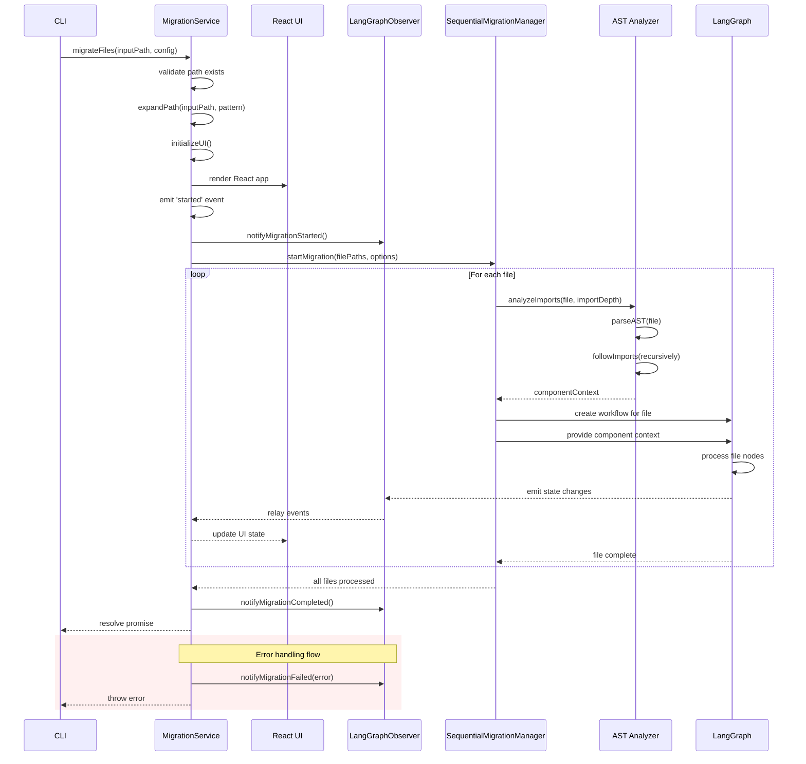

# Migration Service

## Overview

The Migration Service acts as the central orchestration component in the application. It serves as the bridge between the minimal CLI and the entire migration process, with responsibilities including initializing the UI layer, setting up state management, and coordinating the migration workflow.

## Responsibilities

1. **UI Initialization**: Starts the React UI application
2. **State Management**: Initializes the LangGraph-React bridge for state observation
3. **Process Orchestration**: Manages the migration process from start to finish
4. **File Processing**: Coordinates the migration of multiple files through the SequentialMigrationManager
5. **Error Handling**: Centralizes error handling for the migration process
6. **Import Analysis**: Configures AST-based import analysis for LLM context

## Interface

```typescript
class MigrationService extends EventEmitter {
  constructor();
  
  // Main entry point called by CLI - initializes everything
  async migrateFiles(inputPath: string, options?: MigrationOptions): Promise<void>;
  
  // Stop an ongoing migration
  stopMigration(): void;
  
  // Get current migration stats
  getMigrationStats(): MigrationStats;
  
  // Event registration for internal components
  on(event: MigrationEventType, handler: Function): void;
  off(event: MigrationEventType, handler: Function): void;
}

// Migration options
interface MigrationOptions {
  skipTs?: boolean;
  skipLint?: boolean;
  maxRetries?: number;
  pattern?: string;
  importDepth?: number;
}

// Stats interface
interface MigrationStats {
  total: number;
  completed: number;
  failed: number;
  inProgress: number;
  currentFile?: string;
}

// Event types
type MigrationEventType = 
  | 'started' 
  | 'fileStarted' 
  | 'fileCompleted'
  | 'fileFailed'
  | 'completed'
  | 'failed'
  | 'progress';
```

## AST Import Analysis

A key feature of the migration process is AST-based import analysis, which:

1. **Analyzes Test Files**: Parses the TypeScript/React test files using an AST parser
2. **Identifies Component Imports**: Determines which components are being tested
3. **Follows Import Chain**: Recursively analyzes imports up to the specified depth
4. **Builds Context**: Includes relevant component code as context for the LLM

This analysis is critical for providing the LLM with sufficient context about the component under test, including its props, state, and dependencies. The `importDepth` option controls how deep this analysis goes:

- **importDepth=0**: Only analyze the test file itself
- **importDepth=1**: Include direct imports (the component being tested)
- **importDepth=2**: Include imports of imports (dependencies of the tested component)
- **importDepth=3+**: Follow import chain even deeper

Deeper analysis provides more context but increases processing time. The default of 1 typically provides a good balance for most migrations.

## Implementation

```typescript
// services/migrationService.ts
import { EventEmitter } from 'events';
import React from 'react';
import ReactDOM from 'react-dom';
import { App } from '../components/App';
import { langGraphObserver } from '../langGraph/observer';
import { SequentialMigrationManager } from '../migration/migrationManager';
import fs from 'fs';
import path from 'path';
import { glob } from 'glob';

export class MigrationService extends EventEmitter {
  private manager: SequentialMigrationManager;
  private observer: typeof langGraphObserver;
  private uiInitialized: boolean = false;
  
  constructor() {
    super();
    this.observer = langGraphObserver;
    this.manager = new SequentialMigrationManager(this.observer);
    
    // Set up internal event relaying 
    this.setupEventRelays();
  }
  
  // Expand path to find test files
  private async expandPath(inputPath: string, pattern: string): Promise<string[]> {
    const stats = fs.statSync(inputPath);
    
    if (stats.isFile()) {
      // Single file - check if it's a test file
      const fileName = path.basename(inputPath);
      const isTest = /\.(test|spec)\.(ts|tsx)$/.test(fileName);
      return isTest ? [inputPath] : [];
    } else if (stats.isDirectory()) {
      // Directory - find all test files matching the pattern
      const fullPattern = path.join(inputPath, pattern);
      const files = await glob(fullPattern);
      return [...new Set(files)]; // Remove duplicates
    }
    
    return [];
  }
  
  private setupEventRelays() {
    // Relay events from observer to service consumers
    this.observer.on('fileStateUpdate', (event) => {
      this.emit('progress', this.getMigrationStats());
    });
    
    // Other event relays...
  }
  
  // Initialize the React UI
  private initializeUI() {
    if (this.uiInitialized) return;
    
    // Create a container for the UI
    const container = document.createElement('div');
    container.id = 'migration-ui-root';
    document.body.appendChild(container);
    
    // Render the React app
    ReactDOM.render(
      <App />,
      container
    );
    
    this.uiInitialized = true;
  }
  
  async migrateFiles(inputPath: string, options?: MigrationOptions) {
    try {
      // 1. Validate path exists
      if (!fs.existsSync(inputPath)) {
        throw new Error(`Path does not exist: ${inputPath}`);
      }
      
      // 2. Expand the file path with the provided pattern
      const pattern = options?.pattern || '**/*.{test,spec}.{ts,tsx}';
      const filePaths = await this.expandPath(inputPath, pattern);
      
      if (filePaths.length === 0) {
        throw new Error(`No test files found matching pattern '${pattern}' in '${inputPath}'`);
      }
      
      // 3. Initialize the UI
      this.initializeUI();
      
      // 4. Emit started event
      this.emit('started', { 
        totalFiles: filePaths.length,
        files: filePaths,
        options
      });
      
      // 5. Notify observer that migration is starting
      this.observer.notifyMigrationStarted(filePaths.length);
      
      // 6. Start the migration process, passing importDepth option
      await this.manager.startMigration(filePaths, options);
      
      // 7. Notify observer that migration completed successfully
      this.observer.notifyMigrationCompleted();
      
      // 8. Return with success (for CLI)
      return;
    } catch (error) {
      // Notify observer that migration failed
      this.observer.notifyMigrationFailed(error);
      
      // Re-throw error for CLI error handling
      throw error;
    }
  }
  
  stopMigration() {
    this.manager.stop();
  }
  
  getMigrationStats(): MigrationStats {
    const managerStats = this.manager.getStats();
    
    return {
      total: managerStats.total,
      inProgress: managerStats.currentlyProcessing ? 1 : 0,
      completed: this.countFilesByStatus('success'),
      failed: this.countFilesByStatus('failed'),
      currentFile: managerStats.currentFile
    };
  }
  
  private countFilesByStatus(status: string): number {
    // This would normally access state from the observer
    // but we're simplifying for the example
    return 0;
  }
}

// Create a singleton instance
export const migrationService = new MigrationService();
```

## Integration with CLI

The CLI acts only as an initiator, with no UI or feedback responsibilities:

```typescript
// cli/commands/migrate.ts
import { migrationService } from '../../services/migrationService';

export async function handleMigrateCommand(inputPath: string, options: any) {
  try {
    // Configure options
    const config = {
      skipTs: options.skipTsCheck || false,
      skipLint: options.skipLintCheck || false,
      maxRetries: parseInt(options.maxRetries || '5', 10),
      pattern: options.pattern || '**/*.{test,spec}.{ts,tsx}'
    };
    
    // Start the migration service - this handles file expansion and everything else
    await migrationService.migrateFiles(inputPath, config);
    
    // Exit with success code
    process.exit(0);
  } catch (error) {
    // Exit with error code
    process.exit(1);
  }
}
```

## Process Flow



### Key Process Stages

1. **Initialization**
   - Path validation
   - File pattern expansion
   - UI initialization
   - Event setup

2. **Import Analysis**
   - Parse test file AST
   - Identify component imports
   - Follow import chain to specified depth
   - Build component context for LLM

3. **Migration Process**
   - Manager starts migration with component context
   - Each file is processed through LangGraph
   - State changes are observed and relayed
   - UI is updated with progress

4. **Completion**
   - All files processed
   - Final notifications sent
   - Promise resolved
   - CLI exits

5. **Error Handling**
   - Errors at any stage are caught
   - Observer is notified
   - Error is re-thrown to CLI
   - CLI exits with error code

This flow demonstrates how the Migration Service functions as the central orchestration component, controlling UI initialization, file processing, and managing the overall migration process while maintaining event-based communication between components.