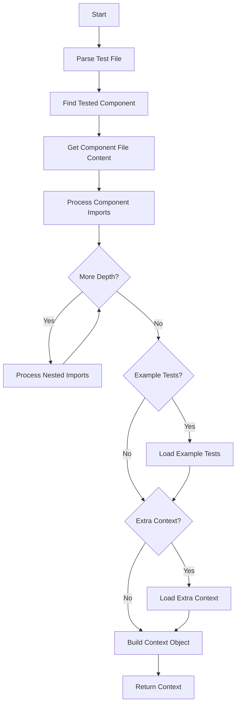

# Context Enricher

## Overview

The Context Enricher is a specialized component that analyzes test files to extract contextual information about the component being tested. It uses AST (Abstract Syntax Tree) parsing to identify which component a test is targeting, then collects the component's source code and its imports up to a specified depth.

The enriched context is then provided to the LangGraph workflow to enhance the migration process from Enzyme to React Testing Library by giving the LLM more information about the component's structure and dependencies.

## Responsibilities

1. **Test Analysis**: Parse test files to identify the primary component being tested
2. **Component Extraction**: Find and extract the content of the component under test
3. **Import Collection**: Recursively collect imports up to the specified depth
4. **Context Building**: Build a simple structure with component and related file contents

## Interface

```typescript
class ContextEnricher {
	constructor(projectRoot: string);

	/**
	 * Analyze a test file and extract the tested component along with its imports
	 * @param testFilePath Path to the test file
	 * @param options Configuration options including import depth
	 * @returns Enriched context containing component code and related files
	 */
	async enrichContext(
		testFilePath: string,
		options?: EnrichmentOptions,
	): Promise<EnrichedContext>;
}

interface EnrichmentOptions {
	importDepth?: number; // Default: 1
	exampleTests?: string[]; // Paths to example tests that are similar to the one being migrated
	extraContextFile?: string; // Path to a file containing extra context
}

interface EnrichedContext {
	// The identified component under test
	testedComponent: {
		name: string;
		filePath: string;
		content: string;
	};
	// Map of related files (imports) with relative paths as keys
	relatedFiles: Map<string, string>; // path -> content
	// Optional example tests
	exampleTests?: Map<string, string>; // path -> content
	// Optional extra context
	extraContext?: string;
}
```

## Process Flow



## Implementation

```typescript
// context/contextEnricher.ts
import * as fs from 'fs/promises';
import * as path from 'path';
import * as ts from 'typescript';

export class ContextEnricher {
	constructor(private projectRoot: string) {}

	async enrichContext(
		testFilePath: string,
		options: EnrichmentOptions = {},
	): Promise<EnrichedContext> {
		const importDepth = options.importDepth || 1;

		// Read and parse the test file
		const testFileContent = await fs.readFile(testFilePath, 'utf8');
		const sourceFile = ts.createSourceFile(
			testFilePath,
			testFileContent,
			ts.ScriptTarget.Latest,
			true,
		);

		// Find the tested component (assuming only one per test suite)
		const testedComponent = this.findTestedComponent(sourceFile);

		if (!testedComponent) {
			throw new Error(
				`Could not identify a component under test in ${testFilePath}`,
			);
		}

		// Get component file path from import
		const componentFilePath = this.resolveImportPath(
			testedComponent.importPath,
		);
		const componentContent = await fs.readFile(componentFilePath, 'utf8');

		// Build map of related files (component imports)
		const relatedFiles = new Map<string, string>();
		await this.processImports(componentFilePath, relatedFiles, 1, importDepth);

		// Create the base context
		const context: EnrichedContext = {
			testedComponent: {
				name: testedComponent.name,
				filePath: path.relative(this.projectRoot, componentFilePath),
				content: componentContent,
			},
			relatedFiles,
		};

		// Process example tests if provided
		if (options.exampleTests && options.exampleTests.length > 0) {
			context.exampleTests = new Map<string, string>();

			for (const examplePath of options.exampleTests) {
				try {
					const absolutePath = path.isAbsolute(examplePath)
						? examplePath
						: path.resolve(this.projectRoot, examplePath);

					const content = await fs.readFile(absolutePath, 'utf8');
					context.exampleTests.set(
						path.relative(this.projectRoot, absolutePath),
						content,
					);
				} catch (error) {
					console.warn(`Failed to load example test ${examplePath}:`, error);
				}
			}
		}

		// Process extra context file if provided
		if (options.extraContextFile) {
			try {
				const absolutePath = path.isAbsolute(options.extraContextFile)
					? options.extraContextFile
					: path.resolve(this.projectRoot, options.extraContextFile);

				context.extraContext = await fs.readFile(absolutePath, 'utf8');
			} catch (error) {
				console.warn(
					`Failed to load extra context file ${options.extraContextFile}:`,
					error,
				);
			}
		}

		return context;
	}

	private findTestedComponent(
		sourceFile: ts.SourceFile,
	): {name: string; importPath: string} | null {
		// Track imports for later reference
		const imports: {name: string; path: string}[] = [];

		// Extract imports first
		ts.forEachChild(sourceFile, node => {
			if (ts.isImportDeclaration(node)) {
				const importPath = (node.moduleSpecifier as ts.StringLiteral).text;

				if (node.importClause) {
					// Default import
					if (node.importClause.name) {
						imports.push({
							name: node.importClause.name.text,
							path: importPath,
						});
					}

					// Named imports
					if (
						node.importClause.namedBindings &&
						ts.isNamedImports(node.importClause.namedBindings)
					) {
						node.importClause.namedBindings.elements.forEach(element => {
							imports.push({
								name: element.name.text,
								path: importPath,
							});
						});
					}
				}
			}
		});

		// Common testing patterns
		const testPatterns = [
			'shallow',
			'mount',
			'render', // Enzyme and RTL
			'screen',
			'findBy',
			'getBy', // RTL patterns
			'wrapper',
			'querySelector', // Common testing patterns
		];

		// Look for component usage in test file
		let testedComponent: {name: string; importPath: string} | null = null;

		ts.forEachChild(sourceFile, node => {
			if (testedComponent) return; // Already found

			// Check for testing function calls
			if (ts.isCallExpression(node)) {
				const callText = node.expression.getText();

				if (testPatterns.some(pattern => callText.includes(pattern))) {
					if (node.arguments.length > 0) {
						// Check first argument which is usually the component
						const firstArg = node.arguments[0];
						let componentName = '';

						// JSX Element case (<ComponentName />)
						if (
							ts.isJsxElement(firstArg) ||
							ts.isJsxSelfClosingElement(firstArg)
						) {
							const tagName = ts.isJsxElement(firstArg)
								? firstArg.openingElement.tagName.getText()
								: firstArg.tagName.getText();
							componentName = tagName;
						}
						// Variable reference case (ComponentName)
						else if (ts.isIdentifier(firstArg)) {
							componentName = firstArg.text;
						}

						if (componentName) {
							// Look for matching import
							const matchingImport = imports.find(
								imp => imp.name === componentName,
							);
							if (matchingImport) {
								testedComponent = {
									name: componentName,
									importPath: matchingImport.path,
								};
							}
						}
					}
				}
			}
		});

		return testedComponent;
	}

	private async processImports(
		filePath: string,
		relatedFiles: Map<string, string>,
		currentDepth: number,
		maxDepth: number,
	): Promise<void> {
		if (currentDepth > maxDepth) return;

		try {
			const content = await fs.readFile(filePath, 'utf8');
			const sourceFile = ts.createSourceFile(
				filePath,
				content,
				ts.ScriptTarget.Latest,
				true,
			);

			// Extract imports
			const imports: string[] = [];
			ts.forEachChild(sourceFile, node => {
				if (ts.isImportDeclaration(node)) {
					const importPath = (node.moduleSpecifier as ts.StringLiteral).text;

					// Skip node_modules and non-relative imports
					if (importPath.startsWith('.')) {
						imports.push(importPath);
					}
				}
			});

			// Process each import recursively
			for (const importPath of imports) {
				const resolvedPath = this.resolveImportPath(
					importPath,
					path.dirname(filePath),
				);

				// Skip if already processed
				if (relatedFiles.has(path.relative(this.projectRoot, resolvedPath))) {
					continue;
				}

				try {
					const importContent = await fs.readFile(resolvedPath, 'utf8');

					// Add to related files map with relative path
					relatedFiles.set(
						path.relative(this.projectRoot, resolvedPath),
						importContent,
					);

					// Process nested imports if not at max depth
					if (currentDepth < maxDepth) {
						await this.processImports(
							resolvedPath,
							relatedFiles,
							currentDepth + 1,
							maxDepth,
						);
					}
				} catch (error) {
					console.warn(
						`Error processing import ${importPath} from ${filePath}:`,
						error,
					);
				}
			}
		} catch (error) {
			console.error(`Error processing file ${filePath}:`, error);
		}
	}

	private resolveImportPath(
		importPath: string,
		basePath: string = this.projectRoot,
	): string {
		// If it's a relative path, resolve it relative to base path
		if (importPath.startsWith('.')) {
			const resolved = path.resolve(basePath, importPath);

			// Try with different extensions if needed
			for (const ext of ['', '.ts', '.tsx', '.js', '.jsx']) {
				const fullPath = resolved + ext;
				if (fs.existsSync(fullPath)) {
					return fullPath;
				}
			}

			// Try with /index files
			for (const ext of ['.ts', '.tsx', '.js', '.jsx']) {
				const indexPath = path.join(resolved, `index${ext}`);
				if (fs.existsSync(indexPath)) {
					return indexPath;
				}
			}
		}

		// For non-relative imports, try to resolve within project
		try {
			return require.resolve(importPath, {paths: [this.projectRoot]});
		} catch (e) {
			throw new Error(`Could not resolve import path: ${importPath}`);
		}
	}
}
```

## Integration with Migration Service

The Context Enricher is integrated into the Migration Service to enhance the LangGraph workflow with component context:

```typescript
// services/migrationService.ts
import {ContextEnricher} from '../context/contextEnricher';

export class MigrationService {
	private contextEnricher: ContextEnricher;

	constructor(private projectRoot: string) {
		this.contextEnricher = new ContextEnricher(projectRoot);
	}

	async migrateFiles(testFiles: string[], options: MigrationOptions = {}) {
		for (const testFile of testFiles) {
			try {
				// Get component context
				const enrichedContext = await this.contextEnricher.enrichContext(
					testFile,
					{
						importDepth: options.importDepth || 1,
						exampleTests: options.exampleTests,
						extraContextFile: options.extraContextFile,
					},
				);

				// Pass to LangGraph with simplified context structure
				const workflow = createLangGraphWorkflow(testFile, {
					componentName: enrichedContext.testedComponent.name,
					componentCode: enrichedContext.testedComponent.content,
					imports: Object.fromEntries(enrichedContext.relatedFiles),
					examples: enrichedContext.exampleTests
						? Object.fromEntries(enrichedContext.exampleTests)
						: {},
					extraContext: enrichedContext.extraContext || '',
				});

				// Continue with workflow execution...
			} catch (error) {
				console.error(`Error processing ${testFile}:`, error);
			}
		}
	}
}
```

## Integration with LangGraph Workflow

The enriched context is passed to the LangGraph workflow to enhance the LLM's understanding of the component:

```typescript
// workflow/langGraphWorkflow.ts
export function createLangGraphWorkflow(
	testFilePath: string,
	context: {
		componentName: string;
		componentCode: string;
		imports: Record<string, string>;
	},
	options: WorkflowOptions,
) {
	// Initialize state graph with context
	const graph = new StateGraph({
		channels: {
			file: {
				path: testFilePath,
				content: '',
				status: 'pending',
				currentStep: 'INITIALIZE',
				context: {
					componentName: context.componentName,
					componentCode: context.componentCode,
					imports: context.imports,
				},
				// Other state...
			},
		},
	});

	// Add nodes and configure workflow...

	return graph;
}
```

## Benefits of the Simplified Approach

1. **Focused Component Analysis**: By focusing on identifying just the main component under test, the analysis is more reliable and efficient

2. **Raw Content Access**: Providing raw file contents rather than parsed structures gives the LLM complete information about components

3. **Import Depth Control**: The configurable import depth allows balancing between context completeness and processing efficiency

4. **Simple Data Structure**: Using a simple map structure makes it easy to integrate with various parts of the system

5. **Performance**: The simplified approach is more performant and has fewer potential failure points
