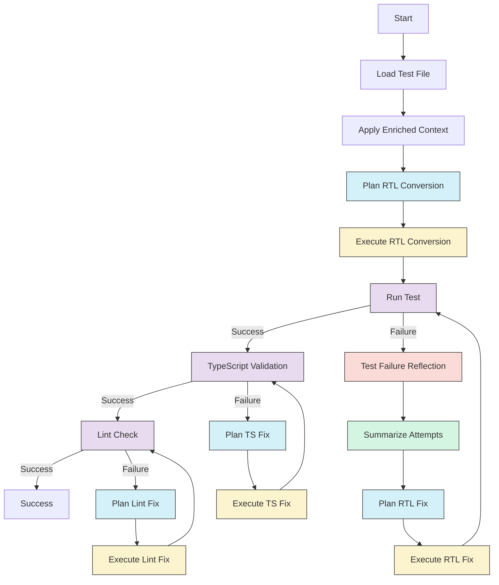

# LangGraph Workflow Architecture

## Overview

The LangGraph workflow defines an intelligent, self-improving process for migrating Enzyme tests to React Testing Library. The workflow operates as a state machine with nodes that handle different aspects of the migration process, from initial analysis to test validation, with built-in reflection and learning capabilities that allow it to improve its approach over multiple attempts.

## Consolidated Workflow Architecture



## Key Concepts

The workflow incorporates several key concepts to improve effectiveness:

1. **Plan-Execute Pattern**: Each major operation is split into a planning phase and an execution phase, allowing the system to reason about the approach before implementing it.

2. **Reflection Mechanism**: After test failures, a reflection step analyzes why the implementation failed and suggests improvements for the next attempt.

3. **Attempt Summarization**: A summarization component identifies patterns across multiple fix attempts, providing institutional memory that prevents repeating failed approaches.

4. **Model Specialization**: Different models are used for different parts of the workflow, with more capable models (o3-mini) handling complex planning tasks.

5. **Escalating Divergence**: As fix attempts increase, the system automatically shifts toward more radically different approaches to break out of stuck states.

## Prompt-Based Architecture

The workflow uses structured prompts stored in dedicated files to guide each step of the process:

1. **Migration Guidelines** (`migration-guidelines.ts`): Provides core principles for RTL migration that inform all prompts

2. **Planning Prompts**:
   - `plan-rtl-conversion-prompt.ts`: For planning the initial Enzyme to RTL conversion
   - `plan-rtl-fix-prompt.ts`: For planning fixes after test failures

3. **Execution Prompts**:
   - `execute-rtl-conversion-prompt.ts`: For executing the conversion plan
   - `execute-rtl-fix-prompt.ts`: For implementing the fix plan

4. **Reflection Prompts**:
   - `reflection-prompt.ts`: For analyzing test failures and suggesting improvements
   - `summarize-attempts-prompt.ts`: For identifying patterns across multiple attempts

These prompts provide consistent guidance to the LLMs while enabling flexible responses based on the specific context of each test.

## State Definition

The workflow state contains all information required for migration and learning:

```typescript
interface WorkflowState {
  file: FileState;
}

interface FileState {
  // Basic file information
		path: string;
		content: string;
		tempPath?: string;
  originalTest: string;
  rtlTest?: string;

  // Status tracking
		status: 'pending' | 'in-progress' | 'success' | 'failed';
  currentStep: WorkflowStep;
		error?: Error;

  // Context and enrichment
  context: EnrichedContext;

  // Validation results
		tsCheck?: {
			success: boolean;
			errors: string[];
    output?: string;
		};
		lintCheck?: {
			success: boolean;
			errors: string[];
    output?: string;
  };

  // Fix histories
  rtlFixHistory?: FixAttempt[];
  tsFixHistory?: FixAttempt[];
  lintFixHistory?: FixAttempt[];

  // Plans and reflections
  fixPlan?: FixPlan;
  lastReflection?: string;
  attemptSummary?: string;

  // Configuration
  commands: {
    lintCheck: string;
    lintFix: string;
    tsCheck: string;
    test: string;
  };
		retries: {
			rtl: number;
    test: number;
			ts: number;
			lint: number;
		};
		maxRetries: number;
  skipTs?: boolean;
  skipLint?: boolean;
  skipTest?: boolean;
}

interface EnrichedContext {
  componentName: string;
  componentCode: string;
  imports: Record<string, string>;
  examples: Record<string, string>;
  extraContext: string;
}

interface FixAttempt {
  attempt: number;
  timestamp: string;
  testContent: string;
  error: string;
  explanation?: string;
  plan?: FixPlan;
  reflection?: string;
}

interface FixPlan {
  explanation: string;
  plan: string;
  mockingNeeded: boolean;
  mockStrategy: string;
  timestamp: string;
}

enum WorkflowStep {
  INITIALIZE = 'INITIALIZE',
  LOAD_TEST_FILE = 'LOAD_TEST_FILE',
  PLAN_RTL_CONVERSION = 'PLAN_RTL_CONVERSION',
  EXECUTE_RTL_CONVERSION = 'EXECUTE_RTL_CONVERSION',
  EXECUTE_RTL_CONVERSION_FAILED = 'EXECUTE_RTL_CONVERSION_FAILED',
  RUN_TEST = 'RUN_TEST',
  RUN_TEST_PASSED = 'RUN_TEST_PASSED',
  RUN_TEST_FAILED = 'RUN_TEST_FAILED',
  REFLECTION = 'REFLECTION',
  SUMMARIZE_ATTEMPTS = 'SUMMARIZE_ATTEMPTS',
  PLAN_RTL_FIX = 'PLAN_RTL_FIX',
  EXECUTE_RTL_FIX = 'EXECUTE_RTL_FIX',
  TS_CHECK = 'TS_CHECK',
  TS_CHECK_PASSED = 'TS_CHECK_PASSED',
  TS_CHECK_FAILED = 'TS_CHECK_FAILED',
  TS_CHECK_ERROR = 'TS_CHECK_ERROR',
  PLAN_TS_FIX = 'PLAN_TS_FIX',
  EXECUTE_TS_FIX = 'EXECUTE_TS_FIX',
  LINT_CHECK = 'LINT_CHECK',
  LINT_CHECK_PASSED = 'LINT_CHECK_PASSED',
  LINT_CHECK_FAILED = 'LINT_CHECK_FAILED',
  LINT_CHECK_ERROR = 'LINT_CHECK_ERROR',
  PLAN_LINT_FIX = 'PLAN_LINT_FIX',
  EXECUTE_LINT_FIX = 'EXECUTE_LINT_FIX',
  COMPLETED = 'COMPLETED',
  FAILED = 'FAILED'
}
```

## Workflow Nodes

### Initial Migration Nodes

#### 1. Load Test File

Initializes the workflow by loading the Enzyme test file and preparing the state.

```typescript
export const loadTestFileNode = async (state: WorkflowState): Promise<NodeResult> => {
  // Read file content
  // Initialize the state
  // Set currentStep to LOAD_TEST_FILE
};
```

#### 2. Plan RTL Conversion

Analyzes the Enzyme test and creates a strategic conversion plan using the plan-rtl-conversion-prompt.

```typescript
export const planRtlConversionNode = async (state: WorkflowState): Promise<NodeResult> => {
  // Uses o3-mini model for sophisticated planning
  // Uses plan-rtl-conversion-prompt.ts to generate the prompt
  // Analyzes the Enzyme test structure
  // Creates a detailed conversion plan
  // Sets currentStep to PLAN_RTL_CONVERSION
};
```

#### 3. Execute RTL Conversion

Implements the conversion plan to transform the Enzyme test to RTL using the execute-rtl-conversion-prompt.

```typescript
export const executeRtlConversionNode = async (state: WorkflowState): Promise<NodeResult> => {
  // Uses execute-rtl-conversion-prompt.ts to generate the prompt
  // Follows the conversion plan
  // Generates the converted RTL test
  // Sets currentStep to EXECUTE_RTL_CONVERSION
};
```

### Test Validation and Fix Nodes

#### 4. Run Test

Executes the converted test to validate it works.

```typescript
export const runTestNode = async (state: WorkflowState): Promise<NodeResult> => {
  // Runs the test with the configured test command
  // Captures test output and errors
  // Sets currentStep to RUN_TEST_PASSED or RUN_TEST_FAILED
};
```

#### 5. Reflection Node

Analyzes test failures to understand why the approach didn't work using the reflection-prompt.

```typescript
export const reflectionNode = async (state: WorkflowState): Promise<NodeResult> => {
  // Uses o3-mini model for sophisticated analysis
  // Uses reflection-prompt.ts to generate the prompt
  // Analyzes test errors
  // Examines the last attempted fix
  // Identifies specific patterns of failure
  // Suggests improved approaches
  // Returns a string reflection instead of a complex object
  // Sets currentStep to REFLECTION
};
```

#### 6. Summarize Attempts

Creates or updates a concise summary of previous fix attempts using the summarize-attempts-prompt.

```typescript
export const summarizeAttemptsNode = async (state: WorkflowState): Promise<NodeResult> => {
  // Uses gpt-4o-mini model for summarization
  // Uses summarize-attempts-prompt.ts to generate the prompt
  // Examines all previous fix attempts
  // Identifies recurring patterns of failure
  // Creates a text-based summary of attempted strategies
  // Returns a string summary instead of a structured object
  // Sets currentStep to SUMMARIZE_ATTEMPTS
};
```

#### 7. Plan RTL Fix

Creates a plan to fix test failures, informed by the reflection and summary, using the plan-rtl-fix-prompt.

```typescript
export const planRtlFixNode = async (state: WorkflowState): Promise<NodeResult> => {
  // Uses o3-mini model for sophisticated planning
  // Uses plan-rtl-fix-prompt.ts to generate the prompt
  // Reviews the test error output
  // Incorporates reflection feedback and attempt summary
  // Uses escalating divergence based on retry count
  // Creates a targeted fix plan
  // Sets currentStep to PLAN_RTL_FIX
};
```

#### 8. Execute RTL Fix

Implements the fix plan to resolve test failures using the execute-rtl-fix-prompt.

```typescript
export const executeRtlFixNode = async (state: WorkflowState): Promise<NodeResult> => {
  // Uses gpt-4o-mini model for code implementation
  // Uses execute-rtl-fix-prompt.ts to generate the prompt
  // Follows the fix plan
  // Implements specific changes to the test
  // Adds attempt to rtlFixHistory
  // Sets currentStep to EXECUTE_RTL_FIX
};
```

### TypeScript and Lint Validation Nodes

The workflow includes similar plan-execute patterns for TypeScript and linting errors.

## Model Selection Strategy

The workflow uses specialized models for different tasks:

1. **Planning Nodes**: Use `o3-mini` for its stronger reasoning capabilities
   - planRtlConversionNode
   - planRtlFixNode
   - reflectionNode

2. **Execution and Summary Nodes**: Use `gpt-4o-mini` for code generation and summarization
   - executeRtlConversionNode
   - executeRtlFixNode
   - executeTsFixNode
   - executeLintFixNode
   - summarizeAttemptsNode

This specialization allows the system to leverage more capable models for complex reasoning tasks while using faster models for straightforward code generation and summarization tasks.

## Prompt Engineering Highlights

Several key prompt engineering techniques improve the workflow:

1. **Escalating Divergence**: Prompts become increasingly forceful about taking different approaches as retry count increases.

2. **Root Cause Analysis**: The reflection prompt requires explicit analysis of why previous attempts failed.

3. **Strategy Categorization**: The summarization process categorizes approaches by type (query selection, event handling, etc.).

4. **Explicit Anti-Patterns**: Prompts include lists of specific strategies to avoid based on previous failures.

5. **Contextual Enrichment**: All prompts include relevant context such as component code, imports, and examples.

## Benefits of the Reflective Workflow

This reflective workflow provides significant advantages over traditional approaches:

1. **Learning from Failures**: The system remembers and learns from previous failed attempts
2. **Breaking Out of Loops**: The escalating divergence prevents getting stuck in similar approaches
3. **Institutional Memory**: The summary provides a condensed version of all previous attempts
4. **Directed Improvement**: The reflection step provides specific guidance for the next plan
5. **Context Management**: Summarization prevents context growth over many iterations

By incorporating these learning mechanisms, the workflow becomes more effective at migrating complex tests that might require multiple iterations to get right.
