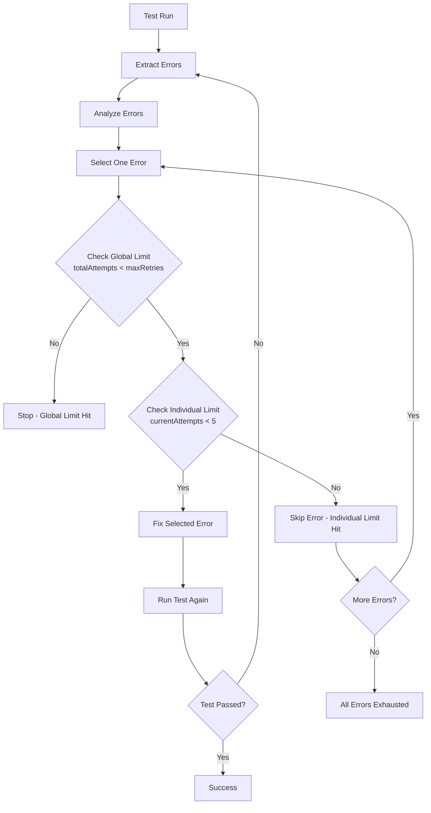

# Fix and Retry Process Architecture

## Overview

The unshallow application implements a sophisticated **two-level retry system** that handles both individual error retries and global retry limits. This system ensures robust error handling while preventing infinite loops during the migration process.

## Two-Level Retry System

### 1. Individual Error Retry Limits (Per-Error Focus)

#### Structure

Each test error gets tracked individually with its own retry counter:

- **Fixed limit per error**: `MAX_ERROR_ATTEMPTS = 5` (hardcoded in `analyze-test-errors.ts`)
- **Error tracking**: Each error gets a unique fingerprint and is stored in `trackedErrors` object
- **Error states**: `'new' | 'active' | 'fixed' | 'regressed'`

#### Error Tracking Data Structure

```typescript
type TrackedError = {
	fingerprint: string; // Unique identifier for the error
	testName: string; // Name of the failing test
	message: string; // Original error message
	normalized: string; // Normalized error message for comparison
	currentAttempts: number; // Individual retry counter (0-5)
	status: 'new' | 'active' | 'fixed' | 'regressed';
};
```

#### Process Flow

1. **Error Extraction**: When a test fails, errors are extracted and fingerprinted
2. **Error Registration**: Each error gets its own `TrackedError` object
3. **Error Selection**: The `analyze-test-errors` node selects **one error at a time** based on priority:
   - **Priority order**: Regressed → New → Active
   - Only selects errors with `currentAttempts < MAX_ERROR_ATTEMPTS`
4. **Attempt Tracking**: When an error is selected, its `currentAttempts` counter increments
5. **Abandonment**: After 5 attempts, the error is abandoned (marked as exceeding retry limits)

### 2. Global Retry Limits (Total Attempts)

#### Structure

Tracks total fix attempts across all errors for the file:

- **Configurable limit**: `maxRetries` (default: 8, configurable via WorkflowOptions)
- **Global counter**: `totalAttempts` tracks all fix attempts regardless of which error

#### Process Flow

1. **Global Tracking**: Every time any error is selected for fixing, `totalAttempts` increments
2. **Global Limit Check**: If `totalAttempts >= maxRetries`, the entire fix process stops
3. **Prevention**: This prevents infinite loops even if individual errors haven't hit their limits

## Current Retry Flow



## Key Characteristics

### Sequential Error Processing

- **One error at a time**: Only one error is addressed per iteration
- **Prioritized selection**: Errors are prioritized based on status
- **Dedicated attempts**: Each error gets up to 5 dedicated fix attempts

### Smart Error Management

- **State transitions**: Errors can transition between states (new → active → fixed → regressed)
- **Regression priority**: Previously fixed errors that break again get highest priority
- **Intelligent skipping**: Errors that exceed individual limits are automatically skipped

### Error Priority System

1. **Regressed errors**: Previously fixed but broken again (highest priority)
2. **New errors**: Never seen before (medium priority)
3. **Active errors**: Existing errors we're still working on (lowest priority)

### Graceful Degradation

- **Global limit hit**: Marks file as failed but stops attempting
- **Individual limits exceeded**: Marks file as failed when all errors exceed limits
- **Dual protection**: Uses both limits to prevent runaway processes

### State Persistence

- **Comprehensive tracking**: All retry counts and error states maintained in `WorkflowState`
- **Resumption capability**: Enables resumption and detailed reporting
- **Audit trail**: Complete history of attempts and outcomes

## Implementation Details

### Key Files

- `source/langgraph-workflow/nodes/analyze-test-errors.ts`: Main retry logic
- `source/langgraph-workflow/edges.ts`: Retry limit checking functions
- `source/langgraph-workflow/interfaces/index.ts`: Data structures and types

### Configuration Options

```typescript
interface WorkflowOptions {
	maxRetries?: number; // Global retry limit (default: 8)
	useFixLoop?: boolean; // Enable/disable fix loop
	// ... other options
}
```

### State Management

```typescript
interface FileState {
	// Retry tracking
	retries: {
		rtl: number;
		test: number;
		ts: number;
		lint: number;
	};
	maxRetries: number;

	// Fix loop specific
	trackedErrors?: Record<string, TrackedError>;
	currentError?: TrackedError | null;
	totalAttempts?: number;

	// ... other state
}
```

## Current Limitations

### Process Efficiency

1. **Sequential processing**: One-at-a-time processing can be slow for files with multiple independent errors
2. **No parallel fixes**: Cannot address multiple unrelated errors simultaneously

### Configuration Flexibility

1. **Fixed individual limits**: 5 attempts per error aren't configurable
2. **Hardcoded constants**: MAX_ERROR_ATTEMPTS is not exposed in configuration

### User Interaction

1. **No user intervention**: Cannot provide context or guidance during retry process
2. **No manual override**: Cannot skip or prioritize specific errors manually
3. **Limited visibility**: No real-time visibility into retry process

### Error Handling

1. **No error grouping**: Similar errors are treated as completely separate entities
2. **No learning**: System doesn't learn from successful fixes to apply to similar errors

## Future Improvements

### Planned Enhancements

1. **Web UI Integration**: Real-time monitoring and intervention capabilities
2. **User Context Input**: Allow users to provide additional context for failed retries
3. **Configurable Limits**: Make individual error limits configurable
4. **Batch Operations**: Enable bulk retry operations with user-provided context
5. **Smart Grouping**: Group similar errors for more efficient processing

### Architectural Considerations

- **State Persistence**: Current state management supports UI integration
- **Event Streaming**: WebSocket integration for real-time updates
- **User Input**: Context injection points for user-provided guidance
- **Queue Management**: Integration with better-queue + LevelDB for enhanced queueing
