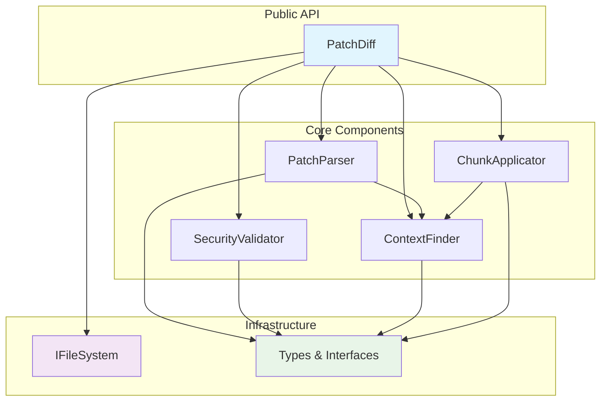
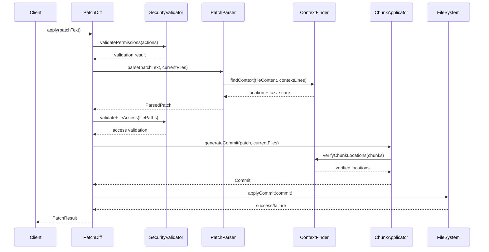
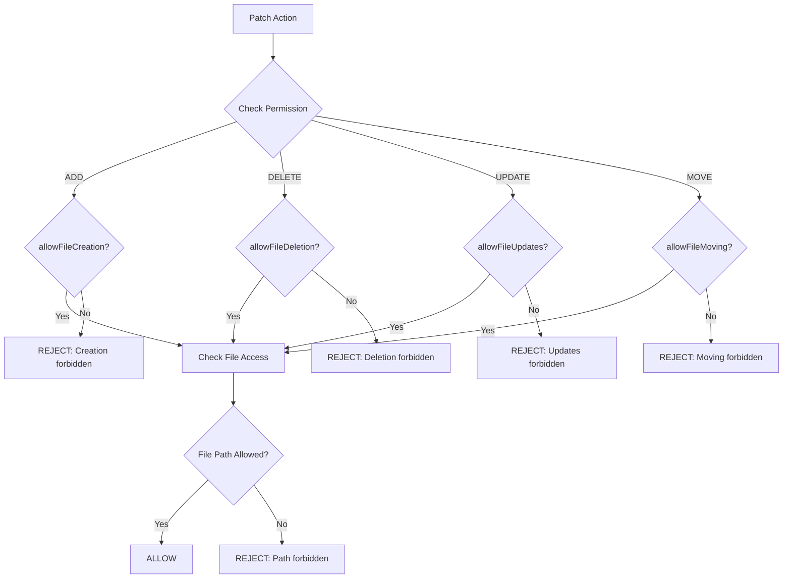
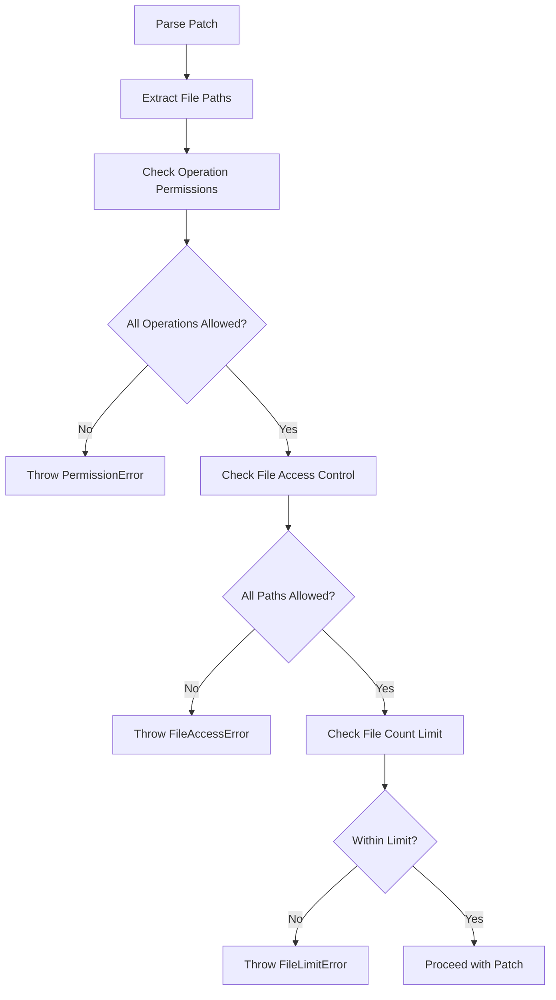
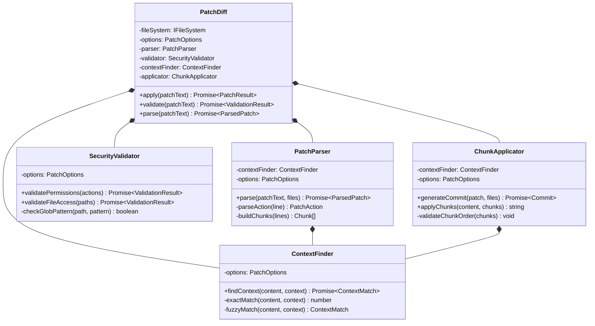
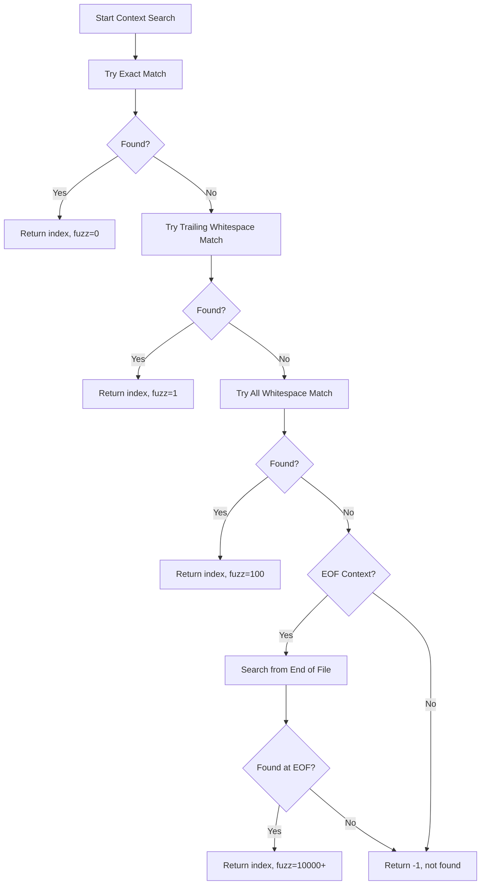

# TypeScript Patch Diff Module

## Table of Contents
- [Architecture Overview](#architecture-overview)
- [API Contracts](#api-contracts)
- [Type Definitions](#type-definitions)
- [Security Model](#security-model)
- [Component Composition](#component-composition)
- [Usage Examples](#usage-examples)
- [Error Handling](#error-handling)

## Architecture Overview

The TypeScript Patch Diff module is a context-based patching system designed specifically for applying AI-generated code modifications. It migrates the existing Python `patch_diff.py` utility to TypeScript with enhanced security features including permission models and file access control.

### Design Principles

1. **Composition Over Inheritance**: All components use composition to collaborate
2. **Security First**: Built-in permission model and file access control
3. **Type Safety**: Full TypeScript typing with zero `any` usage
4. **Context-Based Matching**: Uses code content as anchors instead of line numbers
5. **Fuzzy Matching**: Handles whitespace variations gracefully
6. **Hard Dependencies**: FileSystem is a hard dependency, not injected

### System Architecture



### Data Flow



## API Contracts

### Main PatchDiff Class

```typescript
export class PatchDiff {
  constructor(
    private readonly fileSystem: IFileSystem,
    private readonly options: PatchOptions = DEFAULT_PATCH_OPTIONS
  );
  
  /**
   * Apply a patch and return detailed results
   */
  async apply(patchText: string): Promise<PatchResult>;
  
  /**
   * Validate a patch without applying it
   */
  async validate(patchText: string): Promise<PatchValidationResult>;
  
  /**
   * Parse patch text and return structured representation
   */
  async parse(patchText: string): Promise<ParsedPatch>;
}
```

### Core Interfaces

```typescript
// Primary result interface
interface PatchResult {
  success: boolean;
  filesModified: number;
  filesCreated: number;
  filesDeleted: number;
  filesMoved: number;
  fuzzScore: number;
  executionTimeMs: number;
  modifiedFiles: string[];
  fileContents: Map<string, string>;  // New content of all modified files
  warnings: string[];
  error?: PatchError;
}

// Configuration interface
interface PatchOptions {
  fuzzyMatching: FuzzyMatchingConfig;
  permissions: PatchPermissions;
  fileAccess: FileAccessControl;
  validateBeforeApply: boolean;
  createBackups: boolean;
  timeoutMs: number;
  stopOnFirstError: boolean;
}
```

### Component Interfaces

```typescript
// Parser component
interface IPatchParser {
  parse(patchText: string, currentFiles: Map<string, string>): Promise<ParsedPatch>;
}

// Security validator component  
interface ISecurityValidator {
  validatePermissions(actions: Map<string, PatchAction>): Promise<ValidationResult>;
  validateFileAccess(filePaths: string[]): Promise<ValidationResult>;
}

// Context finder component
interface IContextFinder {
  findContext(fileContent: string, contextLines: string[]): Promise<ContextMatch>;
}

// Chunk applicator component
interface IChunkApplicator {
  generateCommit(patch: ParsedPatch, currentFiles: Map<string, string>): Promise<Commit>;
  applyChunks(originalContent: string, chunks: Chunk[]): string;
}
```

## Type Definitions

### Core Action Types

```typescript
enum ActionType {
  ADD = 'add',
  DELETE = 'delete', 
  UPDATE = 'update'
}

interface PatchAction {
  type: ActionType;
  newFile?: string;           // For ADD actions
  chunks: Chunk[];            // For UPDATE actions
  movePath?: string;          // For file moves
  filePath: string;           // Original file path
}

interface Chunk {
  origIndex: number;          // Index in original file
  delLines: string[];         // Lines to delete
  insLines: string[];         // Lines to insert
  contextLines?: string[];    // Context used for finding location
  fuzzScore?: number;         // Matching fuzz score
}
```

### Security Types

```typescript
interface PatchPermissions {
  allowFileCreation: boolean;
  allowFileDeletion: boolean;
  allowFileUpdates: boolean;
  allowFileMoving: boolean;
  allowDirectoryCreation: boolean;
}

interface FileAccessControl {
  allowedPaths: string[];     // Glob patterns for allowed files
  forbiddenPaths: string[];   // Glob patterns for forbidden files
  whitelistMode: boolean;     // Only allowedPaths can be modified
  maxFilesPerPatch: number;   // Maximum files per patch operation
}
```

### Result Types

```typescript
interface ParsedPatch {
  actions: Map<string, PatchAction>;
  fuzzScore: number;
  metadata: {
    totalLines: number;
    parseTimeMs: number;
    contextSearches: number;
  };
}

interface Commit {
  changes: Map<string, FileChange>;
  metadata: {
    totalFiles: number;
    createdAt: Date;
    id: string;
  };
}
```

## Security Model

### Permission-Based Access Control

The security model enforces operation-level permissions to prevent unauthorized actions:



### File Access Control Modes

**Whitelist Mode** (Secure by default):
```typescript
const secureOptions: PatchOptions = {
  fileAccess: {
    allowedPaths: ['src/**/*.ts', 'tests/**/*.test.ts'],
    forbiddenPaths: [],
    whitelistMode: true,  // Only allowedPaths can be modified
    maxFilesPerPatch: 5
  }
};
```

**Blacklist Mode** (Permissive with restrictions):
```typescript
const permissiveOptions: PatchOptions = {
  fileAccess: {
    allowedPaths: ['**/*'],
    forbiddenPaths: ['*.env', 'src/config/*', '.git/**'],
    whitelistMode: false,  // All paths except forbiddenPaths
    maxFilesPerPatch: 20
  }
};
```

### Security Validation Flow



## Component Composition

The module uses composition to combine specialized components without inheritance:



### Context Finding Algorithm



## Usage Examples

### Basic Usage

```typescript
import { PatchDiff, DEFAULT_PATCH_OPTIONS } from '../patch-diff';
import { FileSystem } from '../file-system';

// Create patch diff instance with file system dependency and default options
const fileSystem = new FileSystem();
const patchDiff = new PatchDiff(fileSystem, DEFAULT_PATCH_OPTIONS);

// Apply a simple patch
const patchText = `
*** Begin Patch
*** Update File: src/utils.ts
@@ export function formatDate(date: Date) {
-  return date.toISOString();
+  return date.toLocaleDateString('en-US');
}
*** End Patch
`;

const result = await patchDiff.apply(patchText);
console.log(`Applied patch: ${result.success ? 'Success' : 'Failed'}`);
console.log(`Files modified: ${result.filesModified}`);

// Access the new file contents
if (result.success) {
  for (const [filePath, content] of result.fileContents) {
    console.log(`Updated ${filePath}:`);
    console.log(content);
  }
}
```

### Secure Configuration

```typescript
// Restrictive configuration for production use
const secureOptions: PatchOptions = {
  permissions: {
    allowFileCreation: false,     // Block new file creation
    allowFileDeletion: false,     // Block file deletion
    allowFileUpdates: true,       // Allow updates only
    allowFileMoving: false,       // Block file moves
    allowDirectoryCreation: false
  },
  fileAccess: {
    allowedPaths: [
      'src/**/*.ts',              // Only TypeScript source files
      'src/**/*.tsx',             // Only TypeScript React files
      'tests/**/*.test.ts'        // Only test files
    ],
    forbiddenPaths: [
      'src/config/*',             // Block config files
      '*.env',                    // Block environment files
      'package.json',             // Block package.json
      '.git/**'                   // Block git files
    ],
    whitelistMode: true,          // Strict whitelist mode
    maxFilesPerPatch: 3           // Limit to 3 files per patch
  },
  validateBeforeApply: true,      // Always validate first
  stopOnFirstError: true          // Stop on first error
};

// Create patch diff with secure configuration
const fileSystem = new FileSystem();
const securePatchDiff = new PatchDiff(fileSystem, secureOptions);

const result = await securePatchDiff.apply(patchText);
```

### Validation Only

```typescript
// Validate patch without applying changes
const validation = await securePatchDiff.validate(patchText);

if (!validation.isValid) {
  console.error('Patch validation failed:');
  validation.errors.forEach(error => console.error(`- ${error}`));
  return;
}

console.log('Patch validation passed');
console.log(`Would affect ${validation.affectedFiles.length} files`);
console.log(`Estimated fuzz score: ${validation.estimatedFuzzScore}`);
```

### Error Handling

```typescript
try {
  const result = await securePatchDiff.apply(patchText);
  
  if (!result.success) {
    console.error(`Patch failed: ${result.error?.message}`);
    if (result.error instanceof FileAccessError) {
      console.error(`Forbidden file: ${result.error.filePath}`);
    }
  }
} catch (error) {
  if (error instanceof PatchError) {
    console.error(`Patch error: ${error.code} - ${error.message}`);
    console.error(`Context: ${JSON.stringify(error.context)}`);
  } else {
    console.error(`Unexpected error: ${error.message}`);
  }
}
```

### Batch Processing

```typescript
// Process multiple patches with same configuration
const patches = [patch1, patch2, patch3];
const results: PatchResult[] = [];

for (const patch of patches) {
  try {
    const result = await securePatchDiff.apply(patch);
    results.push(result);
    
    if (!result.success && securePatchDiff.options.stopOnFirstError) {
      break;
    }
  } catch (error) {
    console.error(`Failed to apply patch: ${error.message}`);
    break;
  }
}

// Summary
const successful = results.filter(r => r.success).length;
const totalFiles = results.reduce((sum, r) => sum + r.filesModified, 0);
console.log(`Applied ${successful}/${patches.length} patches`);
console.log(`Modified ${totalFiles} files total`);

// Access all modified file contents
const allModifiedContents = new Map<string, string>();
for (const result of results) {
  if (result.success) {
    for (const [filePath, content] of result.fileContents) {
      allModifiedContents.set(filePath, content);
    }
  }
}
```

## Error Handling

### Error Hierarchy

```typescript
class PatchError extends Error {
  constructor(
    message: string,
    public readonly code: PatchErrorCode,
    public readonly context?: Record<string, unknown>,
    public readonly filePath?: string,
    public readonly lineNumber?: number
  );
}

// Specific error types
class InvalidPatchFormatError extends PatchError;
class FileNotFoundError extends PatchError;
class FileAlreadyExistsError extends PatchError;
class ContextNotFoundError extends PatchError;
class FileSystemError extends PatchError;
class PermissionDeniedError extends PatchError;
class FileAccessDeniedError extends PatchError;
```

### Error Context

All errors include rich context for debugging:

```typescript
try {
  await securePatchDiff.apply(patchText);
} catch (error) {
  if (error instanceof ContextNotFoundError) {
    console.error(error.getFullMessage());
    // Output: "CONTEXT_NOT_FOUND: Context not found in src/utils.ts: def greet(name) | print(f"Hello {name}") (in src/utils.ts:15) - Context: {"contextLines":["def greet(name):","    print(f\"Hello {name}\")"],"searchAttempts":3}"
  }
}
```

### Validation Results

Non-throwing validation provides detailed feedback:

```typescript
interface PatchValidationResult {
  isValid: boolean;
  errors: string[];           // Blocking errors
  warnings: string[];         // Non-blocking warnings
  affectedFiles: string[];    // Files that would be changed
  estimatedFuzzScore: number; // Expected fuzz score
}
```

This comprehensive documentation ensures clear contracts, security guarantees, and proper usage patterns for the TypeScript Patch Diff module.