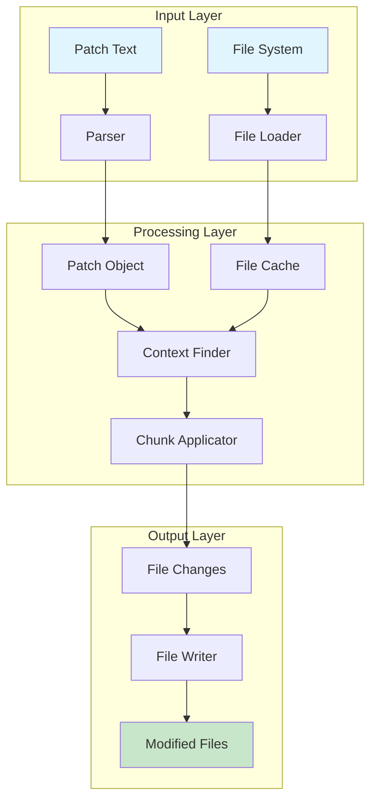
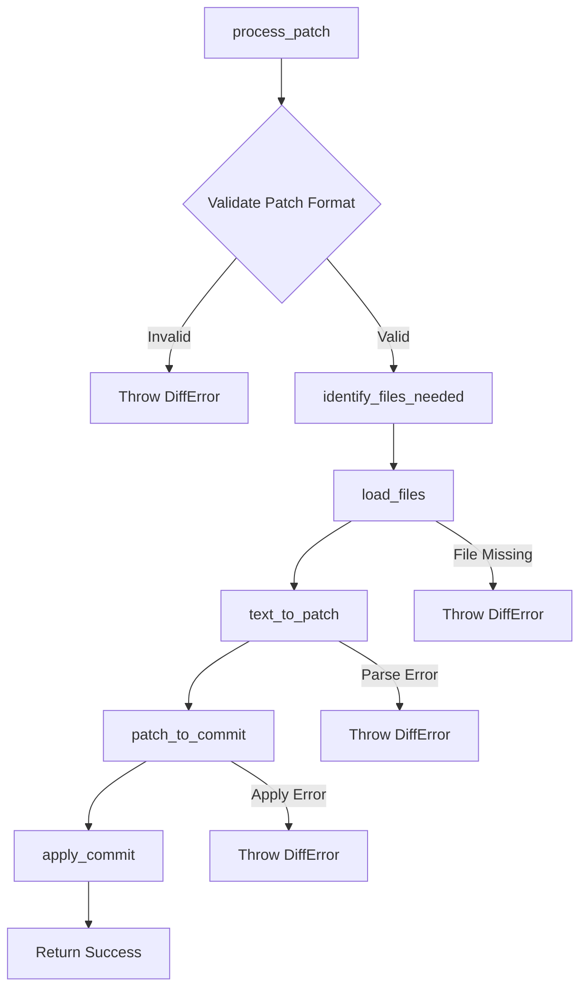
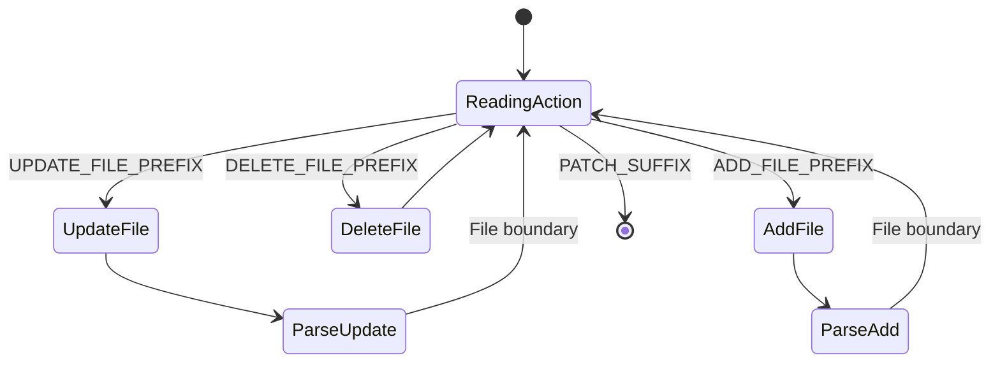
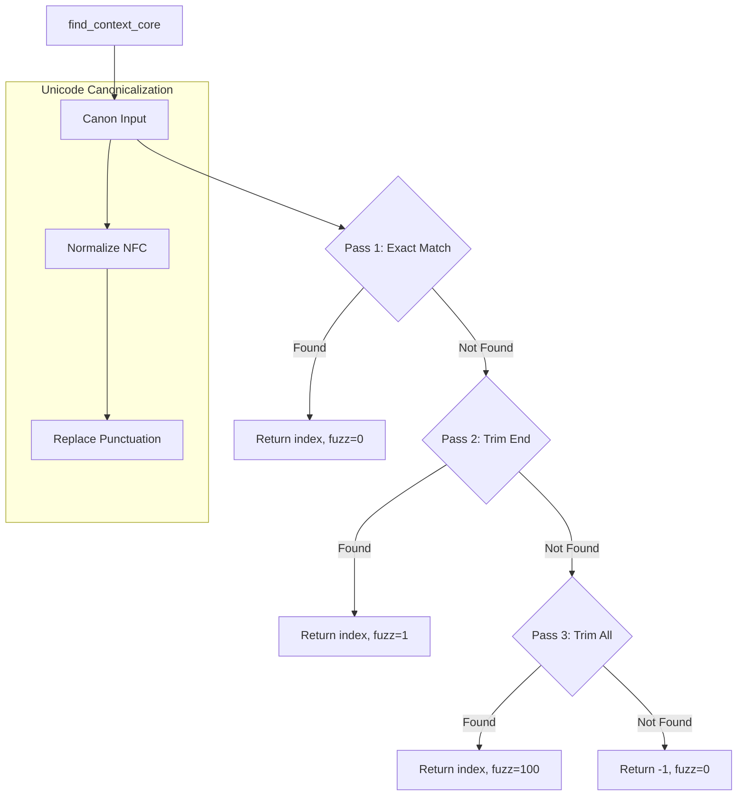
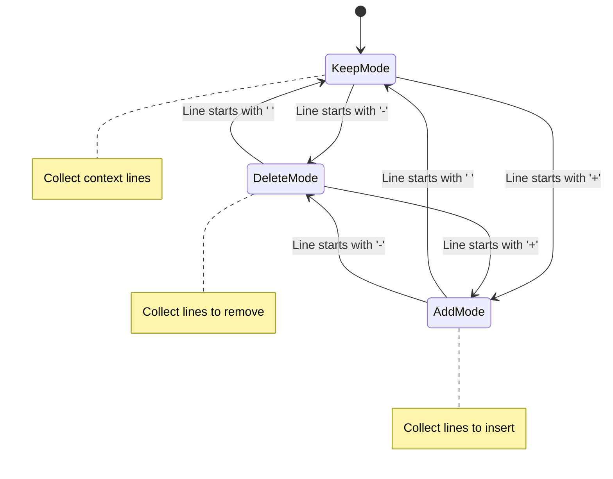
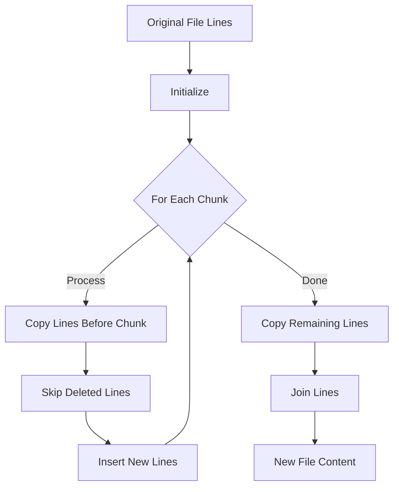
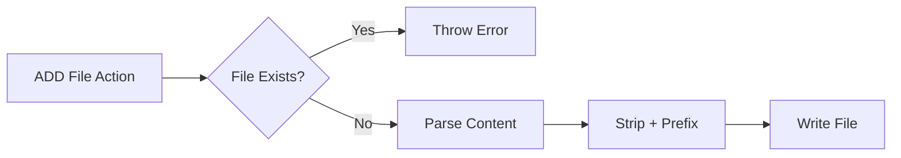
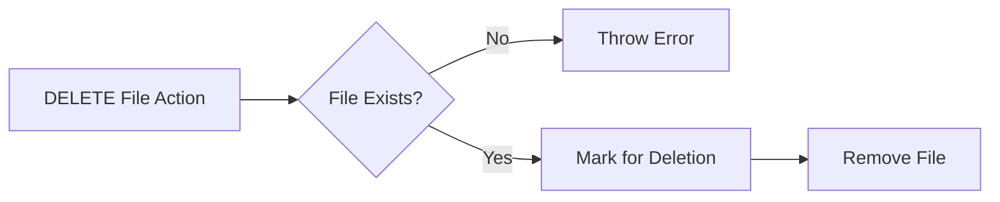
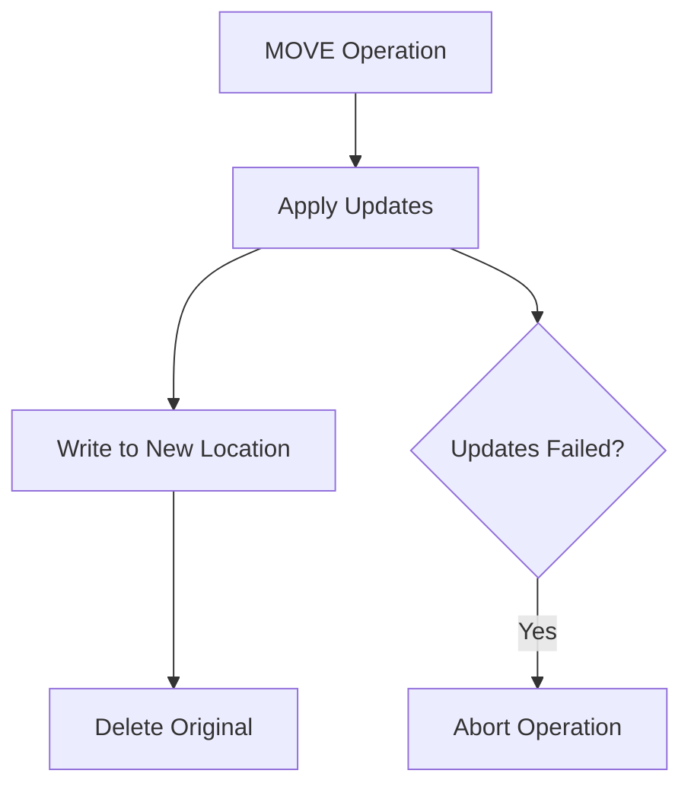
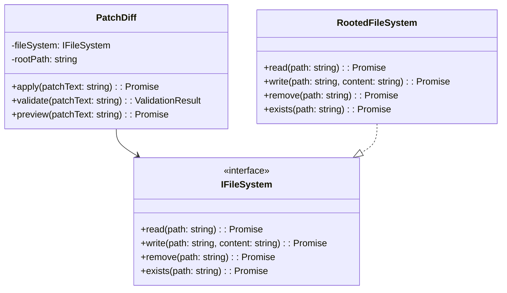

# Patch-Diff System: Deep Technical Documentation

## Table of Contents

- [Overview](#overview)
- [Algorithm Architecture](#algorithm-architecture)
- [Core Algorithm Flow](#core-algorithm-flow)
- [Detailed Implementation Analysis](#detailed-implementation-analysis)
- [Context Finding Algorithm](#context-finding-algorithm)
- [Chunk Application Process](#chunk-application-process)
- [File Operation Handlers](#file-operation-handlers)
- [Unicode Normalization](#unicode-normalization)
- [Edge Cases and Error Handling](#edge-cases-and-error-handling)
- [Integration Architecture](#integration-architecture)
- [Testing Strategy](#testing-strategy)

## Overview

The patch-diff system is a sophisticated implementation of OpenAI's V4A (Version 4A) diff format, designed for applying code changes without relying on line numbers. This document provides an exhaustive technical analysis of the algorithm implementation.

### Key Technical Features

- **Context-based matching**: Uses surrounding code context with 3-pass fuzzy matching
- **Unicode normalization**: Handles 15+ Unicode variants for robust matching
- **Hierarchical context resolution**: Stack-based context navigation with `@@` markers
- **Atomic operations**: All-or-nothing patch application
- **Streaming parser**: Line-by-line parsing for memory efficiency

## Algorithm Architecture



## Core Algorithm Flow

### Main Entry Point: `process_patch`



Let's analyze the main function line by line:

```typescript
export function process_patch(
  text: string,
  openFn: (p: string) => string,
  writeFn: (p: string, c: string) => void,
  removeFn: (p: string) => void
): string {
  // Line 709: Validate patch starts with correct prefix
  if (!text.startsWith(PATCH_PREFIX)) {
    throw new DiffError('Patch must start with *** Begin Patch\\n');
  }
  
  // Line 712: Extract all files that need to be loaded
  const paths = identify_files_needed(text);
  
  // Line 713: Load file contents into memory
  const orig = load_files(paths, openFn);
  
  // Line 714: Parse patch text into structured format
  const [patch, _fuzz] = text_to_patch(text, orig);
  
  // Line 715: Convert patch to commit (apply changes in memory)
  const commit = patch_to_commit(patch, orig);
  
  // Line 716: Write changes to file system
  apply_commit(commit, writeFn, removeFn);
  
  return 'Done!';
}
```

## Detailed Implementation Analysis

### 1. File Identification Phase

```typescript
export function identify_files_needed(text: string): Array<string> {
  const lines = text.trim().split('\n');
  const result = new Set<string>();
  
  // Scan for UPDATE and DELETE operations
  for (const line of lines) {
    if (line.startsWith(UPDATE_FILE_PREFIX)) {
      result.add(line.slice(UPDATE_FILE_PREFIX.length));
    }
    if (line.startsWith(DELETE_FILE_PREFIX)) {
      result.add(line.slice(DELETE_FILE_PREFIX.length));
    }
  }
  return [...result];
}
```

**Key Points:**
- Only loads files that will be modified or deleted
- Ignores ADD operations (no existing file needed)
- Uses Set to avoid duplicate file loads

### 2. Parser State Machine

The `Parser` class implements a state machine for parsing patches:



#### Parser Implementation Details

```typescript
parse(): void {
  while (!this.is_done([PATCH_SUFFIX])) {
    // Line 144: Try to read UPDATE action
    let path = this.read_str(UPDATE_FILE_PREFIX);
    if (path) {
      // Line 146-147: Check for duplicate paths
      if (this.patch.actions[path]) {
        throw new DiffError(`Update File Error: Duplicate Path: ${path}`);
      }
      
      // Line 149: Check for optional MOVE operation
      const moveTo = this.read_str(MOVE_FILE_TO_PREFIX);
      
      // Line 150-152: Verify file exists
      if (!(path in this.current_files)) {
        throw new DiffError(`Update File Error: Missing File: ${path}`);
      }
      
      // Line 153-156: Parse the update chunks
      const text = this.current_files[path];
      const action = this.parse_update_file(text ?? '');
      action.move_path = moveTo || undefined;
      this.patch.actions[path] = action;
      continue;
    }
    
    // Similar logic for DELETE and ADD...
  }
}
```

### 3. Update File Parser

The most complex operation is parsing file updates:

```typescript
private parse_update_file(text: string): PatchAction {
  const action: PatchAction = { type: ActionType.UPDATE, chunks: [] };
  const fileLines = text.split('\n');
  let index = 0;  // Current position in file
  
  while (!this.is_done([/* file boundaries */])) {
    // Line 203: Read context definition line
    const defStr = this.read_str('@@ ');
    
    // Line 213-277: Find context in file
    if (defStr.trim()) {
      // Complex context finding logic...
      // First tries exact match in already-seen lines
      // Then searches forward from current position
      // Applies canonicalization for Unicode variants
    }
    
    // Line 279-303: Parse chunks at this location
    const [nextChunkContext, chunks, endPatchIndex, eof] = 
      peek_next_section(this.lines, this.index);
    
    // Apply chunks to determine actual position
    const [newIndex, fuzz] = find_context(
      fileLines, nextChunkContext, index, eof
    );
    
    // Update chunk positions and add to action
    for (const ch of chunks) {
      ch.orig_index += newIndex;
      action.chunks.push(ch);
    }
    
    index = newIndex + nextChunkContext.length;
    this.index = endPatchIndex;
  }
  return action;
}
```

## Context Finding Algorithm

The context finding algorithm is the heart of the patch system:



### Detailed Context Finding Implementation

```typescript
function find_context_core(
  lines: Array<string>,
  context: Array<string>,
  start: number
): [number, number] {
  // Line 382-388: Define canonicalization function
  const canon = (s: string): string =>
    s.normalize('NFC')  // Unicode normalization
     .replace(/./gu, (c) => PUNCT_EQUIV[c] ?? c);  // Replace lookalikes
  
  if (context.length === 0) {
    return [start, 0];  // Empty context matches at start
  }
  
  // Pass 1: Exact equality after canonicalization
  const canonicalContext = canon(context.join('\n'));
  for (let i = start; i < lines.length; i++) {
    const segment = canon(lines.slice(i, i + context.length).join('\n'));
    if (segment === canonicalContext) {
      return [i, 0];  // Perfect match, fuzz = 0
    }
  }
  
  // Pass 2: Ignore trailing whitespace
  for (let i = start; i < lines.length; i++) {
    const segment = canon(
      lines.slice(i, i + context.length)
        .map((s) => s.trimEnd())
        .join('\n')
    );
    const ctx = canon(context.map((s) => s.trimEnd()).join('\n'));
    if (segment === ctx) {
      return [i, 1];  // Good match, minimal fuzz
    }
  }
  
  // Pass 3: Ignore all surrounding whitespace
  for (let i = start; i < lines.length; i++) {
    const segment = canon(
      lines.slice(i, i + context.length)
        .map((s) => s.trim())
        .join('\n')
    );
    const ctx = canon(context.map((s) => s.trim()).join('\n'));
    if (segment === ctx) {
      return [i, 100];  // Fuzzy match, high fuzz score
    }
  }
  
  return [-1, 0];  // No match found
}
```

### EOF Context Handling

Special handling for end-of-file contexts:

```typescript
function find_context(
  lines: Array<string>,
  context: Array<string>,
  start: number,
  eof: boolean
): [number, number] {
  if (eof) {
    // Line 439-443: First try at exact EOF position
    let [newIndex, fuzz] = find_context_core(
      lines,
      context,
      lines.length - context.length  // Start from end
    );
    if (newIndex !== -1) {
      return [newIndex, fuzz];
    }
    
    // Line 447-448: Fall back to searching from start
    [newIndex, fuzz] = find_context_core(lines, context, start);
    return [newIndex, fuzz + 10000];  // High fuzz penalty for wrong position
  }
  return find_context_core(lines, context, start);
}
```

## Chunk Application Process

The `peek_next_section` function parses individual chunks:



### Chunk Parsing Implementation

```typescript
function peek_next_section(
  lines: Array<string>,
  initialIndex: number
): [Array<string>, Array<Chunk>, number, boolean] {
  let index = initialIndex;
  const old: Array<string> = [];  // Original file content
  let delLines: Array<string> = [];
  let insLines: Array<string> = [];
  const chunks: Array<Chunk> = [];
  let mode: 'keep' | 'add' | 'delete' = 'keep';
  
  while (index < lines.length) {
    const s = lines[index]!;
    
    // Check for section boundaries
    if ([/* boundary markers */].some(p => s.startsWith(p.trim()))) {
      break;
    }
    
    // Line 485-503: Determine line mode
    const lastMode = mode;
    let line = s;
    if (line[0] === HUNK_ADD_LINE_PREFIX) {
      mode = 'add';
    } else if (line[0] === '-') {
      mode = 'delete';
    } else if (line[0] === ' ') {
      mode = 'keep';
    } else {
      // Tolerate missing leading space (common model error)
      mode = 'keep';
      line = ' ' + line;
    }
    
    line = line.slice(1);  // Remove prefix
    
    // Line 505-515: Create chunk when transitioning back to 'keep'
    if (mode === 'keep' && lastMode !== mode) {
      if (insLines.length || delLines.length) {
        chunks.push({
          orig_index: old.length - delLines.length,
          del_lines: delLines,
          ins_lines: insLines,
        });
      }
      delLines = [];
      insLines = [];
    }
    
    // Line 516-523: Collect lines based on mode
    if (mode === 'delete') {
      delLines.push(line);
      old.push(line);  // Track original content
    } else if (mode === 'add') {
      insLines.push(line);
    } else {
      old.push(line);  // Context line
    }
    
    index++;
  }
  
  // Line 525-531: Final chunk if any
  if (insLines.length || delLines.length) {
    chunks.push({
      orig_index: old.length - delLines.length,
      del_lines: delLines,
      ins_lines: insLines,
    });
  }
  
  // Check for EOF marker
  if (index < lines.length && lines[index] === END_OF_FILE_PREFIX) {
    index += 1;
    return [old, chunks, index, true];  // EOF flag
  }
  
  return [old, chunks, index, false];
}
```

### File Update Application

The `_get_updated_file` function applies chunks to create the new file:



```typescript
function _get_updated_file(
  text: string,
  action: PatchAction,
  path: string
): string {
  const origLines = text.split('\n');
  const destLines: Array<string> = [];
  let origIndex = 0;
  
  for (const chunk of action.chunks) {
    // Line 606-614: Validate chunk position
    if (chunk.orig_index > origLines.length) {
      throw new DiffError(
        `${path}: chunk.orig_index ${chunk.orig_index} > len(lines) ${origLines.length}`
      );
    }
    if (origIndex > chunk.orig_index) {
      throw new DiffError(
        `${path}: orig_index ${origIndex} > chunk.orig_index ${chunk.orig_index}`
      );
    }
    
    // Line 616: Copy unchanged lines before chunk
    destLines.push(...origLines.slice(origIndex, chunk.orig_index));
    const delta = chunk.orig_index - origIndex;
    origIndex += delta;
    
    // Line 620-625: Insert new lines
    if (chunk.ins_lines.length) {
      for (const l of chunk.ins_lines) {
        destLines.push(l);
      }
    }
    
    // Line 626: Skip deleted lines
    origIndex += chunk.del_lines.length;
  }
  
  // Line 628: Copy remaining lines after last chunk
  destLines.push(...origLines.slice(origIndex));
  
  return destLines.join('\n');
}
```

## File Operation Handlers

### ADD File Operation



```typescript
private parse_add_file(): PatchAction {
  const lines: Array<string> = [];
  
  while (!this.is_done([/* boundaries */])) {
    const s = this.read_str();
    
    // Line 319-321: Validate line starts with +
    if (!s.startsWith(HUNK_ADD_LINE_PREFIX)) {
      throw new DiffError(`Invalid Add File Line: ${s}`);
    }
    
    // Line 322: Strip + prefix and collect
    lines.push(s.slice(1));
  }
  
  return {
    type: ActionType.ADD,
    new_file: lines.join('\n'),
    chunks: [],
  };
}
```

### DELETE File Operation



### MOVE File Operation



## Unicode Normalization

The system handles these Unicode equivalents by normalizing them to ASCII versions before comparison:

### Implementation:

```typescript
const PUNCT_EQUIV: Record<string, string> = {
  // Hyphen/dash variants (7 total)
  '\u002D': '-',  // HYPHEN-MINUS
  '\u2010': '-',  // HYPHEN
  '\u2011': '-',  // NON-BREAKING HYPHEN
  '\u2012': '-',  // FIGURE DASH
  '\u2013': '-',  // EN DASH
  '\u2014': '-',  // EM DASH
  '\u2212': '-',  // MINUS SIGN
  
  // Double quotes (6 total)
  '\u0022': '"',  // QUOTATION MARK
  '\u201C': '"',  // LEFT DOUBLE QUOTATION
  '\u201D': '"',  // RIGHT DOUBLE QUOTATION
  '\u201E': '"',  // DOUBLE LOW-9 QUOTATION
  '\u00AB': '"',  // LEFT ANGLE QUOTATION
  '\u00BB': '"',  // RIGHT ANGLE QUOTATION
  
  // Single quotes (4 total)
  '\u0027': "'",  // APOSTROPHE
  '\u2018': "'",  // LEFT SINGLE QUOTATION
  '\u2019': "'",  // RIGHT SINGLE QUOTATION
  '\u201B': "'",  // SINGLE HIGH-REVERSED-9
  
  // Spaces (2 total)
  '\u00A0': ' ',  // NO-BREAK SPACE
  '\u202F': ' ',  // NARROW NO-BREAK SPACE
};
```

## Edge Cases and Error Handling

### Error Hierarchy

The system uses a hierarchy of error types extending the base `DiffError` class to handle different failure scenarios:

### Specific Edge Cases

#### 1. Ambiguous Context Resolution

When the same 3-line context appears multiple times:

```python
# File has:
def process():
    result = []
    for item in data:
        result.append(item)  # This pattern
    return result

def transform():
    output = []
    for item in data:
        result.append(item)  # Same pattern!
    return output
```

Solution: Use hierarchical markers:
```
@@ def process():
    for item in data:
-       result.append(item)
+       result.append(item * 2)
```

#### 2. Whitespace Tolerance

The algorithm handles these progressively:

```typescript
// Original file (tabs and spaces mixed):
"def  func():\t\n    return\t42  \n"

// Pass 1: Must match exactly (including mixed whitespace)
// Pass 2: Matches "def  func():\t\n    return\t42\n" (trailing spaces removed)  
// Pass 3: Matches "def func():\nreturn 42" (all whitespace normalized)
```

#### 3. Missing Context Lines

When models omit leading spaces:

```diff
# Model outputs:
def func():
    x = 1
y = 2  # Missing leading space!
-   z = 3
+   z = 4

# Parser tolerates by adding space:
line = ' ' + line;  // Line 498
```

#### 4. Overlapping Changes

```typescript
// Chunk 1: lines 10-15
// Chunk 2: lines 13-18
// Parser ensures sequential application without conflicts
```

## Integration Architecture

### With RootedFileSystem



### Implementation:

```typescript
export class PatchDiff {
  constructor(
    private fileSystem: IFileSystem,
    private rootPath: string
  ) {}
  
  async apply(patchText: string): Promise<PatchResult> {
    try {
      // Step 1: Validate patch format
      if (!patchText.startsWith(PATCH_PREFIX)) {
        throw new InvalidPatchError('Missing patch prefix');
      }
      
      // Step 2: Parse to identify files
      const filesNeeded = identify_files_needed(patchText);
      const filesAdded = identify_files_added(patchText);
      
      // Step 3: Security validation
      this.validatePaths([...filesNeeded, ...filesAdded]);
      
      // Step 4: Load existing files
      const fileContents: Record<string, string> = {};
      for (const path of filesNeeded) {
        try {
          const content = await this.fileSystem.read(
            this.resolvePath(path)
          );
          fileContents[path] = content;
        } catch (error) {
          throw new FileNotFoundError(`Cannot read: ${path}`);
        }
      }
      
      // Step 5: Check ADD conflicts
      for (const path of filesAdded) {
        const exists = await this.fileSystem.exists(
          this.resolvePath(path)
        );
        if (exists) {
          throw new FileExistsError(`File already exists: ${path}`);
        }
      }
      
      // Step 6: Parse patch with file contents
      const [patch, fuzz] = text_to_patch(patchText, fileContents);
      
      // Step 7: Generate commit (in-memory changes)
      const commit = patch_to_commit(patch, fileContents);
      
      // Step 8: Apply changes to file system
      const changes: FileChange[] = [];
      for (const [path, change] of Object.entries(commit.changes)) {
        await this.applyChange(path, change);
        changes.push(change);
      }
      
      return {
        success: true,
        changes,
        fuzz,
      };
    } catch (error) {
      return {
        success: false,
        error: error as Error,
      };
    }
  }
  
  private async applyChange(
    path: string,
    change: FileChange
  ): Promise<void> {
    const fullPath = this.resolvePath(path);
    
    switch (change.type) {
      case ActionType.DELETE:
        await this.fileSystem.remove(fullPath);
        break;
        
      case ActionType.ADD:
        await this.fileSystem.write(
          fullPath,
          change.new_content || ''
        );
        break;
        
      case ActionType.UPDATE:
        if (change.move_path) {
          // Write to new location
          await this.fileSystem.write(
            this.resolvePath(change.move_path),
            change.new_content || ''
          );
          // Delete old location
          await this.fileSystem.remove(fullPath);
        } else {
          // Update in place
          await this.fileSystem.write(
            fullPath,
            change.new_content || ''
          );
        }
        break;
    }
  }
  
  private validatePaths(paths: string[]): void {
    for (const path of paths) {
      // No absolute paths
      if (path.isAbsolute(path)) {
        throw new SecurityError(`Absolute path not allowed: ${path}`);
      }
      
      // No directory traversal
      if (path.includes('../')) {
        throw new SecurityError(`Path traversal not allowed: ${path}`);
      }
      
      // Must be within root
      const resolved = this.resolvePath(path);
      if (!resolved.startsWith(this.rootPath)) {
        throw new SecurityError(`Path outside root: ${path}`);
      }
    }
  }
  
  private resolvePath(relativePath: string): string {
    return path.join(this.rootPath, relativePath);
  }
}
```

## Testing Strategy

### Test Categories

The test suite is organized into four main categories: unit tests (parser, context finder, chunk applicator, Unicode normalizer), integration tests (simple updates, multi-file operations, hierarchical context, whitespace fuzzing, file operations), error tests (missing files, ambiguous context, invalid syntax, security violations), and performance tests (large files, many small changes, deep nesting).

### Critical Test Scenarios

#### 1. Unicode Normalization Test

```typescript
it('should normalize Unicode variants', async () => {
  const template = 'def calculate(x):\n    return x — 1  // EN DASH\n';
  const patch = `*** Begin Patch
*** Update File: test.py
def calculate(x):
-    return x - 1  // ASCII HYPHEN
+    return x - 2
*** End Patch`;
  
  const result = await patchDiff.apply(patch);
  expect(result.success).toBe(true);
  expect(result.fuzz).toBe(0);  // Should match despite Unicode difference
});
```

#### 2. Hierarchical Context Test

```typescript
it('should handle identical method names in different classes', async () => {
  const template = `
class UserService:
    def update(self, id, data):
        return self.db.update(id, data)

class ProductService:
    def update(self, id, data):
        return self.db.update(id, data)
  `;
  
  const patch = `*** Begin Patch
*** Update File: services.py
@@ class UserService:
    def update(self, id, data):
-        return self.db.update(id, data)
+        return self.db.update_user(id, data)

@@ class ProductService:
    def update(self, id, data):
-        return self.db.update(id, data)
+        return self.db.update_product(id, data)
*** End Patch`;
  
  // Should update both methods correctly
});
```

#### 3. Edge Case: EOF Context

```typescript
it('should handle EOF context correctly', async () => {
  const template = 'line1\nline2\nline3';
  const patch = `*** Begin Patch
*** Update File: test.txt
line2
line3
+line4
*** End of File
*** End Patch`;
  
  const result = await patchDiff.apply(patch);
  expect(result.success).toBe(true);
  // Should add line4 at end
});
```

### Missing Test Coverage

1. **Concurrent Patch Applications**
   - Test applying multiple patches to same file
   - Verify atomic operations

2. **Binary File Handling**
   - Ensure proper error for binary files
   - Test mixed text/binary detection

3. **Memory Performance**
   - Test with 100MB+ files
   - Verify streaming behavior

4. **Complex Hierarchical Nesting**
   - 4+ levels of `@@` markers
   - Nested classes with nested methods

5. **Security Edge Cases**
   - Symlink handling
   - Case-sensitive path attacks
   - Unicode path normalization

## Summary

The patch-diff algorithm is a sophisticated system that handles the complexity of applying contextual changes to files without line numbers. Its key innovations include:

1. **3-pass fuzzy matching** with progressive whitespace tolerance
2. **Unicode normalization** for 19 common punctuation variants
3. **Hierarchical context resolution** for ambiguous locations
4. **Atomic operations** ensuring consistency
5. **Security-first design** preventing path traversal

The implementation demonstrates careful attention to edge cases, robust error handling, and integration with modern TypeScript patterns. The migration from CLI to programmatic API enables integration with AI-driven code generation systems while maintaining the robustness of the original Python implementation.