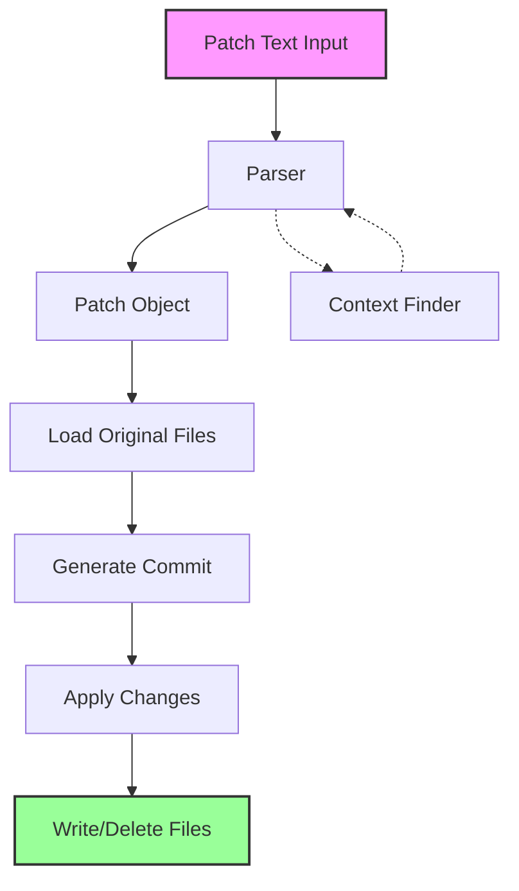
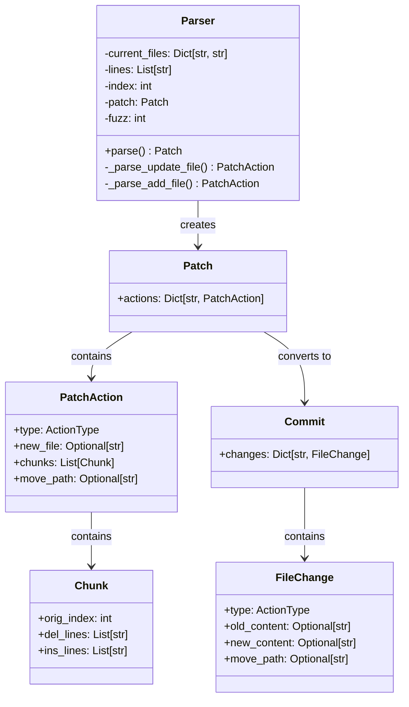
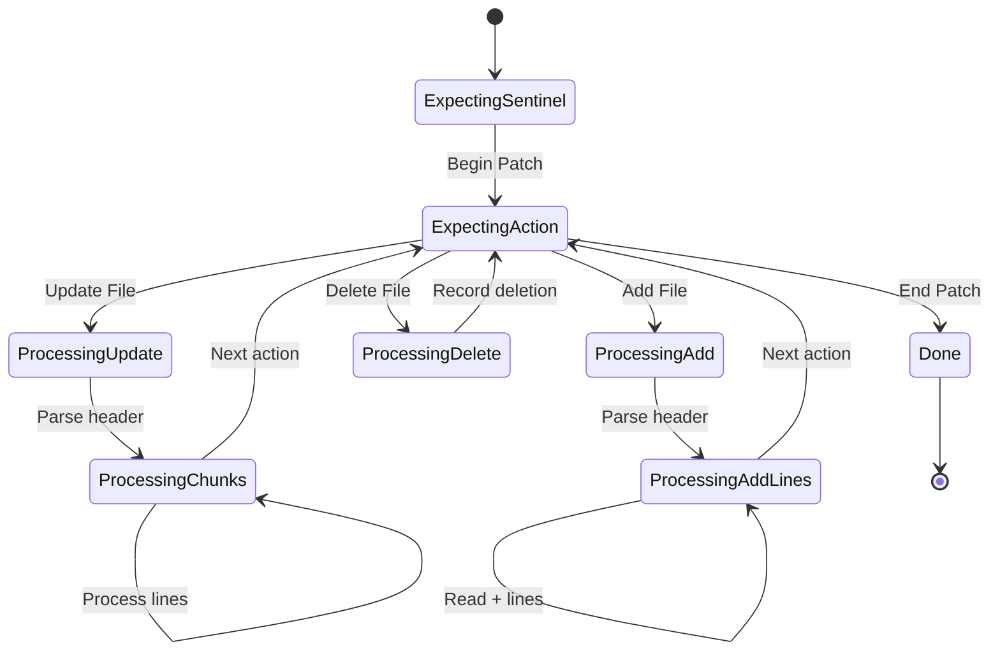
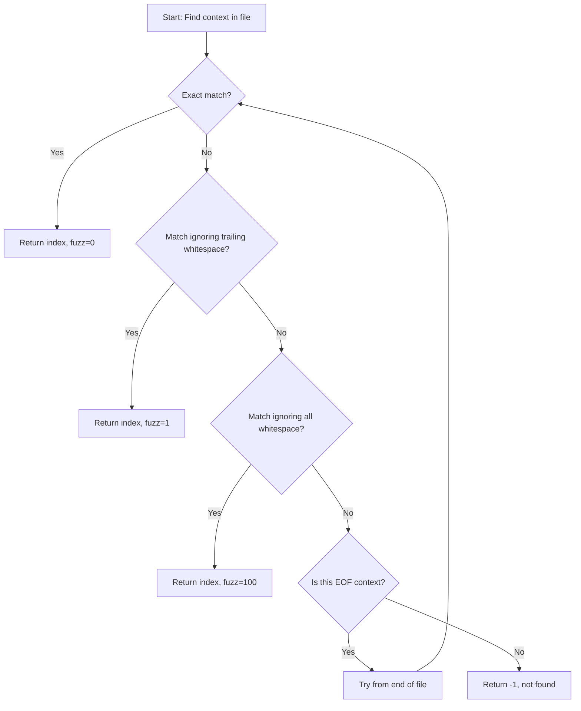
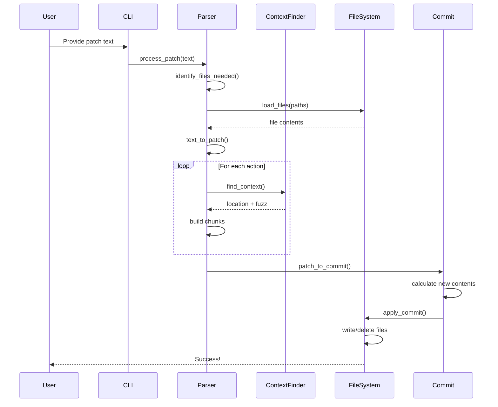
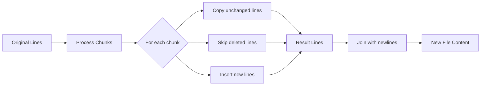
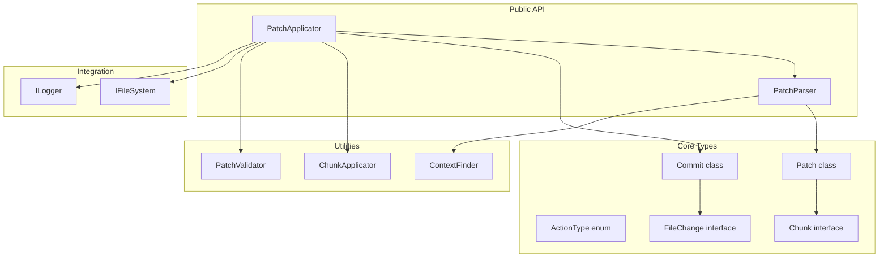

# patch_diff.py - A Context-Based Patching System for AI-Generated Code

## Table of Contents
- [Overview](#overview)
- [Architecture](#architecture)
- [Patch Format Specification](#patch-format-specification)
- [Parser Implementation](#parser-implementation)
- [Data Flow and Processing](#data-flow-and-processing)
- [Examples](#examples)
- [Error Handling](#error-handling)
- [TypeScript Migration Guide](#typescript-migration-guide)

## Overview

`patch_diff.py` is a sophisticated text patching utility designed specifically for applying AI-generated code modifications. Unlike traditional diff tools that rely on line numbers, this tool uses **context-based matching** to identify where changes should be applied, making it more robust and suitable for AI-assisted coding scenarios.

### Why Context-Based Patching?

Traditional diff formats (like unified diff) use line numbers to specify where changes should be applied:
```diff
@@ -10,5 +10,5 @@
```

This approach has limitations when working with AI-generated patches:
- Line numbers can shift if the file has been modified
- AI models struggle to calculate accurate line numbers
- Small formatting changes can break line-based patches

Context-based patching solves these issues by:
- Using actual code content as anchors instead of line numbers
- Supporting fuzzy matching for whitespace variations
- Providing clear, human-readable patch formats

### Key Features

- **Three operation types**: ADD, UPDATE, and DELETE files
- **Context-aware matching**: Finds code locations using surrounding context
- **Fuzzy matching**: Handles whitespace variations gracefully
- **Atomic commits**: All changes in a patch succeed or fail together
- **Move/rename support**: Can move files while updating them

## Architecture

### High-Level System Flow



### Component Architecture



## Patch Format Specification

### Basic Structure

Every patch must be wrapped in sentinels:
```
*** Begin Patch
[patch content]
*** End Patch
```

### Operation Types

#### 1. UPDATE Operation
Updates an existing file by applying changes at specific locations:

```
*** Update File: src/components/Button.tsx
@@ const Button = ({ onClick, children }) => {
   return (
-    <button onClick={onClick}>
+    <button onClick={onClick} className="btn-primary">
       {children}
     </button>
   );
```

**Key elements:**
- `*** Update File:` followed by the file path
- `@@` followed by a context line that uniquely identifies where to make changes
- Lines with ` ` (space) prefix are context (unchanged)
- Lines with `-` prefix are deleted
- Lines with `+` prefix are added

#### 2. ADD Operation
Creates a new file:

```
*** Add File: src/utils/helpers.ts
+export function formatDate(date: Date): string {
+  return date.toLocaleDateString('en-US', {
+    year: 'numeric',
+    month: 'long',
+    day: 'numeric'
+  });
+}
```

**Note:** All lines in an ADD operation must start with `+`

#### 3. DELETE Operation
Removes an existing file:

```
*** Delete File: src/deprecated/OldComponent.tsx
```

### Advanced Features

#### Multiple Changes in One File
You can specify multiple change locations using multiple `@@` sections:

```
*** Update File: src/App.tsx
@@ import React from 'react';
+import { Button } from './components/Button';

@@ function App() {
   return (
     <div>
-      <button>Click me</button>
+      <Button onClick={() => alert('Clicked!')}>Click me</Button>
     </div>
   );
```

#### File Move/Rename
You can move a file while updating it:

```
*** Update File: src/OldButton.tsx
*** Move to: src/components/Button.tsx
@@ export const OldButton
-export const OldButton = () => {
+export const Button = () => {
```

#### Context-Only Sections
Sometimes you need to provide additional context without making changes:

```
*** Update File: src/config.ts
@@ export const config = {
   apiUrl: 'https://api.example.com',
   timeout: 5000,
@@
@@ // Authentication settings
-  useAuth: false,
+  useAuth: true,
+  authProvider: 'oauth2',
```

The middle `@@` with no following content acts as a waypoint to help locate the next change.

## Parser Implementation

### State Machine

The parser operates as a state machine that processes patches line by line:



### Context Finding Algorithm

The context finding algorithm is the heart of the system. It attempts to locate code snippets using progressively more lenient matching:



**Fuzz Scores:**
- `0`: Perfect match
- `1`: Match with trailing whitespace differences
- `100`: Match with all whitespace differences
- `10,000+`: EOF context matched from non-EOF position

### Parsing Process Example

Let's trace through parsing a simple update:

```
*** Begin Patch
*** Update File: hello.py
@@ def greet(name):
-    print(f"Hello {name}")
+    print(f"Hello, {name}!")
*** End Patch
```

1. **Parser initialization**: Load `hello.py` content
2. **Read sentinel**: Confirm `*** Begin Patch`
3. **Read action**: `*** Update File: hello.py`
4. **Read context**: `@@ def greet(name):`
5. **Find context** in original file
6. **Build chunk**:
   - Context: `def greet(name):`
   - Delete: `    print(f"Hello {name}")`
   - Insert: `    print(f"Hello, {name}!")`
7. **Read end sentinel**: `*** End Patch`

## Data Flow and Processing

### Complete Patch Application Flow



### Chunk Application Process

When applying chunks to generate the new file content:



## Examples

### Example 1: Simple Function Update

**Original file (`math_utils.py`):**
```python
def add(a, b):
    """Add two numbers"""
    return a + b

def multiply(a, b):
    """Multiply two numbers"""
    return a * b
```

**Patch:**
```
*** Begin Patch
*** Update File: math_utils.py
@@ def add(a, b):
     """Add two numbers"""
-    return a + b
+    result = a + b
+    print(f"Adding {a} + {b} = {result}")
+    return result
*** End Patch
```

**Result:**
```python
def add(a, b):
    """Add two numbers"""
    result = a + b
    print(f"Adding {a} + {b} = {result}")
    return result

def multiply(a, b):
    """Multiply two numbers"""
    return a * b
```

### Example 2: Multi-File Patch with Add and Delete

```
*** Begin Patch
*** Delete File: src/old_config.js

*** Add File: src/config.ts
+interface Config {
+  apiUrl: string;
+  timeout: number;
+  debug: boolean;
+}
+
+export const config: Config = {
+  apiUrl: process.env.API_URL || 'https://api.example.com',
+  timeout: 5000,
+  debug: process.env.NODE_ENV === 'development'
+};

*** Update File: src/index.ts
@@ import express from 'express';
-import { config } from './old_config.js';
+import { config } from './config';

@@ app.listen(port, () => {
-  console.log(`Server running on port ${port}`);
+  console.log(`Server running on port ${port} - Debug: ${config.debug}`);
});
*** End Patch
```

### Example 3: Complex Update with Multiple Chunks

```
*** Begin Patch
*** Update File: src/UserService.ts
@@ export class UserService {
   private users: User[] = [];
+  private emailIndex: Map<string, User> = new Map();

@@ async createUser(data: CreateUserDto): Promise<User> {
     const user = new User(data);
-    this.users.push(user);
+    
+    // Check for duplicate email
+    if (this.emailIndex.has(data.email)) {
+      throw new Error('Email already exists');
+    }
+    
+    this.users.push(user);
+    this.emailIndex.set(user.email, user);
     
     await this.sendWelcomeEmail(user);
     return user;

@@ async deleteUser(id: string): Promise<void> {
-    this.users = this.users.filter(u => u.id !== id);
+    const userIndex = this.users.findIndex(u => u.id === id);
+    if (userIndex === -1) {
+      throw new Error('User not found');
+    }
+    
+    const user = this.users[userIndex];
+    this.users.splice(userIndex, 1);
+    this.emailIndex.delete(user.email);
   }
*** End Patch
```

## Error Handling

### Common Errors and Their Meanings

1. **"Invalid patch text - missing sentinels"**
   - The patch doesn't start with `*** Begin Patch` or end with `*** End Patch`

2. **"Update File Error - missing file: [path]"**
   - Attempting to update or delete a file that doesn't exist

3. **"Add File Error - file already exists: [path]"**
   - Attempting to add a file that already exists

4. **"Invalid context at [index]"**
   - The context lines specified with `@@` couldn't be found in the file

5. **"Overlapping chunks at [index]"**
   - Two chunks are trying to modify the same lines

### Error Recovery Strategies

The parser includes several recovery mechanisms:

1. **Fuzzy Matching**: Automatically handles whitespace differences
2. **EOF Context**: Special handling for context at end of file
3. **Validation**: Pre-flight checks before applying any changes
4. **Atomic Operations**: All changes succeed or none are applied

## TypeScript Migration Guide

### Proposed Architecture



### Type Definitions

```typescript
// types.ts
export enum ActionType {
  ADD = 'add',
  DELETE = 'delete',
  UPDATE = 'update'
}

export interface Chunk {
  origIndex: number;
  delLines: string[];
  insLines: string[];
}

export interface PatchAction {
  type: ActionType;
  newFile?: string;
  chunks: Chunk[];
  movePath?: string;
}

export interface FileChange {
  type: ActionType;
  oldContent?: string;
  newContent?: string;
  movePath?: string;
}

export class Patch {
  constructor(public actions: Map<string, PatchAction> = new Map()) {}
}

export class Commit {
  constructor(public changes: Map<string, FileChange> = new Map()) {}
}

export interface PatchOptions {
  allowFuzzyMatching: boolean;
  maxFuzzScore: number;
  validateBeforeApply: boolean;
}
```

### Core Classes

```typescript
// PatchParser.ts
export class PatchParser {
  private lines: string[];
  private index: number = 0;
  private currentFiles: Map<string, string>;
  private patch: Patch = new Patch();
  private fuzz: number = 0;

  constructor(
    patchText: string,
    currentFiles: Map<string, string>,
    private options: PatchOptions
  ) {
    this.lines = patchText.split('\n');
    this.currentFiles = currentFiles;
  }

  parse(): { patch: Patch; fuzz: number } {
    this.validateSentinels();
    
    while (!this.isAtEnd()) {
      this.parseNextAction();
    }
    
    return { patch: this.patch, fuzz: this.fuzz };
  }

  private parseNextAction(): void {
    const line = this.currentLine();
    
    if (line.startsWith('*** Update File:')) {
      this.parseUpdateAction();
    } else if (line.startsWith('*** Add File:')) {
      this.parseAddAction();
    } else if (line.startsWith('*** Delete File:')) {
      this.parseDeleteAction();
    } else if (line === '*** End Patch') {
      this.index = this.lines.length;
    } else {
      throw new PatchError(`Unknown action: ${line}`);
    }
  }
}

// PatchApplicator.ts
export class PatchApplicator {
  constructor(
    private fileSystem: IFileSystem,
    private logger: ILogger,
    private options: PatchOptions = defaultOptions
  ) {}

  async apply(patchText: string): Promise<ApplyResult> {
    // 1. Identify files needed
    const filesNeeded = this.identifyFilesNeeded(patchText);
    
    // 2. Load files
    const currentFiles = await this.loadFiles(filesNeeded);
    
    // 3. Parse patch
    const parser = new PatchParser(patchText, currentFiles, this.options);
    const { patch, fuzz } = parser.parse();
    
    // 4. Validate if requested
    if (this.options.validateBeforeApply) {
      this.validatePatch(patch, currentFiles);
    }
    
    // 5. Generate commit
    const commit = this.generateCommit(patch, currentFiles);
    
    // 6. Apply commit
    await this.applyCommit(commit);
    
    return {
      filesModified: commit.changes.size,
      fuzzScore: fuzz,
      success: true
    };
  }
}
```

### Integration Points

1. **File System Interface**:
```typescript
interface IFileSystem {
  readFile(path: string): Promise<string>;
  writeFile(path: string, content: string): Promise<void>;
  deleteFile(path: string): Promise<void>;
  exists(path: string): Promise<boolean>;
}
```

2. **Logging Interface**:
```typescript
interface ILogger {
  debug(message: string, context?: any): void;
  info(message: string, context?: any): void;
  warn(message: string, context?: any): void;
  error(message: string, error?: Error): void;
}
```

3. **Error Handling**:
```typescript
export class PatchError extends Error {
  constructor(
    message: string,
    public code: PatchErrorCode,
    public context?: any
  ) {
    super(message);
    this.name = 'PatchError';
  }
}

export enum PatchErrorCode {
  INVALID_FORMAT = 'INVALID_FORMAT',
  FILE_NOT_FOUND = 'FILE_NOT_FOUND',
  CONTEXT_NOT_FOUND = 'CONTEXT_NOT_FOUND',
  OVERLAPPING_CHUNKS = 'OVERLAPPING_CHUNKS',
  // ... etc
}
```

### Migration Roadmap

1. **Phase 1: Core Types and Interfaces**
   - Define all TypeScript interfaces and types
   - Create error classes and enums

2. **Phase 2: Parser Implementation**
   - Port the Parser class with proper typing
   - Implement context finding algorithms
   - Add comprehensive error handling

3. **Phase 3: Applicator Implementation**
   - Create PatchApplicator class
   - Implement file operations with async/await
   - Add validation and logging

4. **Phase 4: Testing**
   - Unit tests for parser logic
   - Unit tests for chunk application
   - Integration tests with mock file system
   - End-to-end tests with real files

5. **Phase 5: Integration**
   - Update workflow to use TypeScript implementation
   - Remove Python dependency
   - Add CLI support if needed

### Key Improvements in TypeScript Version

1. **Type Safety**: Full TypeScript typing eliminates runtime type errors
2. **Async Operations**: Native async/await for file operations
3. **Better Error Handling**: Typed errors with specific error codes
4. **Dependency Injection**: Clean interfaces for file system and logging
5. **Configuration**: Flexible options for fuzzy matching and validation
6. **Progress Tracking**: Support for progress callbacks during large patches
7. **Validation**: Pre-flight validation before applying changes
8. **Transaction Support**: Potential for rollback on failure

This migration preserves all the core functionality while adding modern TypeScript features and better integration with the rest of the application architecture.