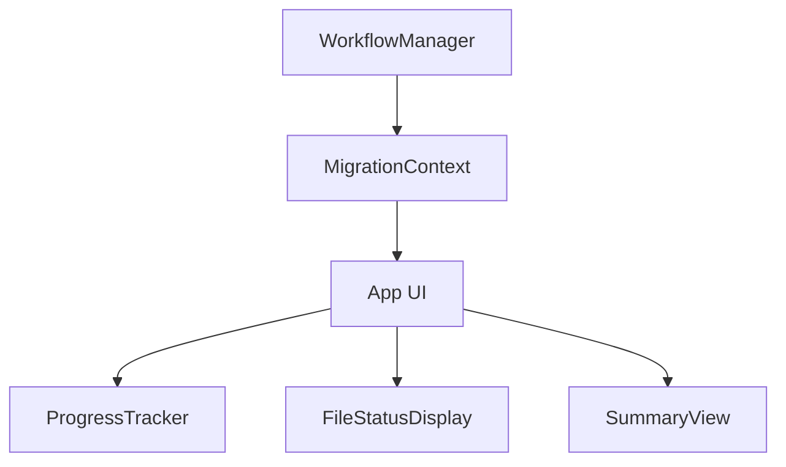

# State Management

## State Architecture



## Core State Structure

```typescript
type MigrationState = {
  // Overall status
  status: 'running' | 'completed' | 'failed';
  
  // Files tracking
  files: {
    [path: string]: FileState;
  };
  
  // Current operation
  currentFile?: string;
};

type FileState = {
  path: string;
  status: 'pending' | 'in-progress' | 'success' | 'failed';
  step: 'migration' | 'ts' | 'lint' | 'complete';
  retries: number;
  maxRetries: number;
  tempFilePath?: string;
  attemptFilePath?: string;
  error?: {
    step: string;
    message: string;
    details?: string;
    timestamp: number;
  };
};
```

## State Management Pattern

```typescript
// Context definition
const MigrationContext = createContext<{
  state: MigrationState;
  startMigration: (files: string[]) => void;
  // Other actions...
}>(initialContextValue);

// Context provider
export const MigrationProvider: React.FC = ({ children }) => {
  const [state, dispatch] = useReducer(migrationReducer, initialState);
  
  // Action creators
  const startMigration = useCallback((files: string[]) => {
    dispatch({ type: 'MIGRATION_STARTED', payload: { totalFiles: files.length } });
    // Workflow logic here...
  }, []);
  
  // Memoize the context value to prevent unnecessary re-renders
  const contextValue = useMemo(() => ({
    state,
    startMigration,
    // Other actions...
  }), [state, startMigration]);
  
  return (
    <MigrationContext.Provider value={contextValue}>
      {children}
    </MigrationContext.Provider>
  );
};

// Custom hook for components to access the context
export const useMigration = () => useContext(MigrationContext);
```

## UI Components

All UI components use the same context and re-render when the state changes:

```tsx
// App component wraps everything with the provider
const App = () => (
  <MigrationProvider>
    <Layout>
      <ProgressTracker />
      <FileStatusDisplay />
      <SummaryView />
    </Layout>
  </MigrationProvider>
);

// ProgressTracker uses the shared context
const ProgressTracker = () => {
  const { state } = useMigration();
  const { files, currentFile } = state;
  
  // Compute stats from files
  const total = Object.keys(files).length;
  const completed = Object.values(files).filter(f => f.status === 'success').length;
  const failed = Object.values(files).filter(f => f.status === 'failed').length;
  
  const percentage = total > 0 
    ? Math.round((completed + failed) / total * 100) 
    : 0;
  
  return (
    <Box>
      <Text>Progress: {percentage}%</Text>
      <Bar percentage={percentage} />
      <Text>Processing: {currentFile}</Text>
    </Box>
  );
};

// FileStatusDisplay also uses the shared context
const FileStatusDisplay = () => {
  const { state } = useMigration();
  const { currentFile, files } = state;
  
  // If no current file, don't render
  if (!currentFile) return null;
  
  const file = files[currentFile];
  
  return (
    <Box>
      <Text>Current file: {file.path}</Text>
      <Text>Status: {file.status}</Text>
      <Text>Step: {file.step}</Text>
      {file.retries > 0 && (
        <Text>Retry: {file.retries}/{file.maxRetries}</Text>
      )}
    </Box>
  );
};

// SummaryView uses the shared context too
const SummaryView = () => {
  const { state } = useMigration();
  const { files, status } = state;
  
  // Only show summary when migration is completed
  if (status !== 'completed' && status !== 'failed') return null;
  
  // Get all files with errors
  const filesWithErrors = Object.values(files).filter(f => f.error);
  
  return (
    <Box>
      <ResultsTable files={Object.values(files)} />
      <Text>Failed files: {filesWithErrors.length}</Text>
      {filesWithErrors.length > 0 && (
        <ErrorList files={filesWithErrors} />
      )}
    </Box>
  );
};
```

## Under the Hood

While the UI uses a single source of truth, the internal state management still uses a reducer with actions:

```typescript
// Action types
type MigrationAction = 
  | { type: 'MIGRATION_STARTED', payload: { totalFiles: number } }
  | { type: 'FILE_STARTED', payload: { file: string, tempFile: string } }
  | { type: 'STEP_STARTED', payload: { file: string, step: string } }
  | { type: 'STEP_COMPLETED', payload: { file: string, step: string, success: boolean, error?: Error } }
  | { type: 'RETRY_ATTEMPT', payload: { file: string, step: string, attempt: number, maxRetries: number } }
  | { type: 'FILE_COMPLETED', payload: { file: string, success: boolean } }
  | { type: 'MIGRATION_COMPLETED' };

// Reducer to handle state transitions
const migrationReducer = (state: MigrationState, action: MigrationAction): MigrationState => {
  switch (action.type) {
    case 'MIGRATION_STARTED':
      // Initialize state for a new migration
      return {
        ...state,
        status: 'running',
        files: {},
        currentFile: undefined
      };
    // Other action handlers...
    default:
      return state;
  }
};
```

## Performance Optimization

For performance with large file sets, use memoization and selectors:

```typescript
// Memoized selectors
const useFileStats = () => {
  const { state } = useMigration();
  
  return useMemo(() => {
    const files = Object.values(state.files);
    return {
      total: files.length,
      completed: files.filter(f => f.status === 'success').length,
      failed: files.filter(f => f.status === 'failed').length,
      inProgress: files.filter(f => f.status === 'in-progress').length,
      pending: files.filter(f => f.status === 'pending').length
    };
  }, [state.files]);
};

// Component using memoized selector
const StatsDisplay = () => {
  const stats = useFileStats();
  
  return (
    <Box>
      <Text>Files: {stats.total}</Text>
      <Text>Completed: {stats.completed}</Text>
      <Text>Failed: {stats.failed}</Text>
    </Box>
  );
};
``` 