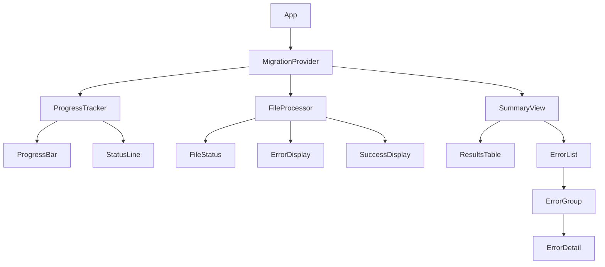

# Unshallow UI Documentation

## Component Structure

### Core Components
1. MigrationProvider
   - Manages overall migration state
   - Provides context for child components

2. ProgressTracker
   - Shows overall progress
   - Displays current file/operation
   - Progress bar component
   - Status line component

3. FileProcessor
   - Individual file status
   - Error display
   - Success display

## UI Layout Example
```
🔄 Unshallowing Enzyme Tests

Processing: src/components/__tests__/Header.test.tsx
━━━━━━━━━━━━━━━━━━━━━━━━━━━━━━━━━━━━━━━━ 45%

Current: Converting Enzyme assertions to RTL
Status: 3/7 files processed
└─ Last success: Button.test.tsx
└─ Current file: Header.test.tsx
   ├─ [✓] Analysis
   ├─ [⠋] RTL Conversion
   ├─ [ ] TypeScript Check
   └─ [ ] Lint Check

Press ^C to cancel
```

## Progress Indicators
- File/Directory progress bar
- Operation status spinners
- Success/Error indicators
- Clear step completion markers

## Component Hierarchy


## Interactive Elements
- Error resolution prompts
- Retry confirmations
- Operation status updates
- Progress tracking

## Summary UI

### Results Table
```
Migration Results Summary
━━━━━━━━━━━━━━━━━━━━━━━━━━━━━━━━━━━━━━━━━━━━━━━━━━━━━━━━━━━━━━━━━━━━━━━━━━━━━━━━

File                          Migration   TS Check   Lint Check   Final Status
────────────────────────────  ──────────  ─────────  ──────────  ─────────────
Header.test.tsx               ✓           ✓          ✓           ✓ Completed
Button.test.tsx               ✓           ✓          ✗           ✗ Failed
Modal.test.tsx               ✗           -          -           ✗ Failed
Form.test.tsx                ✓           ✗          -           ✗ Failed

Summary: 1/4 files successfully unshallowed
━━━━━━━━━━━━━━━━━━━━━━━━━━━━━━━━━━━━━━━━━━━━━━━━━━━━━━━━━━━━━━━━━━━━━━━━━━━━━━━━

Statistics:
• Files Attempted:    4
• Successfully Migrated: 3/4 (75%)
• TypeScript Failed:  1/3 (33%)
• Lint Check Failed:  1/2 (50%)
• Overall Success:    1/4 (25%)

Errors:
Button.test.tsx:
  └─ Lint Check Failed:
     • Line 23: Expected ... but found ...
     • Line 45: Unexpected ...

Modal.test.tsx:
  └─ Migration Failed:
     • Could not parse Enzyme shallow wrapper pattern
     • Max retries (5) reached

Form.test.tsx:
  └─ TypeScript Check Failed:
     • TS2339: Property 'getBy' does not exist on type 'RenderResult'
     • TS2345: Argument of type 'string' not assignable to parameter...

You can check the last state of the files on the ./attempts directory
━━━━━━━━━━━━━━━━━━━━━━━━━━━━━━━━━━━━━━━━━━━━━━━━━━━━━━━━━━━━━━━━━━━━━━━━━━━━━━━━
Run with --skip-ts-check or --skip-lint-check to bypass checks
```

### Summary Components
1. ResultsTable
   - Displays migration status for each file
   - Shows progress through each phase
   - Uses symbols for status (✓, ✗, -)
   - Includes final status column

2. ErrorList
   - Groups errors by file
   - Hierarchical error display
   - Shows error type and details
   - Includes helpful suggestions

### Status Symbols
- ✓ Success/Passed
- ✗ Failed
- - Skipped/Not Attempted

### Color Scheme
- Green: Success (✓)
- Red: Failure (✗)
- Gray: Skipped (-) 